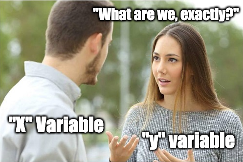

```{r setup, include=FALSE}
library(knitr)

default_source_hook <- knit_hooks$get('source')
default_output_hook <- knit_hooks$get('output')

knit_hooks$set(
  source = function(x, options) {
    paste0(
      "\n::: {.codebox data-latex=\"\"}\n\n",
      default_source_hook(x, options),
      "\n\n:::\n\n")
  }
)

knit_hooks$set(
  output = function(x, options) {
    paste0(
      "\n::: {.codebox data-latex=\"\"}\n\n",
      default_output_hook(x, options),
      "\n\n:::\n\n")
  }
)

knitr::opts_chunk$set(echo = TRUE)
```

# Introduction

## The orchids example

```{r, echo = TRUE}
set.seed(12345) # For reproducibility
n.times <- 50;n.picks=10;p.orchid <- 0.4
y <- rbinom(n.times, size = n.picks, prob = p.orchid) 
```

\columnsbegin
\column{0.5\textwidth}
```{r, echo =FALSE}
hist(y, xlab = "Proportion of orchids", 
     ylab = "Number of samplings", freq = FALSE, col = "white")
lines(density(y), col = "red", lty = "dashed")
```
\column{0.5\textwidth}

\columnsend


## The orchids example

```{r, echo = TRUE}
set.seed(12345) # For reproducibility
n.times <- 100;n.picks=1;p.orchid <- 0.4
y <- rbinom(n.times, size = n.picks, prob = p.orchid) 
```

\columnsbegin
\column{0.5\textwidth}
```{r, echo =FALSE}
hist(y, xlab = "Proportion of orchids", 
     ylab = "Number of samplings", freq = FALSE, col = "white")
lines(density(y), col = "red", lty = "dashed")
```
\column{0.5\textwidth}

\columnsend

## The orchids example

The Binomial distribution is approximately normal for large $n_{picks}$ and $\pi$ away from 0 and 1

**Many distributions are approximately normal** under some conditions

## Normal approximation

```{r, echo = FALSE}
par(mfrow=c(2,2), mar =  c(6,4,4,2))
plot(table(rbinom(1000,10,0.5)), ylab="Frequency", main=expression(paste("Binomial with N = 10, ", p, " = 0.5")), xlab="rbinom(1000, 10, 0.5)")
plot(table(rpois(1000,20)), ylab="Frequency", main=expression(paste("Poisson with ", lambda, " = 10")), xlab = "rpois(1000, 20)")
hist(rchisq(1000, 50), ylab="Frequency", main=expression(paste(chi^2, " with  k = 50")))
hist(rt(1000, 30), ylab="Frequency", main=expression(paste("Student's t with ", nu, " = 30")))
```


## Normality

\columnsbegin
\column{0.5\textwidth}
\textbf{Real data is rarely normally distributed.}\newline
But it is a nice starting point when learning GLMs.\newline
We can use it (e.g.,) when the mean is far enough from zero.
\column{0.5\textwidth}
\centering

\columnsend

# $\mathcal{N}(\mu,\sigma^2)$

## The normal distribution

\begin{equation}
f(y_i;\mu, \sigma) = \frac{1}{\sigma\sqrt{2\pi}}\exp\biggl\{\frac{(y_i-\mu)^2}{2\sigma^2}\biggr\}
\end{equation}


## The normal distribution (2)

Likelihood:
\begin{equation}
f(y_i;\mu, \sigma) = \frac{1}{\sigma\sqrt{2\pi}}\exp\biggl\{\frac{(y_i-\mu)^2}{2\sigma^2}\biggr\}
\end{equation}

log-Likelihood:
\begin{equation}
\log\{f(y_i;\mu, \sigma)\} = -\frac{1}{2}\log(\sigma^22\pi) -\frac{(y_i-\mu)^2}{2\sigma^2}
\end{equation}
Two parameters: $\mu$ and $\sigma$

- $\mu$ is the mean; the middle of the distribution
- $\sigma$ is the standard deviation; it controls the width

Not only used for data, also the basis of many statistics (e.g., asymptotic sampling distributions)

## Estimating $\mu$

Same process as before: calculate gradient and find estimator

\begin{equation}
\frac{\partial\log\{\mathcal{L}(\textbf{y};\hat{\mu},\sigma)\}}{\partial\mu} = \frac{1}{2\sigma^2}\biggl(2\sum \limits^n_{i=1}y_i-2n\mu\biggl)
\end{equation}

Giving..

\begin{equation}
\hat{\mu} = \frac{1}{n}\sum \limits^n_{i=1}y_i
\end{equation}

It is a linear function of $y_i$ so it follows a normal distribution.

## Estimating $\sigma^2$

Same process as before. MLE is biased so gets a small correction.

\begin{equation}
\hat{\sigma}^2 = \frac{1}{n-1}\sum \limits^n_{i=1}(y_i-\hat{\mu})^2
\end{equation}

Is it a quadratic function of $y_i$ so is $\chi^2$-distributed.

## Uncertainty of $\hat{\mu}$

\begin{equation}
\begin{aligned}
\text{var}(\hat{\mu}) &= \mathams{E}(\hat{\mu}^2)-\mathams{E}(\hat{\mu})\mathams{E}(\hat{\mu})\\
&= \frac{1}{n^2}\sum\limits^n_{i=1}\mathams{E}(y_i^2)-\mathams{E}(\hat{\mu})\mathams{E}(\hat{\mu})\\
&= \frac{1}{n}\sigma^2
\end{aligned}
\end{equation}

- Depends on $n$ (small $n$, large uncertainty)
- Depends on $\sigma^2$
- Which is estimated by $\hat{\sigma}^2$
- But that estimate also has uncertainty

So, we use the $t$-distribution to represent that additional uncertainty.

## The t-distribution

```{r, echo = FALSE}
par(mfrow=c(2,2))
x <- sort(rnorm(1000))
plot(dt(x, .1), x = x, type="l", main = "df = .1")
plot(dt(x, .5), x = x, type="l", main = "df = .5")
plot(dt(x, 2), x = x, type="l", main = "df = 2")
plot(dt(x, 4), x = x, type="l", main = "df = 4")
```

## The t-test

A t-test is used to test the mean difference of two groups

\tiny

```{r}
set.seed(12345)
y <- rnorm(10)
x <- rnorm(10, mean = 2)
t.test(x, y)
```

\normalsize

# Example 1

## Example 1: Alaskan pipeline

Depth of pipeline defects


## Example 1: the data

Data from http://www.itl.nist.gov/div898/handbook/

- 107 defects
- Measured in the field (ultrasonic)
- And in the lab re-measured

\tiny

```{r, echo  =FALSE, message=FALSE, warning=FALSE}
data("alaska.pipeline", package="UsingR")
library(tidyr)
knitr::kable(head(alaska.pipeline, 7), format="latex", booktabs = T)%>%kableExtra::kable_styling(position="center")
```

\normalsize

## Alaska pipline: t-test


```{r, echo = TRUE, eval = FALSE}
t.test(alaska.pipeline$field.defect, 
       alaska.pipeline$lab.defect, paired=TRUE)
```

## Alaska pipline: t-test output

\small

```{r, echo = FALSE}
data(alaska.pipeline, package="UsingR")
t.test(alaska.pipeline$field.defect, 
       alaska.pipeline$lab.defect, paired=TRUE)
```

## Alaska pipeline: t-test visually

```{r, echo = FALSE}
plot(c(1,2), y = range(alaska.pipeline[,c("field.defect","lab.defect")]), type="n", xaxt="n", ylab="Defect depth", xlim = c(0,3), xlab=NA)
axis(1, at = c(1,2), labels = c("Field","Lab"))

points(rep(1, nrow(alaska.pipeline)), alaska.pipeline$field.defect)
points(1, mean(alaska.pipeline$field.defect), pch = 16, col = "red", cex = 1.3)
points(rep(2, nrow(alaska.pipeline)), alaska.pipeline$lab.defect)
points(2, mean(alaska.pipeline$lab.defect), pch = 16, col = "red", cex = 1.3)

lines(c(1,2), c(mean(alaska.pipeline$field.defect), mean(alaska.pipeline$lab.defect)), col="red")
```

# Simple linear regression

## What is a linear regression?

\columnsbegin
\column{0.6\textwidth}
Models with a continuous \textbf{response variable} as a function of one or more \textbf{explanatory variable}. Variables are connected by linear equations.

- $y_i$: the \textbf{response variable}, can only be numerical
- $x_i$: the \textbf{explanatory variable}, can be categorical (0,1) or numerical

\column{0.4\textwidth}



\columnsend

\begin{equation}
y_i = \textcolor{red}{\alpha + x_i\beta} + \textcolor{blue}{\epsilon_i \sim \mathcal{N}(0,\sigma^2)}
\end{equation}


## Synonyms

- Covariate
- Predictor (variable)
- Explanatory variable
- Independent variable

They all refer to $x_i$.

## What is the goal of regression?

We measure data $y_i$ and want to infer its with $x_i$

Steps:

1) We decide on a model
2) We estimate the parameters
3) We check if it is a valid and good model
4) We draw our conclusion (with uncertainty)

## Examples of linear models: categorical $x_i$

\columnsbegin
\column{0.4\textwidth}
$$
\mu_i =
  \begin{cases}
    \beta_0       & \quad \text{if } X_i =0 \\
    \beta_1      & \quad \text{if } X_i =1  
  \end{cases}
$$
$$
\mu_i =
  \begin{cases}
    \alpha       & \quad \text{if } X_i =0 \\
    \alpha + \beta       & \quad \text{if } X_i =1  
  \end{cases}
$$
\column{0.6\textwidth}

$y_i = (1-x_i)\beta_0 + x_i\beta_1 + \textcolor{blue}{\epsilon_i\sim \mathcal{N}(0,\sigma^2)}$

\vspace{2\baselineskip}

$y_i = \alpha+ x_i\beta_1 + \textcolor{blue}{\epsilon_i\sim \mathcal{N}(0,\sigma^2)}$

\columnsend

## Examples of linear models: categorical $x_i$

```{r echo=FALSE, fig.height=4.5, cache = TRUE}
set.seed(12345)
x <- rbinom(50, 0.5, size = 1)
y = 20 + 5*x + rnorm(50)
Means <- aggregate(y,list(x),mean)
par(mfrow=c(1,1), mar=c(4.1,7,1,1), oma=c(0,0,0,0))
plot(y, jitter(1*x), yaxt="n", ann=FALSE, 
     col="grey50") 
points(Means[,2], c(0,1), col=2, pch=3, cex=4)
text(Means[1,2], 0.2, expression(beta[0]), cex=3, adj=-0.2)
text(Means[2,2], 0.8, expression(beta[1]), cex=3, adj=-0.2)

axis(2, c("Something", "Something else"), at=c(0,1), las=1)
```

- $\beta_0$ is the group 1 mean
- $\beta_1$ is the group 2 mean

## Examples of linear models: categorical $x_i$

```{r echo=FALSE, fig.height=4.5, cache = TRUE}
set.seed(12345)
x <- rbinom(50, 0.5, size = 1)
y = 20 + 5*x + rnorm(50)
Means <- aggregate(y,list(x),mean)
par(mfrow=c(1,1), mar=c(4.1,7,1,1), oma=c(0,0,0,0))
plot(y, jitter(1*x), yaxt="n", ann=FALSE, 
     col="grey50") 
points(Means[,2], c(0,1), col=2, pch=3, cex=4)
text(Means[1,2], 0.2, expression(alpha + 0*beta), cex=3, adj=-0.2)
text(Means[2,2], 0.8, expression(alpha + 1*beta), cex=3, adj=-0.2)

axis(2, c("Something", "Something else"), at=c(0,1), las=1)
```

- $\alpha$ is the mean of the first group
- $\beta$ is the deviation from the mean of the first group

## Linear regression and the t-test

Sounds familiar to the t-test?

\pause

- t-test is a type of linear regression
- Namely where we have a categorical covariate with two categories

## Alaska pipline: t-test as linear regression

$$
depth_i =
  \begin{cases}
    \alpha       & \quad \text{if } measured \; in \; the \; field \\
    \alpha + \beta       & \quad \text{if } measured \; in \; the \; lab
  \end{cases}
  + left.over.stuff_i
$$

So, $\beta$ is how much deeper (-) or less deep (+) the defect is detected when measured in the lab

## Alaska pipline: t-test with `lm()`

\tiny

```{r}
alaska <- rbind(data.frame(id = 1:nrow(alaska.pipeline), 
                           lab = "lab", depth = alaska.pipeline$lab.defect),
                data.frame(id = 1:nrow(alaska.pipeline), 
                           lab="field", depth = alaska.pipeline$field.defect))
alaska$lab <- as.factor(alaska$lab)
lm(depth~lab, data = alaska)
```

## Examples of linear models: continuous $x_i$

```{r reg, fig.height = 4.5, echo = FALSE}
x <- rnorm(30)+1;set.seed(2)
y <- rnorm(30,1+x*.4)
model <-  lm(y~x)
plot(y~x, ylab = "Response", xlab = "Explanatory", main=expression(alpha))
abline(model,col="red")
segments(y0=-3,y1=predict(model,data.frame(x=0)), x0 = 0, x1=0, col = "darkorange", lty = "dashed")
segments(y0=predict(model,data.frame(x=0)),y1=predict(model,data.frame(x=0)), x0 = 0, x1=-2, col = "darkorange", lty = "dashed")
text(y=predict(model,data.frame(x=-1)), -1, expression(alpha), adj = c(0.5,-1), cex=3, col = "darkorange")

```

$y_i = \textcolor{darkorange}{\alpha} + x_i\beta + \textcolor{blue}{\epsilon_i\sim \mathcal{N}(0,\sigma^2)}$

- $\textcolor{darkorange}{\alpha}$: the intercept is the value of $y_i$ where $x_i = 0$

## Examples of linear models: continuous $x_i$

```{r reg2, fig.height = 4.5, echo = FALSE}
x <- rnorm(30)+1;set.seed(2)
y <- rnorm(30,1+x*1)
model <-  lm(y~x)
plot(y~x, ylab = "Response", xlab = "Explanatory", main=expression(beta))
abline(model,col="red")
segments(y0=predict(model,data.frame(x=2)),y1=predict(model,data.frame(x=2)), x0 = 2, x1=3, col = "darkorange", lty = "dashed")
segments(y0=predict(model,data.frame(x=2)),y1=predict(model,data.frame(x=3)), x0 = 3, x1=3, col = "darkorange", lty = "dashed")
text(y=predict(model,data.frame(x=2.5)), 2.5, expression(beta), cex=3, adj=c(0,1.5), col = "darkorange")
```

$y_i = \alpha + x_i\textcolor{darkorange}{\beta} + \textcolor{blue}{\epsilon_i\sim \mathcal{N}(0,\sigma^2)}$

- $\alpha$: the intercept is the value of $y_i$ where $x_i = 0$
- $\textcolor{darkorange}{\beta}$: the slope is the change in $y_i$ for a unit increase in $x_i$

## Alaska pipeline: lab and field defects

\begin{equation}
\begin{aligned}
y_i &= \textcolor{red}{\alpha + x_i\beta} + \textcolor{blue}{\epsilon_i\sim \mathcal{N}(0,\sigma^2)}\\
lab.defect_i &= \textcolor{red}{\alpha + field.defect_i *\beta} + \textcolor{blue}{left.over.stuff}
\end{aligned}
\end{equation}

\pause
\small

```{r}
lm(lab.defect~field.defect, data = alaska.pipeline)
```

## What is the best line?

```{r norm2, echo = FALSE}
x <- rnorm(30)+20;set.seed(2)
y <- rnorm(30,1+x*.4)
model <-  lm(y~x)
plot(y~x, ylab = expression(y), xlab = expression(x))
abline(model,col="red", lty = "dotted")
abline(h=9, col="red", lty = "dashed")
```

## How good is the line?

```{r norm, echo = FALSE, fig.height = 5}
x <- rnorm(30)+20;set.seed(2)
y <- rnorm(30,1+x*.4)
model <-  lm(y~x)
plot(y~x, ylab = "Response", xlab = "Explanatory")
abline(model,col="red")

segments(x,y,x,predict(model), col = "blue")
```

Distance from model (line) to data: "error" $\textcolor{blue}{\epsilon_i}$

## Least squares estimation

Minimize the sum of squared residuals:
\begin{equation}
RSS = \sum \limits^n_{i=1} \epsilon_i^2
\end{equation}
which is the same to maximizing the normal likelihood!

- $\hat{\alpha}= \frac{1}{N}(\sum y_i - \hat{\beta}\sum x_i)$
- $\hat{\beta} = \frac{\sum (x_i - \sum \frac{x_i}{N})(y_i - \sum \frac{y_i}{N})}{\sum (x_i - \sum \frac{x_i}{N})^2}$
- $\hat{\sigma^2} = \frac{1}{N-1}\sum (y_i - (\alpha+x_i\beta))^2$
- $\hat{\mu}_i = \hat{\alpha}+x_i\hat{\beta}$


## Our model

\begin{equation}
y_i = \alpha + \beta x_i + \epsilon_i\sim \mathcal{N}(0,\sigma^2)
\end{equation}

- $y_i$: our data
- $\alpha$, $\beta$ describe our line
- $\epsilon_i$ quantifies distance to the model

## Assumptions

We make some critical assumptions here

1) the relationship between $y_i$ and $x_i$
2) distribution of the errors


## Other assumptions for the Errors

\begin{equation}
\epsilon_i \overset{iid}{\sim} \mathcal{N}(0, \sigma^2)
\end{equation}

- are normally distributed
- have constant variance ("Homoscedastcity")
- are independent
- no outliers

## Assumptions for the errors

\textbf{all the errors together tell us how good the line is}

- this is the same as finding the line by maximum likelihood estimation \emoji{smile}

\begin{equation}
y_i \sim \mathcal{N}(\alpha+x_i\beta, \sigma^2)
\end{equation}

## Summary simple linear models

- includes t-test, anova (analysis of variance) and regression
- all use the same mathy bits (and model)
- \textbf{interpretation} depends on the type of \textbf{variable}
- GLMs take the same form

## Summary

- Normal-distribution and t-distribution
- Simple linear regression: one covariate
- Least squares estimation
- Difference in LMs with categorical or continuous explanatory variables
  - Categorical: intercept/mean parameter
  - Continuous: slope parameter

- Fortunately we have the `lm()` function in R!
- More on assumptions checking tomorrow

## Summary (2)

t-test: linear model with categorical covariate of two groups
ANOVA: linear model with categorical covariate of multiple groups
ANCOVA: linear model with categorical and continuous covariate (interaction)

