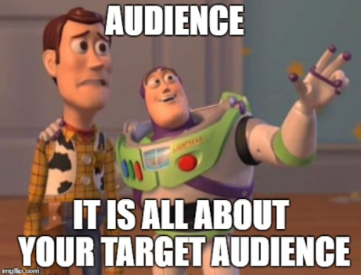
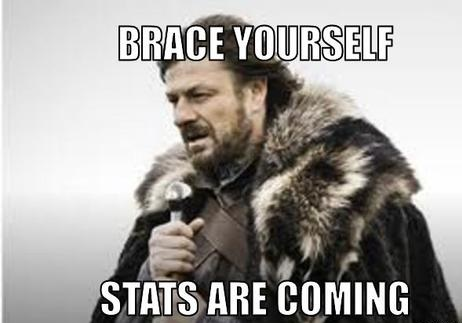
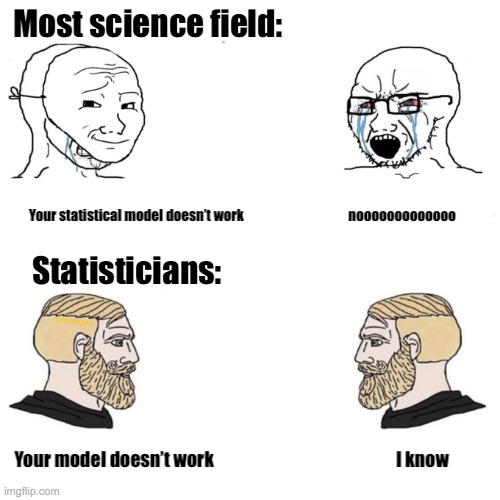
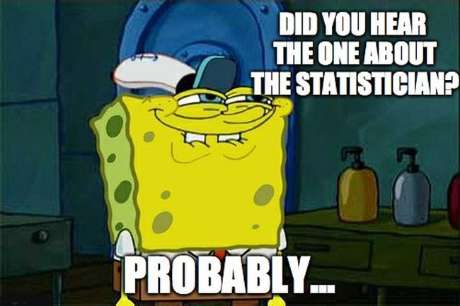
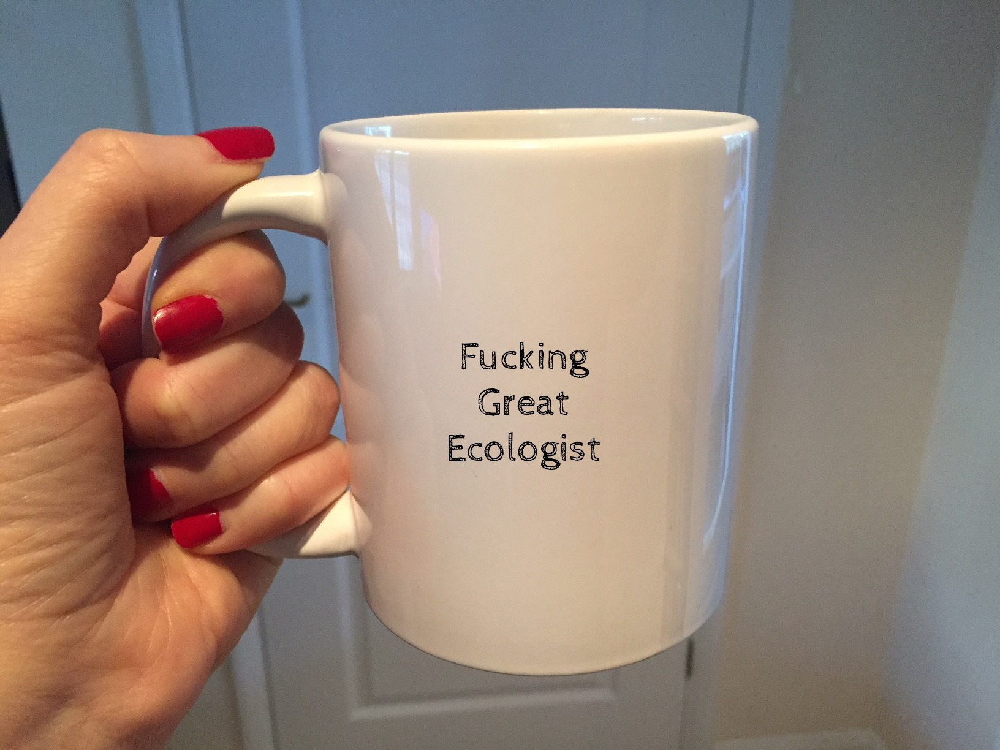
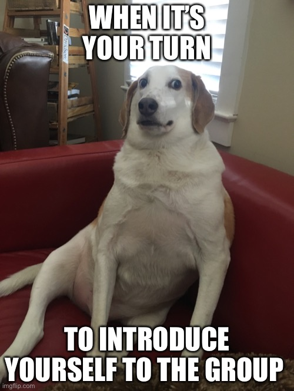

```{r setup, include=FALSE}
library(knitr)

default_source_hook <- knit_hooks$get('source')
default_output_hook <- knit_hooks$get('output')

knit_hooks$set(
  source = function(x, options) {
    paste0(
      "\n::: {.codebox data-latex=\"\"}\n\n",
      default_source_hook(x, options),
      "\n\n:::\n\n")
  }
)

knit_hooks$set(
  output = function(x, options) {
    paste0(
      "\n::: {.codebox data-latex=\"\"}\n\n",
      default_output_hook(x, options),
      "\n\n:::\n\n")
  }
)

knitr::opts_chunk$set(echo = TRUE)
```

# Welcome! \emoji{smile}

\center
{width=60%}

# Outline

[See github for all material](https://github.com/BertvanderVeen/GLM-workshop-1)

Sessions from 14:00 to 20:00 (Monday to Thursday), 14:00 to 18:00 on Friday (Berlin time). Sessions will consist of a mix of lectures, in-class discussion, and practical exercises / case studies over Slack and Zoom.

* Monday: Introduction, sampling theory, simple LMs
* Tuesday: Multiple linear regression (ANOVA, ANCOVA) + GLM introduction
* Wednesday: Binomial regression, model comparison
* Thursday: Discrete responses (Poisson, NB) and other useful models (e.g., beta)
* Friday: Bring your own data, looking beyond (GLMMs? or GAMs, Bayesian statistics..)

## How we will do it

Lectures of about 45 minutes \newline
Practicals of about 45 minutes: datasets and R

  - Practical "tasks" serve as guideline, not as exhaustive exercise
  - I do not provide a lot of \texttt{R} code. We will figure that out together!

## Friday

1. Looking beyond (GLMMs? or GAMs, Bayesian statistics..)
2. Bring your own data

Which topic(s) should we look into on Friday?

## Disclaimer

A \tiny small \normalsize amount of \tiny \color{red}{maths}

{width=50%}

\vfill
\hfill  This is a statistics workshop after all \normalsize

## What I hope you take away

1. There are many details you will forget, that is fine (you might recall them later)
2. Generalised Linear Models are very useful, and easy to use
3. Maths can be useful/stats can be useful
4. You pick the tools you want to work with

\center
{width=40%}

## Detailed outline today

* Who am I, who are you
* Brief reminder of R programming
* Reminder of foundational statistical concepts (sampling theory)
* Introduction to linear models

* 15 minute break 15:45-16:00
* 45 minute break 17:45-18:30
* 2 Lectures/presentations 
* 2 Practicals based on simulated data
  * Tomorrow we start with real data

# Logistics

[All material on github](https://github.com/BertvanderVeen/GLM-workshop)


Please make sure you've downloaded data and updated R/packages

## \texttt{R}-packages

\columnsbegin
\column{0.5\textwidth}


\column{0.5\textwidth}

\textcolor{red}{New}


\columnsend

## Resources
- [ST2304](https://wiki.math.ntnu.no/st2304/2024v/start) by Bob O'Hara and Emily Simmonds
- [Florian Hartig's online book](https://theoreticalecology.github.io/AdvancedRegressionModels)
- [John Fieberg's online book](https://statistics4ecologists-v2.netlify.app/)
- [Zuur et al. 2013](https://www.highstat.com/index.php/our-books?view=article&id=21&catid=18) or [Zuur et al. 2009](https://www.highstat.com/index.php/our-books?view=article&id=17&catid=18)

- [McCullagh and Nelder 1989](https://www.taylorfrancis.com/books/mono/10.1201/9780203753736/generalized-linear-models-mccullagh)
- [Wood 2017](https://www.taylorfrancis.com/books/mono/10.1201/9781315370279/generalized-additive-models-simon-wood)
- [Dunn and Smyth 2021](https://link.springer.com/book/10.1007/978-1-4419-0118-7)
- [Agresti 1990](https://onlinelibrary.wiley.com/doi/book/10.1002/0471249688)

# IntroducionS

## Who am I, and what do I do?

\columnsbegin
\column{0.5\textwidth}



\column{0.5\textwidth}



\columnsend

## Who are you, and what do you do?

\center

{width=50%}