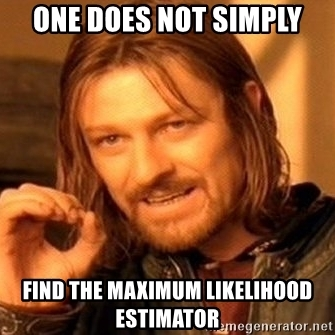

```{r setup, include=FALSE}
library(knitr)

default_source_hook <- knit_hooks$get('source')
default_output_hook <- knit_hooks$get('output')

knit_hooks$set(
  source = function(x, options) {
    paste0(
      "\n::: {.codebox data-latex=\"\"}\n\n",
      default_source_hook(x, options),
      "\n\n:::\n\n")
  }
)

knit_hooks$set(
  output = function(x, options) {
    paste0(
      "\n::: {.codebox data-latex=\"\"}\n\n",
      default_output_hook(x, options),
      "\n\n:::\n\n")
  }
)

knitr::opts_chunk$set(echo = TRUE)
```

# Introduction

## Outline Today

- An orchid example
- Sampling variation
- Maximum likelihood estimation  
- Normal distribution
- Linear models

# Sampling data

## Sampling data

{width=80%}

A nice field with orchids.  \newline

How do we find the proportion of orchids?

---

## What is the proportion of orchids?

\columnsbegin
\column{0.6\textwidth}

\column{0.4\textwidth}
We decide to walk through the field and at 10 places record when we find an orchid (1) or not (0)
\columnsend
\columnsbegin
\column{0.2\textwidth}

\column{0.8\textwidth}
\begin{enumerate}
\item First time: 5 orchids from 10 picks (5/10 = 0.5)
\end{enumerate}
\columnsend

## What is the proportion of orchids?

\columnsbegin
\column{0.6\textwidth}

\column{0.4\textwidth}
We decide to walk through the field and at 10 places record when we find an orchid (1) or not (0)
\columnsend
\columnsbegin
\column{0.2\textwidth}

\column{0.8\textwidth}
\begin{enumerate}
\item First time: 5 orchids from 10 picks (5/10 = 0.5)
\item Second time: 2 orchids from 10 picks (2/10 = 0.2)
\item Third time: 8 orchids from 10 picks (8/10 = 0.8)
\end{enumerate}
\columnsend

So, the same data can give different estimates. Why is that?

## What is the proportion of orchids?

We conclude, half of the flowers are orchids (15/30 = 0.5). But encounter this guy:

\columnsbegin
\column{0.4\textwidth}


He tells us that the true proportion of orchids is 0.4.
\column{0.6\textwidth}
\begin{itemize}
\item What caused our estimate of the proportion of orchids to be inaccurate?
\item And why did we not get the same proportion of orchids every time?
\end{itemize}
\columnsend

## The binomial distribution

\begin{equation}
f(y_i;n_{picks},\pi) = y_i\log\{\pi\}+(n_{picks}-y_i)\log\{1-\pi\} +constant
\end{equation}

- Density: `dbinom`
- Number generator: `rbinom``

## Simulation: counting orchids once

```{r, cache=TRUE}
set.seed(12345) # For reproducibility
p.orchid = 0.4 # The true proportion of orchids
n.picks = 10 # The number of picks in the field
n.times = 1
# Collect data
y <- rbinom(n.times, size = n.picks, prob = p.orchid) 
y/n.picks # Proportion of orchids
```

## Simulation: counting orchids once

What if we sample the whole field once?

```{r, cache=TRUE}
set.seed(12345) # For reproducibility
n.times = 1e5 # The number of picks in the field
n.picks <- 1
 # Collect data
y <- rbinom(n.times, size = n.picks, prob = p.orchid)
mean(y/n.picks) # Proportion of orchids
```

## Simulation: counting orchids 50x10 times

```{r, fig.height = 2.8, cache=TRUE}
set.seed(12345) # For reproducibility
n.times <- 50
n.picks = 10 # The number of picks in the field
# Collect data
y <- rbinom(n.times, size = n.picks, prob = p.orchid) 
hist(y, xlab = "Proportion of orchids", 
     ylab = "Number of samplings")
```

## Simulation: counting orchids 50x10 times

```{r, echo = FALSE, fig.height = 5}
plot(table(y/n.picks), xlab = "Proportion of orchids", ylab = "Number of samplings")
abline(v= 0.4, col = "red", lty = "dashed")
```

As you see, we have variability in our estimate of the proportion of orchids.

- Can we summarize this variation?
- Preferably without collecting data many times

## The strategy

- Collect data
- Learn about the variation in that data
  - We need a model for that
- Work out distribution of the estimates
  - And find the "best" estimate
- Conclude if our answer is robust
  - Q: Are more than half of the flowers in this field orchids?
  
## Q: Are more than half of the flowers in this field orchids?

- Exclude rare events, and decide on an acceptable margin of error (5%)
- What is the range our parameter is estimated to be 95% of the time?

```{r}
quantile(y/n.picks,c(0.025,.975))
```

So 50 times 10 picks tell us little.

## Q: Are more than half of the flowers in this field orchids?

```{r, cache=TRUE}
set.seed(12345)
n.picks = 100
n.times <- 50
# Collecting data
y <- rbinom(n.times, size = n.picks, prob = p.orchid) 
quantile(y/n.picks,c(0.025,.975))
```

50 times 100 picks reduces the variability in the proportion of observed orchids. 
Most of the time we will find fewer orchids than other flowers.

## On average, we will get it right.

```{r, cache=TRUE}
set.seed(12345)
n.picks = 1;n.times <- 100
y <- rbinom(n.times, size = n.picks, prob = p.orchid)
quantile(y/n.picks,c(0.025,.975))
mean(y/n.picks)
```
<!--not sure about this slide: MLE not unbiasde-->
<!--q for bob: why doesnt increasing n reduces variability? Only number of trials-->

## Estimator and Estimand

- Estimand: the parameter we want to estimate, the true population level parameter
- Estimator: how we are estimating it $\hat{p}_{orchid} = \frac{y}{n.picks}$
  - Why is this a good estimator?
- Estimate: the parameter value based on the data

# MLE

## Estimating parameters and quatifying uncertainty

\columnsbegin
\column{0.5\textwidth}
\begin{itemize}
\item We do not usually have infinite amounts of data
\item So how can we quantify variability of the estimator?
\item We need a model for the process that generates the data
\end{itemize}
\column{0.5\textwidth}

\columnsend

## The likelihood: single data point

\begin{equation}
\mathcal{L}(y_i;\Theta) = f(y_i;\Theta)
\end{equation}

The probability of obtaining our data assuming $\Theta$ is the true parameter(s).

## The likelihood: multiple data points (2)

\begin{equation}
\mathcal{L}(\textbf{y};\Theta) = \prod \limits^n_i f(y_i;\Theta)
\end{equation}

We just multiply! (assumes independence)

## The likelihood (3)


```{r, echo = FALSE, fig.height = 5}
plot(dnorm, from = -1, to = 1, xlab = "Some parameter", ylab = "Likelihood")
```

Likelihood tells us about:

- The (set of) parameter estimates that most likely generated the data
- The information contained in our data

## The log-likelihood

\begin{equation}
\log\{\mathcal{L}(\textbf{y};\Theta)\} = \sum \limits^n_i \log\{f(y_i;\Theta)\}
\end{equation}


```{r, echo = FALSE, fig.height=4}
ll <- function(x)dnorm(x, log = TRUE)
plot(ll, from = -1, to = 1, xlab = "Some parameter", ylab = "log-Likelihood")
```

Usually, we work with the log-likelihood. The maximum is the same and it is easier. So we just add things together.

## Back to the orchid example

- Data is binary or counts
- Which follows a binomial likelihood (only as example, for now)

\begin{equation}
f(y_i;n_{picks},\pi) = y_i\log\{\pi\}+(n_{picks}-y_i)\log\{1-\pi\} +constant
\end{equation}

- $N = n_{picks}$ trials
- $r = y_i$ successes (orchids)
- $\pi$ the probability of success (proportion of orchids)

Assumptions

- Each pick is independent from the next
- $\pi$ is the same for all observations 

## Finding the proportion of orchids
```{r, cache=TRUE, echo = FALSE}
set.seed(12345)
n.picks = 100
n.times <- 50
y <- rbinom(n.times, size = n.picks, prob = p.orchid) # Collecting data
```

```{r, cache = TRUE, fig.height = 4}
ll <- function(p, n.picks, y)prod(dbinom(y, n.picks,p))
phat <- seq(0.35,0.45,length.out=3)
plot(sapply(phat, ll, n.picks = n.picks, y = y), 
     x = phat, type = "l", xlab=expression(hat(pi)), ylab="Likelihood")
```

## Finding the proportion of orchids (2)
```{r, cache=TRUE, echo = FALSE}
set.seed(12345)
n.picks = 100
n.times <- 50
y <- rbinom(n.times, size = n.picks, prob = p.orchid) # Collecting data
```

```{r, cache = TRUE, fig.height = 4}
ll <- function(p, n.picks, y)prod(dbinom(y, n.picks,p))
phat <- seq(0.35,0.45,length.out=1000)
plot(sapply(phat, ll, n.picks = n.picks, y = y),
     x = phat, type = "l", xlab=expression(hat(pi)), ylab="Likelihood")
```

## Maximising the likelhood

Trying many values (grid) is very inefficient

We can:

- analytically: do mathematics
- numerically: use an algorithm (as in GLMs)
- simulation: try many values

## Finding the maximum

```{r, cache = TRUE, echo = FALSE, fig.height = 6}
par(mfrow=c(2,2))
ll <- function(p, n.picks, y)sum(dbinom(y, n.picks,p, log = TRUE))
phat <- seq(0.35,0.45,length.out=1000)
lls <- sapply(phat, ll, n.picks = n.picks, y = y)
grad.dbinom=function(y, n.picks, prob) {
    sum(y/prob - (n.picks - y)/(1-prob))
}

p = c(0.36,0.38,0.40, 0.42)
for(i in p){
b<-grad.dbinom(y,n.picks,i)
a<--b*i+ll(i,n.picks,y)
pphat <- phat[order(abs(phat-i),decreasing=FALSE)[1:200]]
plot(lls, x = phat, type = "l", xlab=expression(hat(pi)), ylab="log-Likelihood", lty = "dashed",main = i)
segments(x0=i,x1 = i, y0=ll(0.1,n.picks,y), y1= ll(i,n.picks,y), col="red", lty = "dotted")
lines(x=pphat,y=a+b*pphat, col = "red")
}
```

## Finding the maximum: gradient

```{r, fig.height = 4}
phat =  seq(0.05,0.95,length.out=1000)
plot(sapply(phat, grad.dbinom, y=y, n.picks = n.picks),
     x = phat, type = "l", xlab=expression(hat(pi)), 
     ylab="Gradient", lty = "dashed")
abline(h=0, col = "red")
```

## Finding the maximum: mathy bits

Our function:
\begin{equation}
\log\{\mathcal{L}(\textbf{y};n_{picks})\} = \sum \limits^{n_{times}}_{i=1} y_i\log\{\pi\}+(n_{picks}-y_i)\log\{1-\pi\} +constant
\end{equation}

Slope of the likelihood:
\begin{equation}
\frac{\partial\log\{\mathcal{L}(\textbf{y};n_{picks})\}}{\partial\pi} = \sum \limits^{n_{times}}_{i=1} \frac{y_i}{\pi} - \frac{n_{picks}-y_i}{1-\pi}
\end{equation}

Estimator:
\begin{equation}
0 = \sum \limits^{n_{times}}_{i=1} \frac{y_i}{\pi} - \frac{n_{picks}-y_i}{1-\pi}
\end{equation}

(i.e., the proportion of successes!)

## Maximum likelihood estimation: summary

No ideal properties in finite samples. But as we get more data:

- Get things right with a lot of data (consistency)
- Is the best estimator (in terms of RMSE) in large samples of consistent estimators

Often does well in practice anyway \emoji{smile}

## Letting \texttt{R} do the work

```{r}
optimize(ll, n.picks = n.picks, y=y,
         lower = 0, upper = 1, maximum = TRUE)
```

- Usually there is more than 1 parameter, much harder

# Uncertainty

(an estimate of) Width of the likelihood:
\begin{equation}
\frac{\partial\log\{\mathcal{L}(\textbf{y};n_{picks})\}}{\partial\pi^2} = \sum \limits^{n_{times}}_{i=1} -\frac{y_i}{\pi^2}-\frac{n_{picks}-y_i}{(1-\pi)^2} 
\end{equation}

```{r, cache = TRUE, echo = FALSE, fig.height = 5}
ll <- function(p, n.picks, y)prod(dbinom(y, n.picks,p))
phat <- seq(0.35,0.45,length.out=1000)
plot(sapply(phat, ll, n.picks = n.picks, y = y), x = phat, type = "l", xlab=expression(hat(pi)), ylab="Likelihood", lty = "dashed")
p = optimize(ll, n.picks = n.picks, y=y,
         lower = 0, upper = 1, maximum = TRUE)
se = sqrt(1/(sum(y/p$maximum^2+(n.picks-y)/(1-p$maximum)^2)))

points(x=p$maximum, y=p$objective,col="red")
abline(v=p$maximum+1.96*se, col="red")
abline(v=p$maximum-1.96*se, col="red")
```

## Putting it all together

\columnsbegin
\column{0.7\textwidth}
\begin{itemize}
\item We collect data
\item We estimate a parameter of interest
\item If we collected data again, we get many different estimates
\begin{itemize}
  \item This forms a \textit{sampling} distribution
\end{itemize}
\item We summarize this variability
\item The width of this sampling distribution tells us the variability
\item Instead of collecting data many times, we estimate parameters with MLE
\begin{itemize}
  \item This also allows us to quantify the variability
\end{itemize}
\end{itemize}
\column{0.3\textwidth}

\columnsend

## 95% Confidence intervals

Estimate of the range that the true parameter will fall in 95% of the time. 

Different methods exist. Based on MLE not quite correct for the Binomial distribution due to **assumptions**.

## Why not?

```{r, echo =FALSE}
set.seed(12345)
p.orchid = 0.01
n.times <- 10
n.picks =10
y <- rbinom(n.times, size = n.picks, prob = p.orchid) 
```

```{r, cache = TRUE, echo = FALSE, fig.height = 6}
ll <- function(p, n.picks, y)prod(dbinom(y, n.picks,p))
phat <- seq(1e-10,0.2,length.out=1000)
plot(sapply(phat, ll, n.picks = n.picks, y = y), x = phat, type = "l", xlab=expression(hat(pi)), ylab="Likelihood", lty = "dashed", xlim = c(-0.1,0.1))
p = optimize(ll, n.picks = n.picks, y=y,
         lower = 0, upper = 1, maximum = TRUE)
se = sqrt(1/(sum(y/p$maximum^2+(n.picks-y)/(1-p$maximum)^2)))

points(x=p$maximum, y=p$objective,col="red")
abline(v=p$maximum+1.96*se, col="red")
abline(v=p$maximum-1.96*se, col="red")
```

## Why not? (2)

```{r, echo =FALSE}
set.seed(12345)
p.orchid = 0.99
n.times <- 10
n.picks =10
y <- rbinom(n.times, size = n.picks, prob = p.orchid) 
```

```{r, cache = TRUE, echo = FALSE, fig.height = 6}
ll <- function(p, n.picks, y)prod(dbinom(y, n.picks,p))
phat <- seq(0.95,1-1e-12,length.out=1000)
plot(sapply(phat, ll, n.picks = n.picks, y = y), x = phat, type = "l", xlab=expression(hat(pi)), ylab="Likelihood", lty = "dashed", xlim = c(0.95,1.02))
p = optimize(ll, n.picks = n.picks, y=y,
         lower = 0, upper = 1, maximum = TRUE)
se = sqrt(1/(sum(y/p$maximum^2+(n.picks-y)/(1-p$maximum)^2)))

points(x=p$maximum, y=p$objective,col="red")
abline(v=p$maximum+1.96*se, col="red")
abline(v=p$maximum-1.96*se, col="red")
```

## Why is uncertainty so important

- Our sampling distribution estimates needs summarizing
- Tells us if we expect our answer to be the same if we repeated the study
- I.e., not so important for the *dataset* but important for *multiple datasets*

Afterall, we are looking for a robust recommendation.

## Confidence intervals

*An interval that contains the true value in 95% of repeated samples*\newline
(in large samples)

\columnsbegin
\column{0.6\textwidth}
Be careful with interpretation, and with assumptions.
\begin{itemize}
\item Any computed interval either contains the truth, or it does not
\item Not the range that the true parameter falls in with 95% probability
\item Other misinterpretations
\end{itemize}

\textbf{Assumes:}
\begin{itemize}
\item Asymptotic normality
\item inverse Hessian gives covariance of estimators
\end{itemize}

\column{0.5\textwidth}
- Can be interpreted as a kind of statistical test
- Or generally as "evidence"

\textbf{Gets smaller with:}
\begin{itemize}
\item More information
\item Less variability
\item The confidence level
\end{itemize}
\columnsend

## Repetition

```{r, echo = FALSE}
p.orchid = 0.4
n.times <- 10
n.picks = 10
CI <- NULL
for(i in 1:20){
y <- rbinom(n.times, size = n.picks, prob = p.orchid) 
CI <- rbind(CI,quantile(y/n.picks,c(0.025,.975)))
}

plot(1,1, type="n", xlim=range(CI), ylim=range(1:20), xlab=expression(hat(pi)), ylab="Replicate")
arrows(x0=CI[,1], y0=1:20, x1=CI[,2], y1=1:20, lwd=1.2, angle = 90, code=3, length=0.05)
abline(v=0.4, col="red")
```

# Summary

- Our data comes from a population
- That population is generated by a model
- The model has parameters that we want to find
- We do that based on our data
- Our data is a sample, so it is not a perfect representation of the population
- We need to sample many times to get an idea of variability due to our sampling
- We summarize this with a sampling distribution of our estimates
- And use that to draw a conclusion

## My questions

Menti for "quiz"?
Why not just use a single dataset?
--TODO

## Questions?

\centering

{height=75%}
