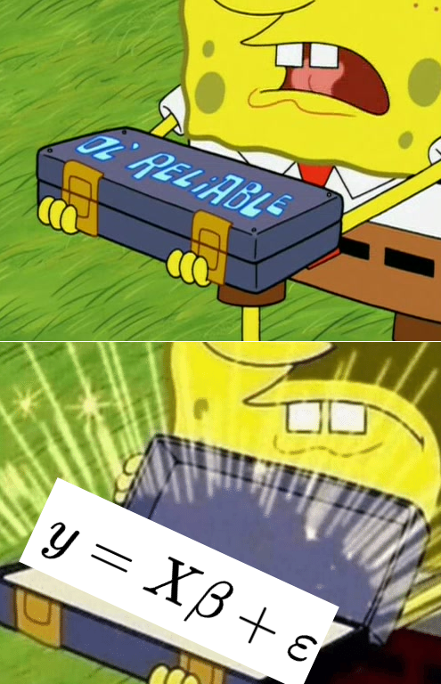

```{r setup, include=FALSE}
library(knitr)

default_source_hook <- knit_hooks$get('source')
default_output_hook <- knit_hooks$get('output')

knit_hooks$set(
  source = function(x, options) {
    paste0(
      "\n::: {.codebox data-latex=\"\"}\n\n",
      default_source_hook(x, options),
      "\n\n:::\n\n")
  }
)

knit_hooks$set(
  output = function(x, options) {
    paste0(
      "\n::: {.codebox data-latex=\"\"}\n\n",
      default_output_hook(x, options),
      "\n\n:::\n\n")
  }
)

knitr::opts_chunk$set(echo = TRUE)
```

# Introduction

## So far: linear models

\columnsbegin
\column{0.5\textwidth}
\begin{equation}
y_i = \textcolor{red}{\alpha + \sum \limits^p_{k=1} x_{ik}\beta} + \textcolor{blue}{\epsilon_i}
\end{equation}
\column{0.5\textwidth}
\center 


\columnsend


## So far: linear models

\columnsbegin
\column{0.7\textwidth}
\begin{equation}
y_i = \textcolor{red}{\alpha + x_i\beta} + \textcolor{blue}{\epsilon_i}
\end{equation}

- $y_i$ the data
- $\textcolor{red}{\alpha + x_i\beta}$ the systematic component: "linear predictor"
- $\textcolor{blue}{\epsilon_i}$ the random component: "error"

\column{0.3\textwidth}

\center 


\columnsend

## Key assumptions

\begin{itemize}
\item Linearity (straight line)
\item Independence of errors
\item Homoscedasticity (same variance for all errors)
\item Normality (distribution of errors)
\end{itemize}

**Real ecological data do not usually follow these assumptions**

\hfill \tiny and don't range $(-\infty,\infty)$

# GLMs

## Generalised linear models (GLMs)

GLMs as a framework were introduced by Nelder and Wedderburn (1972) uniting many different models. With a special focus on teaching statistics.

- Linear regression
- Logistic regression
- Probit regression
- Complementary log-log regression
- Log-linear regression
- Gamma regression

## Generalised linear models (2)

\columnsbegin
\column{0.5\textwidth}

GLMs extend the linear model framework
to address:

\begin{itemize}
\item Variance changes with the mean
\item Range of \textbf{y} is bounded
\end{itemize}
\column{0.5\textwidth}

{width=80%}

\columnsend
\textbf{The basis of many statistical models in Biology}

Many results are now asymptotic.\newline

## Components of a GLM

- \textcolor{red}{Systematic component: $\eta$}
- \textcolor{blue}{Random component: data/distribution)}
- The link function: connects these components
  - This is not a data transformation
- The variance function

**But no explicit error term**

## GLM Likelihood

- We still use MLE for estimation
- But now a different likelihood function (in EF for fixed $\phi$)

All GLMs can be formulated as:

\begin{equation}
\mathcal{L}(y_i;\Theta) = \text{exp}\{\frac{y_i\textcolor{red}{\eta_i}-b(\textcolor{red}{\eta_i})}{a(\phi)} + c(y_i,\phi)\}
\end{equation}

## Linear regression as GLM

Previously:
\begin{equation}
\mathcal{L}(y_i;\Theta) = \frac{1}{\sigma\sqrt{2\pi}}\exp\{-\frac{1}{2}\frac{(y_i-\textcolor{red}{\mu_i})^2}{\sigma^2}\}
\end{equation}

Now:

\begin{equation}
\mathcal{L}(y_i;\Theta) = \text{exp}\{\frac{y_i\textcolor{red}{\eta_i}-b(\textcolor{red}{\eta_i})}{a(\phi)} + c(y_i,\phi)\}
\end{equation}

- for some known functions $a(\cdot)$, $b(\cdot)$ and $c(\cdot)$
- for normal distribution: $\textcolor{red}{\eta_i = \mu_i}$, $a(\phi) = \sigma^2$, $b(\textcolor{red}{\eta_i}) = -\textcolor{red}{\mu}^2/2$, $c(y_i, \phi) = -\frac{1}{2}\{y^2/\sigma^2 + \log(2\pi\sigma^2)\}$

## The linear model

Writing the linear model:

\begin{equation}
y_i = \textcolor{red}{\alpha + \textbf{x}_i\symbf{\beta}} + \textcolor{blue}{\epsilon_i} \sim \mathcal{N}(0,\sigma^2)
\end{equation}

Is the same as:

\begin{equation}
\mathams{E}(y_i\vert \textbf{x}_i) = \alpha + \textbf{x}_i\symbf{\beta}
\end{equation}

as long as $\mathams{E}(\epsilon_i) = 0$.

## Generalised linear model

\begin{equation}
\begin{aligned}
 g\{\mathams{E}(y_i\vert x_i)\} &= \eta_i = \alpha + x_i\beta\\
 \mathams{E}(y_i\vert x_i) &= g^{-1}(\eta_i) = g^{-1}(\alpha + x_i\beta)
 \end{aligned}
\end{equation}

$\text{g}(\cdot)$ is the **link function**

## The link function

<!-- A smooth function with an inverse. -->

\columnsbegin
\column{0.5\textwidth}
- Is a smooth/monotone function
- Has an inverse $g^{-1}(\cdot)$
- Restricts the scale
- $\text{g}(\cdot)$ can be e.g.

\column{0.5\textwidth}

```{r, echo = FALSE, out.height="90%"}
x<-seq(binomial(link=logit)$linkinv(-5),binomial(link=logit)$linkinv(5),length.out=1000)
plot(x=binomial()$linkfun(x),x, cex.main = 5, cex.lab = 5, ylim = c(0,1), xlim = c(-5,5), type = "l", xlab=NA, ylab=NA, xaxt="n", yaxt="n")
abline(v=0,h=0,lty="dashed")
text(-3,.8,"Logit", cex=5)
```
\columnsend
\vspace*{-1.840\baselineskip}
\columnsbegin
\column{0.5\textwidth}

```{r, echo = FALSE, fig.align="center"}
x<-seq(poisson(link=log)$linkinv(-5),poisson(link=log)$linkinv(5),length.out=1000)
plot(x=poisson(link=log)$linkfun(x),x, cex.main = 5, xlim = c(-5,5), type = "l", xlab=NA, ylab=NA, xaxt="n", yaxt="n")
abline(v= 0, h = 0, lty="dashed")
text(-3,125,"Log", cex=5)
```

\column{0.5\textwidth}

```{r, echo = FALSE, fig.align="center"}
x<-seq(-5,5,length.out = 1000)
plot(x=x, 1/x, cex.main = 5, xlim =  c(-5,5),type = "l", xlab=NA, ylab=NA, xaxt="n", yaxt="n")
abline(v= 0, h = 0, lty="dashed")
text(-3,125,"Inverse", cex=5)
```

\columnsend

\vfill

## Variance function

Variance changes with the mean:

$$
\text{var}(y_i;\mu_i,\phi) = \frac{\partial^2g(\eta_i)}{\partial\eta_i^2} a(\phi)
$$

- $\phi$: the dispersion parameter, constant over observations
  - Fixed for some response distributions
- $a(\phi)$ is a function of the form $\phi/w_i$ \tiny (McCullagh and Nelder 1989)

## Assumptions

- No outliers
- Independence
- Correct distribution
- Correct link function
- Correct variance function (implied by previous two)

More on checking assumptions in GLMs tomorrow.

## Fitting GLMs

Unlike LMs, parameters in GLMs need to be estimated **iteratively**.

- More difficult to fit
- Requires numerical *optimisation*
- Susceptible to local convergence

## Popularisation of GLMs

Nelder and Wedderburn (1972) proposed GLMs as a class to unify different forms of regression.

- Linear regression
- Probit regression
- Logistic regression
- Log-linear regression
- Gamma regression
- Inverse Gaussian regression

McCullagh and Nelder (1989) wrote a book that popularised the class.

## Fitting GLMs

Easy and quick in \texttt{R}.

Mathematically more involved than LMs.

## Finding the maximum (from day 1)

```{r, echo = FALSE}
set.seed(12345)
p.orchid = 0.4
n.picks = 100
n.times <- 50
y <- rbinom(n.times, size = n.picks, prob = p.orchid) # Collecting data
```


```{r, cache = TRUE, echo = FALSE, fig.height = 6}
par(mfrow=c(2,2))
ll <- function(p, n.picks, y)sum(dbinom(y, n.picks,p, log = TRUE))
phat <- seq(0.35,0.45,length.out=1000)
lls <- sapply(phat, ll, n.picks = n.picks, y = y)
grad.dbinom=function(y, n.picks, prob) {
    sum(y/prob - (n.picks - y)/(1-prob))
}

p = c(0.36,0.38,0.40, 0.42)
for(i in p){
b<-grad.dbinom(y,n.picks,i)
a<--b*i+ll(i,n.picks,y)
pphat <- phat[order(abs(phat-i),decreasing=FALSE)[1:200]]
plot(lls, x = phat, type = "l", xlab=expression(hat(pi)), ylab="log-Likelihood", lty = "dashed",main = i)
segments(x0=i,x1 = i, y0=ll(0.1,n.picks,y), y1= ll(i,n.picks,y), col="red", lty = "dotted")
lines(x=pphat,y=a+b*pphat, col = "red")
}
```

We need a good algorithm to find the maximum!

## Finding the maximum: GLMs

$$\Theta^{t+1} = \Theta^t + {\frac{\partial^2\log\{\mathcal{L}(\textbf{y}_i;\Theta^t)\}}{\partial\Theta\partial\Theta^\top}}^{-1}\frac{\partial\mathcal{L}(\textbf{y}_i;\Theta^t)}{\partial\Theta}$$

- (Newton-Rhapson) Can get quite expensive to evaluate.
- Nelder and Wedderburn (1972) instead suggested an algorithm that fits a LM repeatedly.

## Iteratively reweighted least squares (IRLs)

1) Start at some (decent) point (e.g., $\hat{\symbf{\eta}} = \textbf{y} + \symbf{\epsilon}$) \tiny (Wood 2017) \normalsize
2) Set $\textbf{z}^t = \symbf{\eta} + \frac{\partial \hat{\symbf{\eta}}}{\partial g^{-1}(\hat{\symbf{\eta}})}\{\textbf{y} - g^{-1}(\hat{\symbf{\eta}})\}/a(g^{-1}(\hat{\symbf{\eta}}))$
3) weight with $\textbf{w} = a(g^{-1}(\hat{\symbf{\eta}}))/\{\frac{\partial \hat{\symbf{\eta}}}{\partial g^{-1}(\hat{\symbf{\eta}})}^2\text{var}(\textbf{y}_i)\}$
4) Fit weighted LM with $\symbf{z}$ as pseudodata and $\textbf{w}$ as weights
5) Repeat until convergence

\hfill \tiny(details omitted) \normalsize
\center
\textbf{And that is the day researchers started liking GLMs.}

## Iteratively reweighted least squares (IRLs)

Prevents having to do numerical optimisation.

## The end?

\center 


## Why is stuff this important?

1) A basic (mathematical) understanding helps apply methods correctly.
2) GLMs may not always converge to the MLE. Then, you will get warnings/errors.
3) If you understand them, you might know what to do!
Similar problems in a lot of more complex models (e.g., GLMMs).

<!-- ## Some examples! \tiny (details later) -->

<!-- \center -->
<!-- {width=50%} -->

## Often used GLMs in ecology

- Binomial: occurrence/counts. Presence of species, number of germinated seeds out of a total
- Poisson: counts. Number of fish caught
- Negative binomial (fixed dispersion): counts. Overdispersed fish. 
- Gamma: (positive) continuous. Body size
- Ordinal (cumulative link). Plant cover classes

## Binomial: 

## in R

- Similar to the lm() function!
- Now the glm() function

A linear regression:
\footnotesize
```{r, echo = TRUE, eval = FALSE}
model <- glm(y ~ x, family = gaussian(link = identity), data = data)
```
\normalsize

A glm:
\footnotesize
```{r, echo = TRUE, eval = FALSE}
model <- glm(y ~ x, family = poisson(link = log), data = data)
```
\normalsize

## Output

\footnotesize
```{r echo= FALSE, eval = TRUE, warning=FALSE}
set.seed(12345)
beta <- rnorm(2)
X <- rnorm(20)
y <- rpois(20, exp(beta[1]+X*beta[2]))
summary(glm(y~X, family = "poisson"))
```

\normalsize

## Back-transformation

- Confidence intervals can be back-transformed to the response scale
  - as long as we have "monotonicity" of the link function
- Standard errors cannot be back-transformed!

## Prediction

\begin{equation}
\hat{mu}_i = g^{-1}(\alpha + \textbf{x}_i\symbf{\beta})
\end{equation}

```{r, eval = FALSE}
predict(model, type = "response")#Type = link alternatively
```

### Newdata

```{r, eval = FALSE}
predict(model, newdata = X, type = "response")#Type = link alternatively
```

## Intervals for $\hat{\mu_i}$

- Confidence intervals
- Prediction intervals

\textbf{More on predicting tomorrow in the practical}

# Deviance

- LMs used RSS to quantify fit
- GLMs use deviance to quantify **lack of fit**
- Deviance $D(\textbf{y};\hat{\symbf{\mu}})$ is different for every GLM.

Normal: $\sum \limits^n_{i=1}(y_i-\hat{\mu_i})^2$
Poisson: $2\sum \limits^n_{i=1} y_i\log(y_i/\hat{\mu}_i)-y_i+\hat{\mu}_i)$
binomial: $2\sum \limits^n_{i=1} y_i\log(y_i/\hat{\mu}_i)+(N-y_i)\log\{(N-y_i)/(N-y_i)\}$
gamma: $2\sum \limits^n_{i=1} -\log\{y_i/\hat{\mu}_i\}+(y_i-\hat{\mu_i})/\hat{\mu_i}$

and so on.

# Deviance

- Measures (twice) difference to a model that perfectly fits the data ("saturated model")
  - equal to RSS for linear regression
- Can be used for hypothesis testing, calculate $R^2_{deviance}$, and "deviance residuals"

## Asymptotic requirements

- Binomial responses: $N\pi\geq3$ and $N(1-\pi)\geq3$
  - Deviance for $N=1$ has no concept of residual variability
- Poisson responses: $\lambda \geq 3$
- Gamma distribution: $\phi\leq3$

\hfill \footnotesize (Dunn and Smyth 2021)

<!-- ## Poisson deviance -->

<!-- For example, for Poisson: -->

<!-- \begin{equation} -->
<!-- D(\textbf{y};\hat{\symbf{\mu}}) = 2\sum \limits^n_{i=1} y_i\log(y_i/exp(\hat{\eta_i})-y_i+exp(\hat{\eta_i})) -->
<!-- \end{equation} -->

## Residuals

- GLMs lack an explicit error term, but it is there!
- So we can still check assumptions by residuals, though they are differently defined
- There are different types; Pearson, Deviance, Anscombe, Quantile residuals..
- We usually -hope- that they are approximately normally distributed
- Residual checking in GLMs can be difficult

(omitted details)

## Some resources

McCullagh and Nelder
Dunn and Smyth
Wood

more friendly
- dunn and smyth (because in R)
- free book john fieberg
- zuur

# Recap

- Remember to bring all components together
- Parameter estimates, uncertainty, multiple predictors, interaction,  model selection
- GLMs for when assumptions of LMs fail (which is very often)
- We covered components of GLMs here
- And how they are fitted in R
- Deviance and residuals