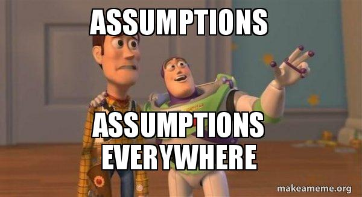

```{r setup, include=FALSE}
library(knitr)

default_source_hook <- knit_hooks$get('source')
default_output_hook <- knit_hooks$get('output')

knit_hooks$set(
  source = function(x, options) {
    paste0(
      "\n::: {.codebox data-latex=\"\"}\n\n",
      default_source_hook(x, options),
      "\n\n:::\n\n")
  }
)

knit_hooks$set(
  output = function(x, options) {
    paste0(
      "\n::: {.codebox data-latex=\"\"}\n\n",
      default_output_hook(x, options),
      "\n\n:::\n\n")
  }
)

knitr::opts_chunk$set(echo = TRUE)
```

# Introduction

## Outline

- Normal distribution
- Linear models
- Assumption violation

## Recap

Recall:

$$y_i = \textcolor{red}{\alpha + \textbf{x}_i\symbf{\beta}} + \textcolor{blue}{\epsilon_i} \sim \mathcal{N}(0,\sigma^2)$$

- \textcolor{red}{the systematic component}: the regression line
- \textcolor{blue}{the random component}: left-over stuff

# Assumptions

## Models make assumptions

Our models make assumptions. Sometimes, these are realistic.

*All models are wrong, but some are useful*

Is is important to:

- Know which assumptions your model makes
- Consider if they are realistic
- Determine if they are violated
- Assess the consequences

**Tests make assumptions too**, but more on that later

## Linear regression assumptions

$$y_i = \alpha + \sum \limits^p_{k=1}x_{ik}\beta_k + \epsilon_i\sim \mathcal{N}(0,\sigma^2)$$

- Linearity
- Normality: normally distributed errors
- Homoscedastcity: same variance for all errors
- Independence of errors
- Lack of perfect multicollinearity ($\textbf{x}_1 \neq \textbf{x}_2$)
- No outliers
- No error in the explanatory variables

## Violating assumptions

\columnsbegin
\column{0.5\textwidth}

- Linearity: Eek
- Normality: cannot trust tests and confidence intervals
- Homoscedasticity: cannot trust tests and confidence intervals
- Independence of errors: Eek
- Lack of perfect multicollinearity
- No outliers: biased parameter estimates

\column{0.5\textwidth}



\columnsend

# Model diagnostics

## Assumption checking: methods

\columnsbegin
\column{0.6\textwidth}
\footnotesize
Tests:

- Score test for non-constant error variance `car::ncvTest`
- Durbin-Watson test for Autocorrelated errors `car::durbinWatsonTest`
- Bonferroni outlier test `car::outlierTest` 
- Shapiro-Wilk normality test `shapiro.est`

Rather: **Residual plots**

- `plot(model)`
- Various packages (e.g., `car` or `DHARMa`)

\column{0.4\textwidth}


\columnsend

## Errors vs. Residuals

The true model:

$$y_i = \alpha + \sum \limits^p_{k=1}x_{ik}\beta_k + \epsilon_i\sim \mathcal{N}(0,\sigma^2)$$

The fitted model:
\vspace*{-\baselineskip}

$$y_i = \hat{\alpha} + \sum \limits^p_{k=1}x_{ik}\hat{\beta}_k + \hat{\epsilon}_i$$

- $\epsilon_i = y_i - \alpha - \sum \limits^n_{i=1}x_{ik}\beta$
- $\hat{\epsilon}_i = y_i - \hat{\alpha} - \sum \limits^n_{i=1}x_{ik}\hat{\beta}$

Residuals are the **observed** deviation from the regression line.

## In \texttt{R}

```{r,eval=FALSE}
model <- lm(y~x)
residuals(model) # estimated random part
fitted(model) # estimated systematic part
```


## Residual plots

Residual plots should have no discernible patterns.

- No curvature
- No shapes whatsoever
- No outliers
- No change in variance

\center

**This can be difficult with few observations.**

## Standardised residuals


\begin{equation}
\frac{\hat{\textcolor{orange}{\epsilon_i}}}{s\sqrt{1-h_i}}, \qquad \text{where } h_i \text{ is "influence"}
\end{equation}

## Studentized residuals

- omit observation $i$
- re-compute residual variance
- calculate standardised residual (with hat matrix)

`rstand` or `rstudent`

## Introducing: Anscombe's quartet

```{r, echo = FALSE, fig.height = 6}
par(mfrow=c(2, 2))
data("anscombe")
plot(y1~x1, data = anscombe)
model1 <- lm(y1~x1, data = anscombe)
abline(model1, col = "red")
plot(y2~x2, data = anscombe)
model2 <- lm(y2~x2, data = anscombe)
abline(model2, col = "red")
plot(y3~x3, data = anscombe)
model3 <- lm(y3~x3, data = anscombe)
abline(model3, col = "red")
plot(y4~x4, data = anscombe)
model4 <- lm(y4~x4, data = anscombe)
abline(model4, col = "red")
```

**All of these regressions have the same parameter estimates**

## Anscombe's quartet: adding residuals

```{r, echo = FALSE, fig.height = 6}
par(mfrow=c(2, 2))
plot(y1~x1, data = anscombe)
model1 <- lm(y1~x1, data = anscombe)
abline(model1, col = "red")
segments(x0 = anscombe$x1, x1 = anscombe$x1, y0= predict(model1), y1=anscombe$y1, col = "blue")
plot(y2~x2, data = anscombe)
model2 <- lm(y2~x2, data = anscombe)
abline(model2, col = "red")
segments(x0 = anscombe$x2, x1 = anscombe$x2, y0= predict(model2), y1=anscombe$y2, col = "blue")
plot(y3~x3, data = anscombe)
model3 <- lm(y3~x3, data = anscombe)
abline(model3, col = "red")
segments(x0 = anscombe$x3, x1 = anscombe$x3, y0= predict(model3), y1=anscombe$y3, col = "blue")
plot(y4~x4, data = anscombe)
model4 <- lm(y4~x4, data = anscombe)
abline(model4, col = "red")
segments(x0 = anscombe$x4, x1 = anscombe$x4, y0= predict(model4), y1=anscombe$y4, col = "blue")
```

## Our toolbox

- Residuals versus fitted: $\hat{\epsilon}_i \ vs.\ \hat{\mu}_i$
- Observed versus theoretical quantiles: $Pr(X \leq y_i) \ vs.\ Pr(X\leq x)$
- Cook's distance plot: $\hat{\epsilon}_i \ vs.\ \hat{\mu}_i$
- Standardized residuals vs. fitted (Scale-location)
- Leverage and influence

## Leverage: hat matrix

$$\hat{\mu}_i = \hat{\alpha} - \sum \limits^n_{i=1}x_{ik}\hat{\beta}$$
but we can also write:

$\hat{\boldsymbol{\mu}} = \textbf{H}\textbf{y}$

- $\textbf{H}$ is the "hat" matrix
- $\textbf{H} = \textbf{X}(\textbf{X}^\top\textbf{X})^{-1}\textbf{X}^\top\textbf{y}$
- Its diagonal gives "leverage" and is between 0 and 1
- Leverage: observation that is far from others on the explanatory variable

## Influence


```{r, echo = FALSE, fig.align = "center", fig.height = 5}
plot(y3~x3, data = anscombe)
model3 <- lm(y3~x3, data = anscombe)
abline(model3, col = "red")
```

An observation that has undue impact on the regression line.

## Outliers

\columnsbegin
\column{0.5\textwidth}

```{r, echo = FALSE, fig.align = "center"}
plot(y3~x3, data = anscombe)
model3 <- lm(y3~x3, data = anscombe)
abline(model3, col = "red")
```

\column{0.5\textwidth}

- Outliers are observations far away from the regression line
- Can be erroneous
- Might be real data
- Remove with caution
- Better: sensitivity analysis

\columnsend

## Cook's distance

Cook's distance: how much the fitted values change if we remove an observation

$$
D_j = \frac{\sum_{i=1}^{n} (\hat{y}_i - \hat{y}_{i(-j)})^2}{\sigma^2}
$$

- $\hat{y}_i$ - prediction
- $\hat{y}_{i(-j)}$ - prediction for model with data point $j$ removed
- $\sigma^2$ - residual variance

## What is influential?

Large values of $D_i$ mean a large influence \newline

Usually $D_i$ > 1, or 4/$n$

```{r AnscombeData3CooksD, fig.height=5, echo=FALSE}
plot(model3, which = 4)
```

## Anscombe's quartet: residuals vs. fitted

```{r, echo = FALSE, fig.height = 6.5}
par(mfrow=c(2, 2))
plot(residuals(model1)~fitted(model1))
plot(residuals(model2)~fitted(model2))
plot(residuals(model3)~fitted(model3))
plot(residuals(model4)~fitted(model4))
```

\center

**What do you see?**

## Anscombe's quartet: residuals vs. fitted

```{r, eval=T,echo=F, out.width="40%", fig.align="center", fig.show="hold", warning=F, message=F}
par(mar=c(5,5,4,2))
mod <- lm(y1~x1,data=anscombe)
plot(residuals.lm(mod)~fitted(mod), data = anscombe, col="red", cex.lab=2, cex=2, cex.main=2, main="linear", pch=16, xlab="Fitted", ylab="Residuals")
text(5.7,1.2,"Good", cex=6,col="green")

lines(loess.smooth(y=residuals.lm(mod),x=fitted(mod)),col="red", lty="dashed", lwd=4)

mod <- lm(y2~x2,data=anscombe)
plot(residuals.lm(mod)~fitted(mod), data = anscombe, col="red", cex.lab=2, cex=2, cex.main=2, main="non-linear", pch=16, xlab="Fitted", ylab="Residuals")
lines(loess.smooth(y=residuals.lm(mod),x=fitted(mod)),col="red", lty="dashed", lwd=4)
text(5.5,0.7,"Bad", cex=6,col="red")

mod <- lm(y3~x3,data=anscombe)
plot(residuals.lm(mod)~fitted(mod), data = anscombe, col="red", cex.lab=2, cex=2, cex.main=2, main="outlier", pch=16, xlab="Fitted", ylab="Residuals")
lines(loess.smooth(y=residuals.lm(mod),x=fitted(mod)),col="red", lty="dashed", lwd=4)
text(5.5,2.5,"Bad", cex=6,col="red")

mod <- lm(y4~x4,data=anscombe)
plot(residuals.lm(mod)~fitted(mod), data = anscombe, col="red", cex.lab=2, cex=2, cex.main=2, main="outlier", pch=16, xlab="Fitted", ylab="Residuals")
lines(loess.smooth(y=residuals.lm(mod),x=fitted(mod)),col="red", lty="dashed", lwd=4)
text(7.5,1.3,"Bad", cex=6,col="red")

```

## Residual diagnostics: normality with QQ-plot

\columnsbegin
\column{0.5\textwidth}

```{r resid1a, eval=T, echo=F, out.width='\\linewidth', fig.align="center", fig.show="hold", fig.height=5}
par(mar=c(5,5,4,2))

n <- 200;alpha <- 0.5;beta <- -1
x <- rgamma(n = n, shape = 1)
mu <- alpha + beta*x
y <- rnorm(n = n, mean = mu)
mod <- lm(y~x)

plot(sort(residuals.lm(mod)),x=qnorm(ppoints(n)), cex.lab=2, cex.axis=2, cex.lab=2, cex=2, cex.main=2, ylab="", xlab="Theoretical quantiles", main="Normal Q-Q")
text(-1,2,"Good", cex=6,col="green")

abline(lm(quantile(residuals.lm(mod),c(0.25,0.75))~qnorm(c(0.25,0.75))), lwd=4,lty="dashed")
```

```{r resid1b, eval=T, echo=F, out.width='\\linewidth', fig.align="center", fig.show="hold", fig.height=5}
par(mar=c(5,5,4,2))

n <- 200;alpha <- 0.5;beta <- -1
x <- rgamma(n = n, shape = 1)
mu <- alpha + beta*x
y <- rlnorm(n = n, meanlog = mu, sdlog = 1)
mod <- lm(y~x)

plot(sort(residuals.lm(mod)),x=qnorm(ppoints(n)), cex.lab=2, cex.axis=2, cex.lab=2, cex=2, cex.main=2, ylab="", xlab="Theoretical quantiles", main="Normal Q-Q")
text(-1,8,"Bad", cex=6,col="red")

abline(lm(quantile(residuals.lm(mod),c(0.25,0.75))~qnorm(c(0.25,0.75))), lwd=4,lty="dashed")
```

\column{0.5\textwidth}

\begin{enumerate}
\item compare residuals to theoretical quantiles
\item points should follow the line
\end{enumerate}
\columnsend


## Residual diagnostics: constant variance

\begin{columns}
\column{0.50\textwidth}

```{r eval=T, echo=F, out.width='\\linewidth', fig.align="center", fig.show="hold", fig.height=6}
par(mar=c(5,5,4,2))

n <- 200;alpha <- 0.5;beta <- -1
x <- rnorm(n = n)
mu <- alpha + beta*x
y <- mu + rnorm(n)
mod <- lm(y~x)

plot(residuals.lm(mod)~fitted(mod), col="red", cex.lab=2, cex=2, cex.main=2, main="", pch=16, xlab="Fitted", ylab="Residuals")
text(-1,2,"Good", cex=6,col="green")
```

```{r eval=T, echo=F, out.width='\\linewidth', fig.align="center", fig.show="hold", fig.height=6}
par(mar=c(5,5,4,2))


n <- 200;alpha <- 0.5;beta <- -1
x <- rnorm(n = n)
mu <- alpha + beta*x
y <- mu + rnorm(n)*x^2
mod <- lm(y~x)

plot(residuals.lm(mod)~fitted(mod), col="red", cex.lab=2, cex=2, cex.main=2, main="", pch=16, xlab="Fitted", ylab="Residuals")
text(-1,6,"Bad", cex=6,col="red")
```

\column{0.50\textwidth}

\begin{enumerate}
\item compare residuals to fitted
\item points should be randomly distributed
\end{enumerate}
\end{columns}

# Improvements

## Addressing assumption violations

- Curvature? Add quadratic term
- Outlier? Sensitivity analysis (if not error)
- Normality? GLM
- Constant variance? GLM

**Alternative: data transformation**


## Data transformation

\begin{equation}
\mathams{E}\{\text{h}(y_i)\vert x_i\} = \alpha + \beta x_i
\end{equation}

- $\text{h}(\cdot)$ data transformation (e.g. $\sqrt(\cdot)$ or $\text{log}(\cdot)$)
- To stabilize variance
- To normalize residuals

\pause

Not the same as

\begin{equation}
\text{h}(\mathams{E}\{y_i\vert x_i\}) = \alpha + \beta x_i
\end{equation}

\center

**Use a Generalised linear model instead**

# Summary

Now we have a valid model \newline
We still need to check **how** good it is (more on that tomorrow)
