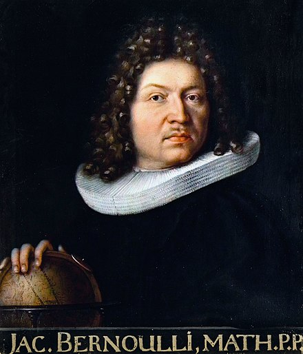
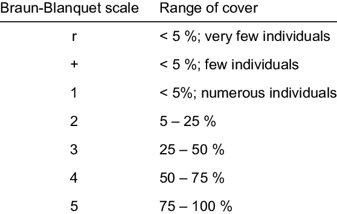

```{r setup, include=FALSE}
library(knitr)

default_source_hook <- knit_hooks$get('source')
default_output_hook <- knit_hooks$get('output')

knit_hooks$set(
  source = function(x, options) {
    paste0(
      "\n::: {.codebox data-latex=\"\"}\n\n",
      default_source_hook(x, options),
      "\n\n:::\n\n")
  }
)

knit_hooks$set(
  output = function(x, options) {
    paste0(
      "\n::: {.codebox data-latex=\"\"}\n\n",
      default_output_hook(x, options),
      "\n\n:::\n\n")
  }
)

knitr::opts_chunk$set(echo = TRUE)
```
# Outline

- Binomial regression
- Model comparison
- P-values
- $R^2$
- Q & A

## Questions about yesterday?

\center

{width=40%}

# Recap

Generalised linear models are a unifying class
\begin{itemize}
\item They have many things in common
\item Two key components: the distribution and the link function
  \item They link the sytematic and the random components
\end{itemize}
  
\begin{equation}
 g\{\text{E}(y_i\vert x_i)\} = \alpha + x_i\beta
\end{equation}

## Link function

- $\text{g}(\cdot)$ the link function, can be e.g.,:
  - identity (linear regression)
  - log
  - logit
  - probit
  - inverse
  - many more

\textbf{Makes sure that the mean is on the right scale (e.g., positive only, or between 0 and 1)}

# Binomial GLMs

## The binomial GLM

\textbf{Data}: $r$ the number of successes in $N$ trials\newline
\textbf{Parameters}: probability $p$ (now: $\pi_i$)\newline
\textbf{Goal}: estimate $\pi_i$ for each observation



## Binomial GLM use

- When a linear regression is not appropriate :)
- For binary data or counts of successes/failures 

### In ecology

- Predicting species' distributions
- Number of germinated plant seeds
- Prevalence of disease in a population
- Probability of observing a behavior
- Proportion of orchids \emoji{upside-down-face}

## Is binomial regression really a GLM?

\begin{equation}
\mathcal{L}(y_i;\Theta) = \text{exp}\biggl\{\textcolor{orange}{\log\binom{N}{r}} + \frac{\frac{r}{N}\textcolor{blue}{\log(\frac{\pi_i}{1-\pi_i})}+\textcolor{red}{\log(1-\pi_i)}}{\textcolor{pink}{1/N}}\biggr\}
\end{equation}

All GLMs can be formulated as:

\begin{equation}
\mathcal{L}(y_i;\Theta) = \text{exp}\{\frac{y_i\textcolor{blue}{\eta_i}-\textcolor{red}{b(\eta_i)}}{\textcolor{pink}{a(\phi)}} +\textcolor{orange}{c(y_i,\phi)}\}
\end{equation}

- for some known functions $\textcolor{pink}{a(\cdot)}$, $\textcolor{red}{b(\cdot)}$ and $\textcolor{orange}{c(\cdot)}$
- for binomial distribution: $\textcolor{blue}{\eta_i = \log(\frac{\pi_i}{1-\pi_i})}$, $\textcolor{pink}{a(\phi) = 1/N}$, $\textcolor{red}{b(\eta_i) = -\log(1-\pi_i)}$, $\textcolor{orange}{c(y_i, \phi) = \log\binom{N}{r}}$
- canonical link

## Bernoulli

- $r \in \{0,1\}$: Bernoulli (presence-absence)
- $N = 1$

\begin{equation}
\mathcal{L}(y_i;\Theta) = \text{exp}\biggl\{\log(1) + \frac{r\textcolor{blue}{\log(\frac{\pi_i}{1-\pi_i})}+\textcolor{red}{\log(1-\pi_i)}}{1}\biggr\}
\end{equation}

All GLMs can be formulated as:

\begin{equation}
\mathcal{L}(y_i;\Theta) = \text{exp}\{\frac{y_i\textcolor{blue}{\eta_i}-\textcolor{red}{b(\eta_i)}}{\textcolor{pink}{a(\phi)}} +\textcolor{orange}{c(y_i,\phi)}\}
\end{equation}

- for some known functions $\textcolor{pink}{a(\cdot)}$, $\textcolor{red}{b(\cdot)}$ and $\textcolor{orange}{c(\cdot)}$
- for Bernoulli distribution: $\textcolor{blue}{\eta_i = \log(\frac{\pi_i}{1-\pi_i})}$, $\textcolor{pink}{a(\phi) = 1}$, $\textcolor{red}{b(\eta_i) = -\log(1-\pi_i)}$, $\textcolor{orange}{c(y_i, \phi) = \log(1)} = 0$
- canonical link

## The binomial GLM

Link functions:

\begin{itemize}
\item Logit: $\log(\frac{\pi_i}{1-\pi_i})$ and inverse $\frac{\exp(\eta_i)}{1+\exp(\eta_i)}$ - \textit{the canonical link}
\item Probit: $\Phi^{-1}(\pi_i)$ and inverse  $\Phi(\eta_i)$
\item Complementary log-log: $\log(-\log(1-\pi_i)$ and inverse $1-\exp(-\exp(\eta_i))$
\item \sout{Log-log}
\end{itemize}

- Logit is canonical and easier to interpret
- Probit is sometimes easier mathematically than Logit
- Complementary log-log for counts

## Binomial link functions

Each is a little different, but all translate from $(0,1)$ to $(-\infty, \infty)$

```{r, fig.show="hold", echo = FALSE, out.width = "40%", out.height="40%", fig.align="center"}
x<-seq(binomial(link=logit)$linkinv(-5),binomial(link=logit)$linkinv(5),length.out=1000)
plot(x=binomial()$linkfun(x),x, main = "Logit", cex.main = 5, cex.axis = 5, ylim = c(0,1), xlim = c(-5,5), type = "l", xlab=NA, ylab=NA)
abline(v= 0, h = 0, lty="dashed")
x<-seq(binomial(link=probit)$linkinv(-5),binomial(link=probit)$linkinv(5),length.out=1000)
plot(x=binomial(link=probit)$linkfun(x),x, main = "Probit", cex.main = 5, cex.axis = 5, ylim = c(0,1), xlim = c(-5,5), type = "l", xlab=NA, ylab=NA)
abline(v= 0, h = 0, lty="dashed")
x<-seq(binomial(link=cloglog)$linkinv(-5),binomial(link=cloglog)$linkinv(5),length.out=10000)
plot(x=binomial(link=cloglog)$linkfun(x),x, main = "Complementary log-log", cex.main = 5, cex.axis = 5, ylim = c(0,1), xlim = c(-5,5), type = "l", xlab=NA, ylab=NA)
abline(v= 0, h = 0, lty="dashed")
x<-seq(from=exp(-exp(-5)),to=exp(-exp(5)),length.out=1000)
plot(x=-log(-log(x)),x, main = "Log-log", cex.main = 5, cex.axis = 5, ylim = c(0,1), xlim = c(-5,5), type = "l", xlab=NA, ylab=NA)
abline(v= 0, h = 0, lty="dashed")
```

## Binomial link functions (2)

```{r, echo = FALSE}
x<-seq(binomial(link=logit)$linkinv(-5),binomial(link=logit)$linkinv(5),length.out=1000)
plot(binomial(link=logit)$linkfun(x),x, xlab = expression(eta[i]), ylab = expression(pi[i]), type="l")
x<-seq(binomial(link=probit)$linkinv(-5),binomial(link=probit)$linkinv(5),length.out=1000)
lines(binomial(link=probit)$linkfun(x),x, lty="dashed")
x<-seq(binomial(link=cloglog)$linkinv(-5),binomial(link=cloglog)$linkinv(5),length.out=1000)
lines(binomial(link=cloglog)$linkfun(x),x, lty="dotted")
x<-seq(from=exp(-exp(5)),to=exp(-exp(-5)),length.out=1000)
lines(-log(-log(x)),x, lty=4)
abline(v= 0, lty="dashed")
legend("bottomright", lty=c(1,2,3,4), legend = c("Logit","Probit", "Complementary log-log", "Log-log"))
```

<!-- - Cloglog is asymmetrical -->

## Binomial link functions (2)

```{r, echo = FALSE}
x<-seq(binomial(link=logit)$linkinv(-5),binomial(link=logit)$linkinv(5),length.out=1000)
plot(binomial(link=logit)$linkfun(x),x, xlab = expression(eta[i]), ylab = expression(pi[i]), type="l")
x<-seq(binomial(link=probit)$linkinv(-5),binomial(link=probit)$linkinv(5),length.out=1000)
lines(binomial(link=probit)$linkfun(x),x, lty="dashed")
x<-seq(binomial(link=cloglog)$linkinv(-5),binomial(link=cloglog)$linkinv(5),length.out=1000)
lines(binomial(link=cloglog)$linkfun(x),x, lty="dotted")
legend("bottomright", lty=c(1,2,3), legend = c("Logit","Probit", "Complementary log-log"))
lines(x = c(-2, -2), y=c(0, binomial(link=logit)$linkinv(-2)),col="red")
lines(x = c(-2, -6), y=c(binomial(link=logit)$linkinv(-2),binomial(link=logit)$linkinv(-2)),col="red")
lines(x = c(-2, -6), y=c(binomial(link=probit)$linkinv(-2),binomial(link=probit)$linkinv(-2)),col="red", lty="dashed")
lines(x = c(-2, -6), y=c(binomial(link=cloglog)$linkinv(-2),binomial(link=cloglog)$linkinv(-2)),col="red", lty="dotted")

lines(x = c(0, 0), y=c(0, binomial(link=logit)$linkinv(0)),col="red")
lines(x = c(0, 0), y=c(0, binomial(link=cloglog)$linkinv(0)),col="red", lty="dotted")
lines(x = c(0, -6), y=c(binomial(link=logit)$linkinv(0),binomial(link=logit)$linkinv(0)),col="red")
lines(x = c(0, -6), y=c(binomial(link=probit)$linkinv(0),binomial(link=probit)$linkinv(0)),col="red", lty="dashed")
lines(x = c(0, -6), y=c(binomial(link=cloglog)$linkinv(0),binomial(link=cloglog)$linkinv(0)),col="red", lty="dotted")

lines(x = c(2, 2), y=c(0, binomial(link=logit)$linkinv(2)),col="red")
lines(x = c(2, 2), y=c(0, binomial(link=probit)$linkinv(2)),col="red", lty="dashed")
lines(x = c(2, 2), y=c(0, binomial(link=cloglog)$linkinv(2)),col="red", lty="dotted")
lines(x = c(2, -6), y=c(binomial(link=logit)$linkinv(2),binomial(link=logit)$linkinv(2)),col="red")
lines(x = c(2, -6), y=c(binomial(link=probit)$linkinv(2),binomial(link=probit)$linkinv(2)),col="red", lty="dashed")
lines(x = c(2, -6), y=c(binomial(link=cloglog)$linkinv(2),binomial(link=cloglog)$linkinv(2)),col="red", lty="dotted")
```

<!-- - Cloglog is asymmetrical -->

## Binomial link functions: logit

\begin{equation}
\begin{aligned}
\text{pr}(y_i = 1) = \pi_i &= \frac{\exp(\eta_i)}{1+\exp(\eta_i)}\\
\log(\frac{\pi_i}{1-\pi_i}) = \eta_i &= \textbf{x}_i\symbf{\beta}
\end{aligned}
\end{equation}

- $\eta$ is the log odds
- Odds ratio: $\frac{\pi_i}{1-\pi_i} = \exp(\eta_i)$
  - E.g., horse races: 10:1 (for every 1 dollar spent, you get 10 if won)
  - I.e., you think that horse 1 is 10 times more likely to win than horse 2
- $\text{pr}(y_i = 0) = 1-\pi$

## Binomial link functions: probit

\columnsbegin
\column{0.5\textwidth}
\begin{equation}
\begin{aligned}
\pi_i &= \Phi(\eta_i)\\
\eta_i &= \textbf{x}_i\symbf{\beta}\\
\eta^\star_i &= \textbf{x}_i\symbf{\beta} + \epsilon_i\sim\mathcal{N}(0,1)
\end{aligned}
\end{equation}
\begin{equation}
y_i =
\begin{cases}
1, & \text{if}\ \eta^\star_i>0\\
0, & \text{otherwise}\\
\end{cases}
\end{equation}
\column{0.5\textwidth}
```{r, echo = FALSE}
eta = -1
x <- seq(-5,5,length.out=1000)
plot(y=dnorm(x),x,type="l", ylab = "dnorm(x)", xaxt="n")
polygon(c(x[x<eta],rev(x[x<eta])),c(rep(0,sum(x<eta)),rev(dnorm(x[x<eta]))), col = "red")
axis(1, at = c(-4,-2,-1,0,2,4), labels = c(-4,-2,expression(eta[i]==-1),0,2,4))
```
\columnsend

\vspace{2\baselineskip}
\centering
**if $\eta^\star_i$ is positive, we have 1 and 0 if it is negative**

## Binomial: Logit LVM

\begin{equation}
\begin{aligned}
\pi_i &= \frac{\exp(\eta_i)}{1+\exp(\eta_i)}\\
\eta_i &= \textbf{x}_i\symbf{\beta}\\
\eta^\star_i &= \textbf{x}_i\symbf{\beta} + \epsilon_i\sim\mathcal{Logistic}(0,1)
\end{aligned}
\end{equation}
\begin{equation}
y_i =
\begin{cases}
1, & \text{if}\ \eta^\star_i>0\\
0, & \text{otherwise}\\
\end{cases}
\end{equation}

## Binomial link functions: complementary log-log

\begin{equation}
\begin{aligned}
\log(\lambda_i) &= \log(-\log(1-\pi_i))\\
\lambda_i &= -\log(1-\pi_i) = \exp(\eta_i)
\end{aligned}
\end{equation}

- Has a link to count data
  - Just look at the Poisson likelihood! **Thursday**
- When binary data are really counts
- Probability to get a count larger than 0
- [Can also be interpreted as LVM (reverse extreme value distribution)](https://grodri.github.io/glms/notes/c3s7)

<!--hazaard ratios-->

## Cumulative link

Suppose you have ordered data:

{width=75%}

Cumulative link functions facilitate this kind of response by introducing **order**. **More on Thursday**.

\textbf{More on Friday}

# Example

## Example: Lizard habitat preference

- Data originally by Schoener (1970)
- Counts of two species of lizard in Jamaica

\columnsbegin
\column{0.5\textwidth}

{width=80%}

\column{0.5\textwidth}

{width=60%}

\columnsend

## Lizards: the data

\center
Dataset also covered in McCullagh and Nelder (1989)

\tiny
```{r, echo  =FALSE, message=FALSE, warning=FALSE}
data(lizards, package="aods3")
lizards <- lizards[-11, ]# remove siites without any lizards
knitr::kable(lizards, format="latex", booktabs = T)
```
\normalsize

## Lizards: visually inspect the data

```{r, echo = FALSE, fig.height = 6}
par(mfrow=c(1,2))
plot(lizards$grahami, x=lizards$Time, ylab = "Observed grahami lizards", xlab="Time")
plot(lizards$grahami, x=lizards$Site, ylab = "Observed grahami lizards", xlab="Site")
```

What can we tell about grahami lizards in Sunny or Shady sites?

## Lizards: visually inspect the data

```{r, echo = FALSE}
par(mfrow=c(1,2))
plot(lizards$grahami, x=lizards$Height, ylab = "Observed grahami lizards", xlab="Perch height")
plot(lizards$grahami, x=lizards$Diameter, ylab = "Observed grahami lizards", xlab="Perch diameter")
```

## Lizards: visually inspect the data

```{r, echo = FALSE, fig.height = 6}
par(mfrow=c(1,2))
plot(lizards$opalinus, x=lizards$Time, ylab = "Observed opalinus lizards", xlab="Time")
plot(lizards$opalinus, x=lizards$Site, ylab = "Observed opalinus lizards", xlab="Site")
```

What can we tell about opalinus lizards in Sunny or Shady sites?

## Lizards: fit the model

\footnotesize
```{r}
model <- glm(cbind(grahami, opalinus)~Time+Diameter+Height+Site, 
             data = lizards, family="binomial")
```

- cbind: combines two vectors as columns
- $N_i$ is the row sum (total lizards per site)
- Canonical link is used by default

## Lizards: interpreting parameters

\small
```{r echo = FALSE}
signif(summary(model)$coefficients,digits = 2L)
```
\normalsize
```{r, echo = FALSE, results='asis', eval = FALSE}
stargazer::stargazer(model, type = "latex", ci = TRUE, font.size = "small", align = TRUE,single.row = TRUE, header = FALSE, no.space = TRUE, float = TRUE)
```

- (Intercept) = Early, small diameter low perches
- Change in odds for observing grahami lizards mid-day: `exp(0.23) = 1.26`
- Down for late-day: `exp(-0.74) = 0.48`
- What else?

## Lizards: inspecting the groups
\small
```{r}
emmeans::emmeans(model, ~Time+Site, type = "response")
```
\normalsize

## Lizards: inspecting the groups visually
\tiny
```{r, fig.height = 5}
plot(emmeans::emmeans(model, ~Time+Site, type = "response"))+ggplot2::theme_classic()+ggplot2::xlab("Probability of observing grahami lizards")
```
\normalsize

## Lizards: parameter estimates with different link functions


```{r, echo = FALSE}
logit_est <- coef(model)
model <- update(model, family = binomial(link=probit))
probit_est <- coef(model)
model <- update(model, family = binomial(link=cloglog))
cloglog_est <- coef(model)

data.frame(logit=signif(logit_est, 2L),
probit=signif(probit_est, 2L),
cloglog=signif(cloglog_est, 2L), row.names= names(coef(model)))
```

## Lizards: group estimates with different link functions

```{r, echo = FALSE}
model <- update(model, family = binomial(link=logit))
logit_est <- emmeans::emmeans(model, ~Time+Site)
model <- update(model, family = binomial(link=probit))
probit_est <- emmeans::emmeans(model, ~Time+Site)
model <- update(model, family = binomial(link=cloglog))
cloglog_est <- emmeans::emmeans(model, ~Time+Site)

levs = expand.grid(logit_est@levels)

data.frame(logit=signif(binomial()$linkinv(logit_est@linfct%*%logit_est@bhat), 2L),
probit=signif(binomial(link=probit)$linkinv(probit_est@linfct%*%probit_est@bhat), 2L),
cloglog=signif(binomial(link=cloglog)$linkinv(cloglog_est@linfct%*%cloglog_est@bhat), 2L), row.names= paste(levs[,1],levs[,2]))
```

# Practicalities

## Overdispersion

In a binomial glm we (amongst others) assume:

- Independent Bernoulli trials
- $\text{var}(y_i) = N_i\pi_i(1-\pi_i)$

If these are violated, we can have overdispersion. And due to omitted covariates.

Methods for diagnosing:

- Residual diagnostics
- Overdispersion factor
- Overdispersion test

Ignoring overdispersion is likely to cause inflated type I error.

\center
\textbf{This will come back for Poisson responses.} \newline
\textbf{It is not possible to detect overdispersion in binary responses.}

## Lizards: checking overdispersion

```{r}
deviance(model)/df.residual(model)
sum(residuals(model,"pearson")^2)/df.residual(model)
```

- Deviance is (approx.) $\chi^2$-distributed
- Can do a test for overdispersion

## Lizards: checking overdispersion

\small
```{r}
performance::check_overdispersion(model)
```


## Accouting for overdispersion

- Beta-binomial GLM
- Quasibinomial GLM
- Mixed-effects model See [GLMM workshop by Physalia](https://www.physalia-courses.org/courses-workshops/glmms-in-r/)

## Perfect separation

`Warning message:
glm.fit: fitted probabilities numerically 0 or 1 occurred`

**Complete separation occurs whenever a linear function of $x_i$ can generate perfect predictions of $y_i$**

In essence: MLE is on the boundary of valid parameter space. We perfectly classify the response.

Solution:

- Sometimes it happens
- Change model (simplify)
- Collapse categories in covariates
- Penalised regression
- Other

## Perfect separation: example

\footnotesize 
```{r, echo = TRUE}
x <- seq(-3, 3, by=0.1)
y <- x > 0
model <- glm(y ~ x, family=binomial)
```
\normalsize

## Perfect separation (2)

\footnotesize
```{r, echo = TRUE}
summary(model)
```


## Perfect separation: example (3)

\footnotesize
```{r, echo = TRUE}
cbind(y, signif(predict(model, type = "response"),2))
```

## Choosing the wrong link
--

## Summary

- Binomial GLMs for binary of count (succeses/failures) responses
- Four potential link functions: logit, probit, cloglog, loglog
- Fixed dispersion: can exhibit overdispersion issues
- Perfect separation