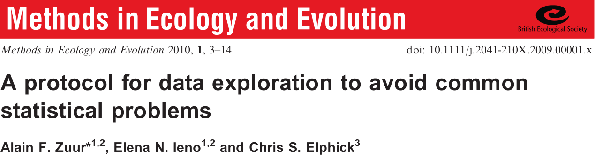
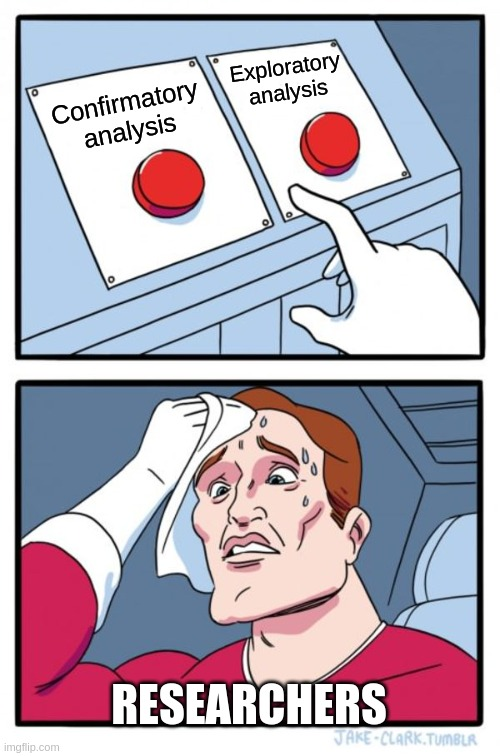

```{r setup, include=FALSE}
library(knitr)

default_source_hook <- knit_hooks$get('source')
default_output_hook <- knit_hooks$get('output')

knit_hooks$set(
  source = function(x, options) {
    paste0(
      "\n::: {.codebox data-latex=\"\"}\n\n",
      default_source_hook(x, options),
      "\n\n:::\n\n")
  }
)

knit_hooks$set(
  output = function(x, options) {
    paste0(
      "\n::: {.codebox data-latex=\"\"}\n\n",
      default_output_hook(x, options),
      "\n\n:::\n\n")
  }
)

knitr::opts_chunk$set(echo = TRUE)
```

# Outline


## 


# Steps

## Principles for statistical ecology


## Poor practice

- Hypothesising after results are known (HARKing)
- Not reporting non-significant results
- Misinterpreting non-significant results
- Providing insufficient detail on methods and analysis
- P-hacking

## Four principles

\begin{enumerate}
\item
\begin{itemize}
 \item Define a focused research question
 \item Plan sampling
 \item Plan analysis
\end{itemize}
\item
\begin{itemize}
 \item Develop a model
 \item Think about the distribution
 \item Generally consider data properties (e.g., dependence)
\end{itemize}
\item
\begin{itemize}
 \item Report methods in detail
 \item Report findings in detail
 \item Ensure reproducibility
\end{itemize}
\end{enumerate}

## A protocol for data exploration



Highly cited. Perhaps because this is a difficult subject?

## A protocol: steps

1) Look for outliers
2) Check constant variance
3) Check normality
4) Consider excess zeros
5) Explore collinearity of covariates
6) What shape does $y = f(x)$ take?
7) Interactions
8) Account for study design

## Typical steps in a real analysis

\textbf{Before analysis}

1. Determine research question
2. Collect data
3. \textit{Plan analysis}

\textbf{Analysis}

1) Explore the data
2) Fit a model
3) Fit another model
4) **Determine which model is better**
5) Check model assumptions, if violated return to 3)
6) Report all results

# Finding a good model

## What makes a good statistical model?

For prediction or for inference?

- A model is usually only good at one thing
  - Prediction
  - Inference
- But it can do both

\pause

This is a matter for **calibration**

## What makes a good statistical model?

One that helps to answer your research question.

- Accurately represents the data generating process
- Not too difficult to interpret
- Is robust

## Principle of Parsimony

The simplest explanation is often the correct one.

\columnsbegin
\column{0.5\textwidth}

A simpler model might

- Make fewer assumptions
- Be easier to interpret
- Be less prone to overfitting
- \textbf{Inadequatley accommodate properties of data}

\column{0.5\textwidth}

{width=80%}

\columnsend

If two competing models fit the data equally well, we continue with the simpler model.

## The problem of model complexity

A model with always fit better if you add a parameter

```{r, echo=FALSE, fig.height = 6}
# Adapted from Bob Ohara
set.seed(12345)
N <- 100; P <- 90
x <- matrix(rnorm(N*P), nrow=N)
mu <- 0.1*x[,1] # true R^2 = 0.1^2/(0.1^2 + 1) = 1%
y <- rnorm(N, mu)
R2 <- sapply(2:P, function(pp, XX, Y) {
  mod <- lm(y ~ XX[,1:pp]) # fit the model
# return coefficient, conf. int. R^2
  c(coef(mod)["XX[, 1:pp]1"],
    confint(mod)["XX[, 1:pp]1",],
    summary(mod)$r.squared)
}, XX=x, Y=y)
plot(2:P, R2[4,], ylab="Explained variation", xlab = "Number of parameters", type="l",ylim=c(0,1))
```

## Model complexity

\columnsbegin
\column{0.4\textwidth}


\column{0.6\textwidth}

```{r, echo = FALSE, fig.height = 3.8}
set.seed(12345)
x = rnorm(30)
y = 2+x*4 + x^2*-3 + rnorm(30, sd=3)
plot(y~x, xlab = NA, ylab = "Response variable", main = "Underfitting", cex.main = 3, xaxt="n")
abline(lm(y~x), col = "red", lty = "dashed")
plot(y~x, xlab = NA, ylab = "Response variable", main = "Just right", cex.main = 3, xaxt="n")
ynew <- predict(lm(y~x+I(x^2)), newdata=data.frame(x=seq(-2,2,length.out=1000)))
lines(y=ynew,seq(-2,2,length.out=1000),col="red",lty="dashed")
plot(y[order(x)]~sort(x), type="l", col = "red", xlab = "Covariate", ylab = "Response variable", main = "Overfitting", cex.main = 3)
points(x,y)
```

\columnsend

# Example 1

## Example: Baseball game attendance

Attendance to baseball games


## Baseball attendance: data from yesterday

Data from Cochran (2002)

- 838 games
- Many variables: team, league, division, year, runs scores, wins
- Response variable: attendance

\tiny

```{r, echo  =FALSE, message=FALSE, warning=FALSE}
data("MLBattend", package="UsingR")
library(tidyr)
knitr::kable(head(MLBattend, 7), format="latex", booktabs = T)%>%kableExtra::kable_styling(position="center")
```

\normalsize


## Baseball attendance: log-likelihoods

```{r, echo = FALSE}
model1 <- glm(cbind(wins, wins+losses)~games.behind,data=MLBattend, family="binomial")
model2 <- update(model1, formula = .~. + attendance)
model3 <- update(model2, formula = .~. + runs.scored)

plot(y=c(logLik(model1), logLik(model2), logLik(model3)),x=c(1,2,3), xaxt="n", type = "b", xlab = NA, ylab = "log(likelihood)")
axis(1, at = c(1, 2, 3), labels = c("Model 1", "Model 2", "Model 3"))
```

## Baseball attendance: deviances

```{r, echo = FALSE}
plot(y=c(deviance(model1), deviance(model2), deviance(model3)),x=c(1,2,3), xaxt="n", type = "b", xlab = NA, ylab = "deviance")
axis(1, at = c(1, 2, 3), labels = c("Model 1", "Model 2", "Model 3"))
```

## Baseball attendance: explained variance

```{r, echo = FALSE}
plot(y=c(1-model1$deviance/model1$null.deviance, 1-model2$deviance/model2$null.deviance, 1-model3$deviance/model3$null.deviance),x=c(1,2,3), xaxt="n", type = "b", xlab = NA, ylab = expression(paste("Deviance ", R^2)))
axis(1, at = c(1, 2, 3), labels = c("Model 1", "Model 2", "Model 3"))
```

## \textcolor{blue}{Confirmatory} vs. \textcolor{red}{Exploratory analysis}

\vskip0.5\baselineskip

\columnsbegin
\column{0.5\textwidth}

{width=90%}

\column{0.5\textwidth}

\textcolor{blue}{Confirmatory}: test hypothesis \newline
\textcolor{red}{Exploratory}: find a good model\newline

Usually indicated by the research question.

\columnsend


# Hypothesis testing

1) Define null hypothesis
2) Define alternative hypothesis
3) Choose a test statistic (e.g., deviance in GLMs)
4) Calculate its distribution under the null hypothesis
5) Check if the observed test statistic falls within the null distribution
6) Accept/Reject

## Likelihood ratio test 

Is improved fit due to noise or is the alternative model actually better?

Procedure

- Fit two models: $M_0$ with $k$ parameters and $M_1$ with $r$
- Calculate likelihood ratio $\Lambda = \log\biggl(\frac{\mathcal{L}(\textbf{y};\Theta_0)_{M_0}}{\mathcal{L}(\textbf{y};\Theta_1)_{M_1}}\biggr)$
- $\mathcal{L}(\textbf{y};\Theta_0)_{M_0} \leq \mathcal{L}(\textbf{y};\Theta_1)_{M_1}$
- $-2\Lambda \sim \mathcal{\chi}^2(k_1-k_0)$ under the null
- $p\geq0.05$ difference in likelihood is due to sampling

## LRT approximation assumptions

- $n\to\infty$
- $\Theta_0$ contained in $\Theta_1$: nested models
- The true parameter is in the interior of the parameter space
- Model is "identifiable"
- Hessian matrix is sufficiently close to the Fisher information
- $y_i$ are independent

\textbf{These assumptions may fail, especially in models more complex than GLMs} \newline
Alternatively: LRT by simulation.

## LRT and deviance

\begin{equation}
\Lambda = \frac{D(\textbf{y};\hat{\symbf{\mu}}_{M0})-D(\textbf{y};\hat{\symbf{\mu}_{M1}})}{\phi}
\end{equation}

# Example 2 

## Example: Lizard habitat preference

- Data originally by Schoener (1970)
- Counts of two species of lizard in Jamaica

\columnsbegin
\column{0.5\textwidth}

{width=80%}

\column{0.5\textwidth}

{width=60%}

\columnsend

## Lizards: the data

\center
Dataset also covered in McCullagh and Nelder (1989)

\tiny
```{r, echo  =FALSE, message=FALSE, warning=FALSE}
data(lizards, package="aods3")
lizards <- lizards[-11, ]# remove sites without any lizards
knitr::kable(lizards, format="latex", booktabs = T)
```
\normalsize

## Example: Lizards

```{r, echo = FALSE}
boxplot(grahami~Site:Time, data = lizards, xlab= "Site:Time", ylab="Number of grahami lizards")
```

## Lizards: interaction

Null hypothesis: There is no interaction of Time and Site

Fit $M_0$:
```{r}
nmodel <- glm(cbind(grahami, opalinus)~Time+Site, 
             data = lizards, family="binomial")
```

Alternative hypothesis: There is an interaction of Time and Site

Fit $M_1$:
```{r}
amodel <- update(nmodel, formula = . ~ Time*Site)
```

## Lizards: interaction

\footnotesize
```{r, echo = FALSE}
summary(amodel)
```

## Lizards: LRT

```{r}
(Lambda <- 2*(logLik(amodel)-logLik(nmodel)))
k <- attr(logLik(amodel),"df")-attr(logLik(nmodel),"df")
pchisq(Lambda, k,lower.tail=FALSE)
```

We reject the alternative hypothesis.

<!-- ## LRT alternative: Score test -->

<!-- ```{r} -->
<!-- anova(nmodel,amodel, test = "Rao") -->
<!-- ``` -->

<!-- Allows parameter estimates on the boundary. -->

## Lizards: LRT simulation

\small
```{r, cache=TRUE}
Lambdas <- NULL
for(i in 1:1000){
ynew <- as.matrix(stats::simulate(nmodel))
nmodel2 <- glm(ynew~Time+Site, 
             data = lizards, family="binomial")
amodel2 <- update(nmodel2, formula = .~Time*Site)
# Store test statistic
Lambdas <- c(Lambdas, 
             2*(logLik(amodel2)-logLik(nmodel2)))
}
# if <0.05 our test statistic in the tail.
sum(Lambdas>Lambda)/1000
```

## Lizards: LRT simulation

\textcolor{red}{Red}: Observed statistic \newline
\textcolor{blue}{Blue}: $\chi^2(2)$

```{r, echo = FALSE, fig.height = 5}
hist(Lambdas, xlab= "Likelihood ratio", breaks = 100, probability = TRUE, cex.main = 1.5)
abline(v=Lambda,col="red", lwd = 3)
lines(y=dchisq(Lambdas, df = 2)[order(Lambdas)], x=sort(Lambdas), col = "blue", lwd = 3)
```

# Information criteria

A different paradigm:\newline
Find the best model amongst a set of models.

Best:

- Penalise complexity (number of parameters)
- By fit (likelihood)

Most commonly:

1) AIC: Akaike's Information Criterion \footnotesize (Akaike 1974) \normalsize
2) BIC: Bayesian Information Criterion \footnotesize (Schwarz 1978) \normalsize

\center

\textbf{Lower = better}

## Akaike's Information Criterion

\begin{equation}
\text{AIC} = -2\mathcal{L}(\textbf{y};\Theta)+2k
\end{equation}

- Penalizes model complexity
- (approximately) Measures information loss to the true data generating process
- Asymptotically

AIC tends to select too complex models with little data. Finite sample correction (Sugiura 1978):
\begin{equation}
\text{AIC}_\text{c} = \text{AIC}+\frac{2k(k+1)}{n-k-1}
\end{equation}

\center 

\textbf{Find the model that predicts best}

## Bayesian Information Criterion

\begin{equation}
\text{BIC} = -2\mathcal{L}(\textbf{y};\Theta)+k\log(n)
\end{equation}

So the penalty is different. \newline 

\center

\textbf{Find the model closest to the "true" model}

## Connection of AIC and LRT

Rule of thumb: difference of 2 points means a model is better

\begin{equation}
\begin{aligned}
\Delta\text{AIC} =&  \text{AIC}_{M_1}-\text{AIC}_{M_0}\\
&=  2\mathcal{L}(\textbf{y};\Theta_0) - 2\mathcal{L}(\textbf{y};\Theta_1) + 2k_1 - 2k_0\\
&=  -2\Lambda + 2(k_1-k_0)
\end{aligned}
\end{equation}

\textbf{So AIC with a rule of \delta = 2 can be seen as a more liberal LRT} \footnotesize (Sutherland et al. 2023) \normalsize

## The cult of (A)IC

[Presentation by Mark Brewer](https://www.youtube.com/watch?v=lEDpZmq5rBw)

\textbf{"Always use (A)IC for model comparison"}

\columnsbegin
\column{0.5\textwidth}
My perspectives

- Use common sense
- Do not blindly test all models ("dredging")
- Use model comparison techniques in moderation

\column{0.5\textwidth}


\columnsend

\textbf{Don't take the "best" model paradigm too seriously}

## Freedman's paradox

Just by chance, predictors with no relationship to the response will be selected.

# Example 3


## Lizards: interaction selection

```{r, echo = FALSE}
AIC(nmodel, amodel)
MuMIn::AICc(nmodel, amodel)
BIC(nmodel, amodel)
```

## $\Delta$AIC by simulation under the simpler model

Solid: observed $\Delta$AIC \newline
Dashed: -2 $\Delta$AIC

```{r, cache=TRUE, echo = FALSE, fig.height = 3.5}
Lambdas <- NULL
for(i in 1:1000){
set.seed(i)
ynew <- as.matrix(stats::simulate(nmodel))
nmodel2 <- glm(ynew~Time+Site, 
             data = lizards, family="binomial")
amodel2 <- update(nmodel2, formula = .~Time*Site)
# Store test statistic
Lambdas <- c(Lambdas, 
             2*(logLik(nmodel2)-logLik(amodel2)) + 2*(attr(logLik(amodel2), "df") - attr(logLik(nmodel2), "df")))
}
# if <0.05 our test statistic in the tail.
dAIC <- 2*(logLik(nmodel)-logLik(amodel)) + 2*(attr(logLik(amodel), "df") - attr(logLik(nmodel), "df"))
h <- hist(Lambdas, breaks = 100, plot = FALSE)
cuts <- cut(h$breaks, c(-Inf,-2,dAIC, Inf))
plot(h, col = as.character(factor(as.factor(cuts),labels=c("black","white", "gray"))), xlab = expression(AIC(M[1])-AIC(M[0])), main = "Positive: M0 is better. Negative: M1 is better.", cex.main = 1.5)
abline(v=dAIC, col = "red", lty="solid", lwd = 3)
abline(v=-2, col = "red", lty="dashed", lwd = 3)
```

Black: We would incorrectly select the more complex model (7%) \newline
White: We would consider the models equivalent (34%)\newline
Gray: Under a 2 $\Delta$AIC rule we would select the more simpler model (59%) \newline

## $\Delta$AIC by simulation under the additive model

```{r, echo = FALSE}
cat("Models with a more extreme test statistic:", sum(Lambdas<=dAIC)/1000)
cat("Models with more than 2 AIC difference:", sum(Lambdas>2)/1000)
```

93% of the time we would have selected the simpler model <!--sum(Lambdas>(-2))/1000-->

## $\Delta$AICc by simulation under the simpler model

Solid: observed $\Delta$AICc \newline
Dashed: -2 $\Delta$AICc

```{r, cache=TRUE, echo = FALSE, fig.height = 3}
# if <0.05 our test statistic in the tail.
k1 <- attr(logLik(amodel), "df")
k0 <- attr(logLik(nmodel), "df")
n <- nrow(lizards)
dAICc = dAIC + (2*k1*(k1+1)/(n-k1-1)- 2*k0*(k0+1)/(n-k0-1))
Lambdas2 <- Lambdas + (2*k1*(k1+1)/(n-k1-1)- 2*k0*(k0+1)/(n-k0-1))

h <- hist(Lambdas2, breaks = 100, plot = FALSE)
cuts <- cut(h$breaks, c(-Inf,-2,dAICc, Inf))
plot(h, col = as.character(factor(as.factor(cuts),labels=c("black","white", "gray"))), xlab = expression(AIC[c](M[1])-AIC[c](M[0])), main = "Positive: M0 is better. Negative: M1 is better.", cex.main = 1.5)

abline(v=dAICc, col = "red", lty="solid", lwd = 3)
abline(v=-2, col = "red", lty="dashed", lwd = 3)
```

Black: We would incorrectly select the more complex model (1%) \newline <!--sum(Lambdas2<=(-2))/1000-->
White: We would consider the models equivalent (40%)\newline <!--sum(Lambdas2>(-2)&Lambdas<=2)/1000-->
Gray: Under a 2 $\Delta$AIC rule we would select the more simpler model (89%) \newline<!--sum(Lambdas2>(2))/1000-->

## $\Delta$AICc by simulation under the simpler model

```{r, echo = FALSE}
cat("Models with more than 2 AIC difference:", sum(Lambdas>2)/1000)
cat("Models with more than 2 AICc difference:", sum(Lambdas2>2)/1000)
```

99% of the time we would select the simpler model. <!--sum(Lambdas2>(-2))/1000-->

## Lizards: interaction and height

```{r, echo = TRUE}
model1 <- glm(cbind(grahami, opalinus)~Time+Site, 
             data = lizards, family="binomial")
model2 <- update(model1, formula = . ~ Time*Site)
model3 <- update(model2, formula = ~.+Height)
```

## Lizards: AIC plotted

```{r, echo = FALSE, fig.heigh = 5}
plot(y=c(AIC(model1), AIC(model2), AIC(model3)),x=c(1,2,3), xaxt="n", type = "b", xlab = NA, ylab = "AIC")
axis(1, at = c(1, 2, 3), labels = c("Model 1", "Model 2", "Model 3"))
```

# Final

## Omitted variable bias

Occurs if we omit a variable, i.e., we have the model:

\begin{equation}
\text{g}\{\mathams{E}(y_i \vert x_{i1},x_{i2})\} = \alpha + x_{i1}\beta_1+x_{i2}\beta_2
\end{equation}

but we fit without $x_{i2}$. The consequence is especially clear for linear models:

\begin{equation}
y_i = \alpha + x_{i1}\beta_1+\epsilon_i, \qquad \text{with } \epsilon_i = x_{i2}\beta_2+\epsilon_i^\star
\end{equation}

- $\epsilon_i$ may be correlated with $x_{i1}$
- Residual variance changes with $x_{i1}$
- Causes bias in parameter estimates and incorrect standard errors

## Multimodel inference

What to do when you have multiple models that are equally good?

- The simpler model
- Do not "model average" for inference \footnotesize<!-- [a rant](https://twitter.com/vdVeenB/status/1557656200619212800) \normalsize-->
- Report multiple models

## Summary

- Hypothesis testing and information criteria: two different paradigms
- Do not mix them
- Do not fall for "the best model"
- The full model is often a good model
- Keep things simple
- See also [Murtaugh (2014)](https://byrneslab.net/classes/biol607/readings/ecology_forum_on_p_values.pdf) and Burnham and Anderson, and a lot of others