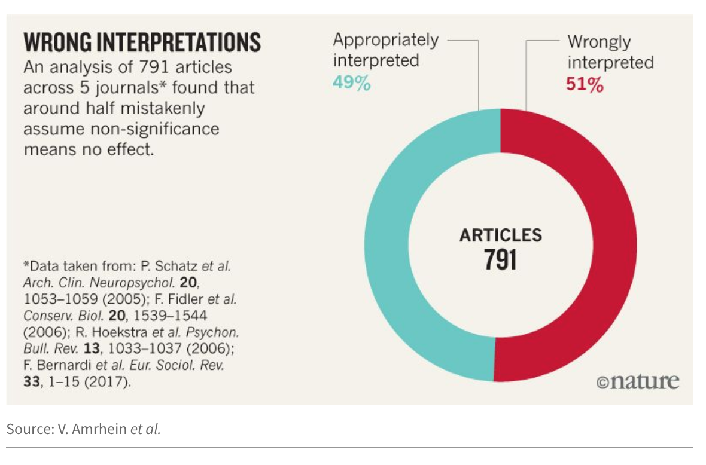
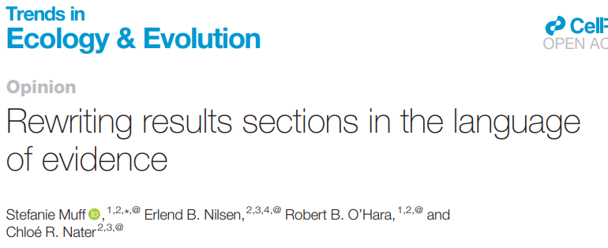
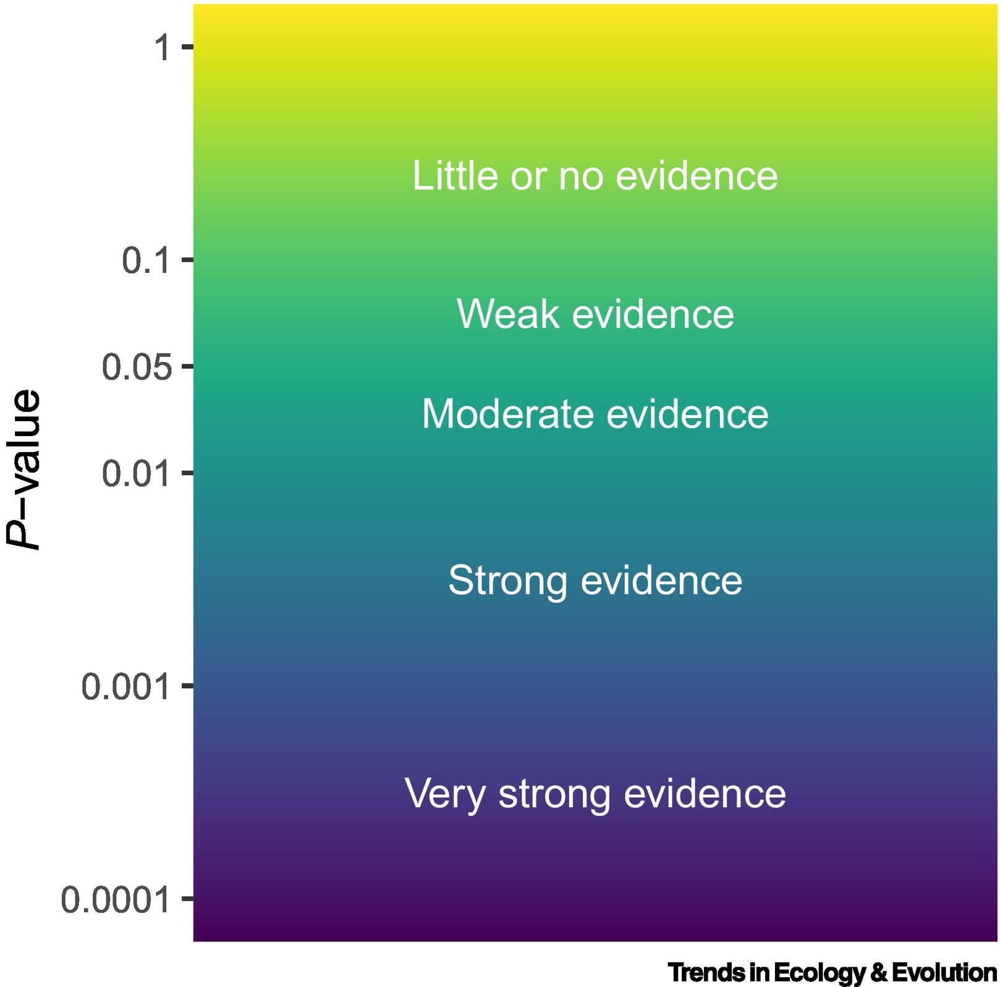
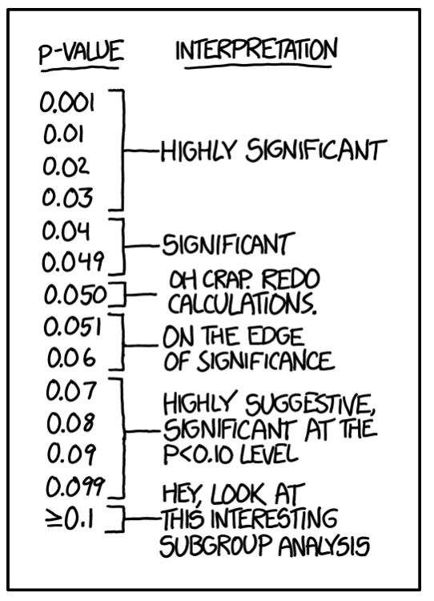

```{r setup, include=FALSE}
library(knitr)

default_source_hook <- knit_hooks$get('source')
default_output_hook <- knit_hooks$get('output')

knit_hooks$set(
  source = function(x, options) {
    paste0(
      "\n::: {.codebox data-latex=\"\"}\n\n",
      default_source_hook(x, options),
      "\n\n:::\n\n")
  }
)

knit_hooks$set(
  output = function(x, options) {
    paste0(
      "\n::: {.codebox data-latex=\"\"}\n\n",
      default_output_hook(x, options),
      "\n\n:::\n\n")
  }
)

knitr::opts_chunk$set(echo = TRUE)
```

# Motivation

{width=75%}

## Recap

```{r,echo=FALSE}
data(lizards,package="aods3")
lizards <- lizards[-11,]
```

Null hypothesis: There is no interaction of Time and Site

Fit $M_0$:
```{r}
nmodel <- glm(cbind(grahami, opalinus)~Time+Site, 
             data = lizards, family="binomial")
```

Alternative hypothesis: There is an interaction of Time and Site

Fit $M_1$:
```{r}
amodel <- glm(cbind(grahami, opalinus)~Time*Site, 
             data = lizards, family="binomial")
```

## Lizards: LRT

```{r}
(Lambda <- 2*(c(logLik(amodel))-c(logLik(nmodel))))
k <- attr(logLik(amodel),"df")-attr(logLik(nmodel),"df")
pchisq(Lambda, k,lower.tail=FALSE)
```

# P values

## P-values: what are they?

We want to calculate some test-statistic, say $\Lambda$

The p-value is correctly interpreted as:

**The probability to get this test-statistic or more extreme, assuming the null hypothesis is true**

Unpacking:

- It is a probability
- Related to a **test statistic**
- (Usually) requires knowledge of its distribution

## P-values: how to interpret them?

$P<0.05$: This result is probably not due to chance
$P>0.05$: This result is likely to due chance

- P-values from a single study will change!
- P-values are computed assuming the null hypothesis is true
- P-values are a function of **effect size** and **sample size**

\textbf{Given enough data, an effect near zero will be statistically significant}

## P-values: how not to interpret them

- Probability of the null hypothesis
- Probability of wrongly rejecting the null hypothesis
- $P>0.05$ as lack of effect
- Importance of the effect
- Anything else?

\textbf{P-values are not a reflection of scientific importance}

## P-values as measure of evidence

\columnsbegin
\column{0.5\textwidth}



\column{0.5\textwidth}



\columnsend

## Errors
```{r, echo = FALSE}
par(mar=c(5,12,4,2))
plot(1:2,1:2,type="n", xaxt="n", yaxt="n", xaxs="i" , yaxs="i",xlab="", ylab="", xlim = c(1,2))
abline(v=1.5, h  =1.5)
text(1.25, 1.25, "Too conservative", col=2, cex=3)
text(1.75, 1.25, "Accurate", col=3, cex=3)
text(1.25, 1.75, "Accurate", col=3, cex=3)
text(1.75, 1.75, "Too optimistic", col=2, cex=3)
axis(2, c("Alternative hypothesis is true", "Null hypothesis is true"), at=c(1.25,1.75), las=1, cex.axis = 1)
axis(1, c("Null hypothesis is accepted", "Alternative hypothesis is accepted"), at=c(1.25,1.75), las=1, cex.axis = 1)

```

## Type 1 error

A false positive: mistakenly rejecting the null hypothesis.

- Controlled by $\alpha$
- We choose $\alpha = 0.05$ usually

## Type 2 error

A false negative: mistakenly accepting the null hypothesis.

- $\beta$
- Not controlled explicitly
- Implicitly controlled by the sample size

## Distribution of p-values

Under the null hypothesis:

\small

```{r, echo = FALSE, fig.height = 5}
hist(runif(10000,0,1), breaks = 10, xaxt="n", main = "P-value distribution", xlab= "P-value")
axis(1, at = c(0.05, seq(0,1, 0.1)), labels = c(0.05, seq(0,1, 0.1)))
abline(v=0.05, col="red")
```

When the alternative hypothesis is true, the distribution is clustered near zero.

- Depends on sample size
- Depends on **effect size**

# Example 1

## Example: Lizards

Fit $M_0$:
```{r}
nmodel <- glm(cbind(grahami, opalinus)~Time+Site, 
             data = lizards, family="binomial")
```

Alternative hypothesis: Diameter matters.

Fit $M_1$:
```{r}
amodel <- update(nmodel, formula = .~Time+Site+Diameter)
```

## P-values by simulation

```{r, eval = FALSE}
Ps <- NULL
for(i in 1:1000){
ynew <- as.matrix(stats::simulate(nmodel))
nmodel2 <- glm(ynew~Time+Site, 
             data = lizards, family="binomial")
amodel2 <- update(nmodel2, formula = .~Time+Site+Diameter)
# Store P-value
(Lambda <- 2*(logLik(amodel2)-logLik(nmodel2)))
k <- attr(logLik(amodel2),"df")-attr(logLik(nmodel2),"df")
Ps <- c(Ps, pchisq(Lambda, k,lower.tail=FALSE))
}
```

## P-values by simulation

\columnsbegin
\column{0.5\textwidth}

```{r, cache = TRUE, echo = FALSE}
Ps <- NULL
for(i in 1:1000){
set.seed(i)
ynew <- as.matrix(stats::simulate(nmodel))
nmodel2 <- glm(ynew~Time+Site, 
             data = lizards, family="binomial")
amodel2 <- update(nmodel2, formula = .~Time+Site+Diameter)
# Store P-value
(Lambda <- 2*(logLik(amodel2)-logLik(nmodel2)))
k <- attr(logLik(amodel2),"df")-attr(logLik(nmodel2),"df")
Ps <- c(Ps, pchisq(Lambda, k,lower.tail=FALSE))
}
hist(Ps, main = "P-values when M0 is true", cex.main = 3)
abline(v=0.05, col="red")

```

\column{0.5\textwidth}

```{r, cache=TRUE, echo = FALSE}
Ps1 <- NULL
for(i in 1:1000){
set.seed(i)
ynew <- as.matrix(stats::simulate(amodel))
nmodel2 <- glm(ynew~Time+Site, 
             data = lizards, family="binomial")
amodel2 <- update(nmodel2, formula = .~Time+Site+Diameter)
# Store P-value
(Lambda <- 2*(logLik(amodel2)-logLik(nmodel2)))
k <- attr(logLik(amodel2),"df")-attr(logLik(nmodel2),"df")
Ps1 <- c(Ps1, pchisq(Lambda, k,lower.tail=FALSE))
}
hist(Ps1, main = "P-values when M1 is true", cex.main = 3)
abline(v=0.05, col="red")

```


\columnsend

\footnotesize
```{r, echo = FALSE}
cat("P-values larger than 0.05:\n", sum(Ps>0.05)/1000, "                              ", sum(Ps1>0.05)/1000)
```


# Conclusion

\small

\columnsbegin
\column{0.5\textwidth}

- 5% of the time we will wrongly accept the alternative hypothesis
- Thus \textbf{your} statistically significant result may be due to chance
- ?% of the time we will wrongly accept the null hypothesis
- "Highly significant" does not exist. Everything $p<0.05$ is statistically significant
- Rejection of the alternative hypothesis does not mean "no effect"

\column{0.5\textwidth}

{width=75%}

\columnsend