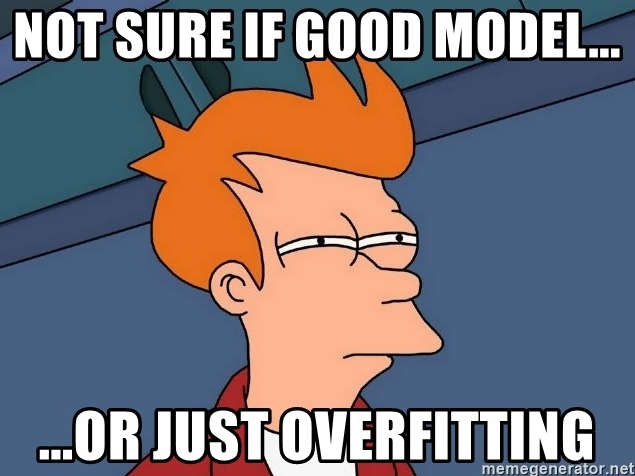

```{r setup, include=FALSE}
library(knitr)

default_source_hook <- knit_hooks$get('source')
default_output_hook <- knit_hooks$get('output')

knit_hooks$set(
  source = function(x, options) {
    paste0(
      "\n::: {.codebox data-latex=\"\"}\n\n",
      default_source_hook(x, options),
      "\n\n:::\n\n")
  }
)

knit_hooks$set(
  output = function(x, options) {
    paste0(
      "\n::: {.codebox data-latex=\"\"}\n\n",
      default_output_hook(x, options),
      "\n\n:::\n\n")
  }
)

knitr::opts_chunk$set(echo = TRUE)
```

# Outline

## Recap

## The problem of model complexity

A model with always fit better if you add a parameter

```{r, echo=FALSE, fig.height = 6}
# Adapted from Bob Ohara
set.seed(12345)
N <- 100; P <- 90
x <- matrix(rnorm(N*P), nrow=N)
mu <- 0.1*x[,1] # true R^2 = 0.1^2/(0.1^2 + 1) = 1%
y <- rnorm(N, mu)
R2 <- sapply(2:P, function(pp, XX, Y) {
  mod <- lm(y ~ XX[,1:pp]) # fit the model
# return coefficient, conf. int. R^2
  c(coef(mod)["XX[, 1:pp]1"],
    confint(mod)["XX[, 1:pp]1",],
    summary(mod)$r.squared)
}, XX=x, Y=y)
plot(2:P, R2[4,], ylab="Explained variation", xlab = "Number of parameters", type="l",ylim=c(0,1))
```

## Model complexity

\columnsbegin
\column{0.4\textwidth}



\column{0.6\textwidth}

```{r, echo = FALSE, fig.height = 4}
set.seed(12345)
x = rnorm(30)
y = 2+x*4 + x^2*-3 + rnorm(30, sd=3)
plot(y~x, xlab = NA, ylab = "Response variable", main = "Underfitting", cex.main = 3)
abline(lm(y~x), col = "red", lty = "dashed")
plot(y~x, xlab = NA, ylab = "Response variable", main = "Just right", cex.main = 3)
ynew <- predict(lm(y~x+I(x^2)), newdata=data.frame(x=seq(-2,2,length.out=1000)))
lines(y=ynew,seq(-2,2,length.out=1000),col="red",lty="dashed")
plot(y[order(x)]~sort(x), type="l", col = "red", xlab = "Covariate", ylab = "Response variable", main = "Overfitting", cex.main = 3)
points(x,y)
```

\columnsend

## Explained variation

```{r, echo = FALSE, fig.height = 3}
set.seed(12345)
x = rnorm(30)
y = 2+x*4 + x^2*-3 + rnorm(30, sd=3)
plot(y~x, xlab = NA, ylab = "Response variable", main = "Low R²", cex.main = 2, xaxt="n")
abline(lm(y~x), col = "red", lty = "dashed")
plot(y~x, xlab = NA, ylab = "Response variable", main = "Intermediate R²", cex.main = 2, xaxt="n")
ynew <- predict(lm(y~x+I(x^2)), newdata=data.frame(x=seq(-2,2,length.out=1000)))
lines(y=ynew,seq(-2,2,length.out=1000),col="red",lty="dashed")
plot(y[order(x)]~sort(x), type="l", col = "red", xlab = "Covariate", ylab = "Response variable", main = "High R²", cex.main = 2)
points(x,y)
```

# $R^2$

## $R^2$: coefficient of determination

The $R^2$ statistic helps us to assess how much variability we have explained.

Low $R^2$: not so much?\newline
High $R^2$: too much?

- Usually larger than 0 but smaller than 1
- Observational studies usually have low $R^2$
- Experimental studies usually have high $R^2$

\textbf{$R^2$ cannot be used to assess goodness of fit}

## $R^2$ in linear regression

\begin{equation}
R^2 = 1 - \frac{\sum \limits^n_{i=1}  (y_i - \mu_i)^2}{\sum \limits^n_{i=1}  (y_i - \alpha_i)^2}
\end{equation}

- the numerator represents the unexplained variation of a model
- the numerator represents the explainable variation of a model
- One minus their fraction is the explained variation

## partial $R^2$

How much variation is explained by a covariate?

\begin{equation}
R^2_k = 1 - \frac{\sum \limits^n_{i=1}  (y_i - \alpha_i)^2 - \sum \limits^n_{i=1}  (y_i - \mu_i)^2}{\sum \limits^n_{i=1}  (y_i - \alpha_i)^2}
\end{equation}

Allows us to partition the explained variation over the covariates.

- Quantifies the variation additionally explained in a more complex models
- Is sensitive to order of covariates
- Multicollinearity: two covariates can explain similar variation

## Adjusted $R^2$

```{r, echo=FALSE}
# Adapted from Bob Ohara
set.seed(12345)
N <- 100; P <- 90
x <- matrix(rnorm(N*P), nrow=N)
mu <- 0.1*x[,1] # true R^2 = 0.1^2/(0.1^2 + 1) = 1%
y <- rnorm(N, mu)
R2 <- sapply(2:P, function(pp, XX, Y) {
  mod <- lm(y ~ XX[,1:pp]) # fit the model
# return coefficient, conf. int. R^2
  c(coef(mod)["XX[, 1:pp]1"],
    confint(mod)["XX[, 1:pp]1",],
    summary(mod)$r.squared,
    summary(mod)$adj.r.squared)
}, XX=x, Y=y)
plot(2:P, R2[4,], ylab="Explained variation", xlab = "Number of parameters", type="l",ylim=c(0,1), col = "red")
lines(2:P, R2[5,], col ="blue", lty = "dashed")
legend("topleft", col = c("red","blue"), lty = c("solid","dashed"), legend = c(expression(R^2),expression(R[adjusted]^2)), cex = 2)
```

## Adjusted $R^2$

\begin{equation}
R^2_{adjusted} = 1-(1-R^2)\frac{(n-1)}{n-p-1}
\end{equation}

- Can be negative, always lower than $R^2$
- Penalize the statistic for increased complexity
- Penalize for small samples
- Most for small $n$ and large $p$

## Connection to Variance Inflation Factor (VIF)

\begin{equation}
\text{VIF}_k = \frac{1}{1-R^2_k}
\end{equation}

Measures increase in uncertainty of a parameter estimator when changing the model.

## Psuedo $R^2$ in Generalised Linear Models

1) GLMs lack the error term of LMs
2) There is often no (clear) residual variance parameter
3) $R^2$ is thus not clearly defined
4) Many many different $R^2$ statistics exist

Concepts and name remain the same.

# GLM $R^2$

## A few GLM $R^2$'s

  - Deviance $R^2$
  - Pseudo $R^2$
  - McFadden's $R^2$
  - Cohen's $R^2$
  - Tjur's $R^2$
  - Somer's $R^2$
  - Cox and snell $R^2$
  - Nagelkerke $R^2$
  - Efron's $R^2$
  - Many more (see `performance::R2`)
  - which one do we choose?

## Deviance $R^2$

Remember: **deviance** is the GLM equivalent of RSS!

\begin{equation}
\begin{aligned}
\text{deviance }R^2 &= 1- \frac{D(\textbf{y};\hat{\symbf{\mu}})}{D(\textbf{y};\hat{\alpha})}\\
\text{Cohen }R^2 &= \frac{D(\textbf{y};\hat{\alpha})-D(\textbf{y};\hat{\symbf{\mu}})}{D(\textbf{y};\hat{\alpha})}
\end{aligned}
\end{equation}

\begin{equation}
\text{deviance }R^2_{adjusted} = 1- \biggr\{1- \frac{D(\textbf{y};\hat{\symbf{\mu}})}{D(\textbf{y};\hat{\alpha})}\biggl\}\frac{n-1}{n-p}
\end{equation}

Based on reduction in deviance

## McFadden $R^2$

\begin{equation}
\text{McFadden }R^2 = 1-\frac{\log\mathcal{L}(\textbf{y};\Theta_1)}{\log\mathcal{L}(\textbf{y};\Theta_1)}
\end{equation}

Based on reduction in the ratio of log-likelihoods.

## GLM $R^2$'s

All quantify change in fit due to increased model complexity, in one way or another.

Which one do we use?

## Example: Lizards interaction

```{r, echo = FALSE}
data(lizards, package="aods3")
lizards <- lizards[-11,]
n = nrow(lizards)
```

First model without interaction of Time and Site

```{r}
model1 <- glm(cbind(grahami, opalinus)~Time+Site, 
             data = lizards, family="binomial")
```

Second model with interaction

```{r}
model2 <- glm(cbind(grahami, opalinus)~Time*Site, 
             data = lizards, family="binomial")
```

## Lizards: $R^2$ under more complex model

\footnotesize 

```{r}
nullmodel <- update(model1, formula = .~1)
(devianceR2 <- c(1-deviance(model1)/deviance(nullmodel),1-deviance(model2)/deviance(nullmodel)))
(adjdevianceR2 <- 1-(1-devianceR2)*(n-1)/(n-c(attr(logLik(model1), "df"),attr(logLik(model2), "df"))))
(mcfaddenR2 <- c(1-logLik(model1)/logLik(nullmodel), 1-logLik(model2)/logLik(nullmodel)))
```

## Variability of $R^2$

$R^2$ is a statistic of the data\newline
So it is susceptible to sampling variation!

Veall and Zimmermann (1992)

- Evaluate which $R^2$ best mimics the original statistic
- Conclude that various popular $R^2$ severely underestimate the truth

## Lizards: deviance $R^2$
\small 
```{r, cache= TRUE}
R2s <- NULL
for(i in 1:1000){
set.seed(i)
ynew <- as.matrix(stats::simulate(model2))
model2s <- update(model2, formula = ynew~.)
nullmodels <- update(model2s, formula = .~1)
R2s <- c(R2s, 1-deviance(model2s)/deviance(nullmodels))
}
```


```{r, echo = FALSE, fig.height = 3}
hist(R2s, xlab = expression(R[deviance]^2), breaks = 100, cex.main = 1.5)
abline(v=devianceR2[2], col = "red", lty="dashed", lwd = 3,main="Red line = observed R2")
```

## Lizards: McKelvey-Zavoina $R^2$

\small

```{r, cache = TRUE, warning=FALSE}
R2s2 <- NULL
for(i in 1:1000){
set.seed(i)
ynew <- as.matrix(stats::simulate(model2))
model2s <- update(model2, formula = ynew~.)
nullmodels <- update(model2s, formula = .~1)
R2s2 <- c(R2s2, DescTools::PseudoR2(model2s, "McKelveyZavoina"))
}
```
```{r, echo = FALSE, fig.height = 3, warning=FALSE}
hist(R2s2, xlab = expression(R[McKelveyZavoina]^2), breaks = 100, cex.main = 1.5, ,main="Red line = observed R2")
abline(v=DescTools::PseudoR2(model2, "McKelveyZavoina"), col = "red", lty="dashed", lwd = 3)
```

## Conclusion

- $R^2$ to quantify improvement of fit in GLMs
- There is no single agreed upon statistic
- Careful with overinterpretation: low $R^2$ can be just fine