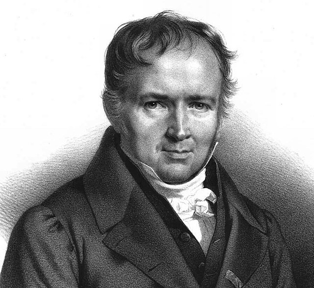
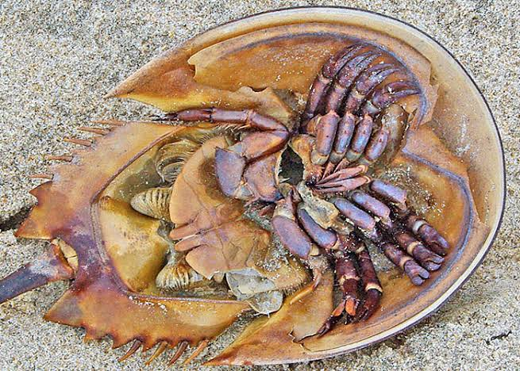

```{r setup, include=FALSE}
library(knitr)

default_source_hook <- knit_hooks$get('source')
default_output_hook <- knit_hooks$get('output')

knit_hooks$set(
  source = function(x, options) {
    paste0(
      "\n::: {.codebox data-latex=\"\"}\n\n",
      default_source_hook(x, options),
      "\n\n:::\n\n")
  }
)

knit_hooks$set(
  output = function(x, options) {
    paste0(
      "\n::: {.codebox data-latex=\"\"}\n\n",
      default_output_hook(x, options),
      "\n\n:::\n\n")
  }
)

knitr::opts_chunk$set(echo = TRUE)
```


## Outline

- Models for count data
- Residual diagnostics in GLMs
- Other useful models

## Questions about yesterday?

\center

{width=40%}

# Recap

## The binomial GLM

\textbf{Data}: $r$ the number of successes in $N$ trials\newline
\textbf{Parameters}: probability $p$ (now: $\pi_i$)\newline
\textbf{Goal}: estimate $\pi_i$ for each observation

## Binomial GLM use

- When a linear regression is not appropriate :)
- For binary data or counts of successes/failures 

### In ecology

- Predicting species' distributions
- Number of germinated plant seeds
- Prevalence of disease in a population
- Probability of observing a behavior
- Proportion of orchids \emoji{upside-down-face}

## Binomial link functions (2)

```{r, echo = FALSE}
x<-seq(binomial(link=logit)$linkinv(-5),binomial(link=logit)$linkinv(5),length.out=1000)
plot(binomial(link=logit)$linkfun(x),x, xlab = expression(pi[i]), ylab = expression(eta[i]), type="l")
x<-seq(binomial(link=probit)$linkinv(-5),binomial(link=probit)$linkinv(5),length.out=1000)
lines(binomial(link=probit)$linkfun(x),x, lty="dashed")
x<-seq(binomial(link=cloglog)$linkinv(-5),binomial(link=cloglog)$linkinv(5),length.out=1000)
lines(binomial(link=cloglog)$linkfun(x),x, lty="dotted")
x<-seq(from=exp(-exp(5)),to=exp(-exp(-5)),length.out=1000)
lines(-log(-log(x)),x, lty=4)
abline(v= 0, lty="dashed")
legend("bottomright", lty=c(1,2,3,4), legend = c("Logit","Probit", "Complementary log-log", "Log-log"))
```

## Outline

# Log-linear regression

Log-linear regression is a class of models that uses the log-link function:

\begin{equation}
\begin{aligned}
 \log\{\mathams{E}(y_i\vert x_i)\} &= \eta_i = \alpha + x_i\beta\\
 \mathams{E}(y_i\vert x_i) &= \lambda_i = \exp(\alpha + x_i\beta)
 \end{aligned}
\end{equation}

\textbf{Log-linear regression is commonly used to analyse count data}

# Poisson

## Typical count cases

- Caught fish
- Plants at a site
- Pidgeons in a city
- [Bigfoot reports](https://zslpublications.onlinelibrary.wiley.com/doi/abs/10.1111/jzo.13148)
- Wrongful convictions
- Stars in the night sky

## The Poisson GLM

\textbf{Data}: $k_i$ the count\newline
\textbf{Parameters}: mean $\lambda$ \newline
\textbf{Goal}: estimate $\lambda_i$ for each observation

## The Poisson distribution

\columnsbegin
\column{0.5\textwidth}

\begin{equation}
\mathcal{L}(y_i;\Theta) = \text{exp}\{y_i\log(\lambda_i) - \lambda_i - \log(y_i!)\}
\end{equation}

\column{0.5\textwidth}


\hfill {width=80%}

\columnsend

\textbf{The Poisson paramater $\lambda$ is the mean of the counting process}

## The Poisson distribution: rates

Alternatively we can write:

\begin{equation}
\mathcal{L}(y_i;\Theta) = \text{exp}\{y_i\log(rt) - rt - \log(y_i!)\}
\end{equation}

so, $\lambda = rt$

- $r$ is the rate at which counts occur, per time period $t$
- we could also record counts within a certain period, instead of the total

## Catching fish

- We go fishing for an hour and catch $\lambda = 5$ fish
- On average we caught $r = \frac{5}{60}$ fish per $t = 1$

## Is Poisson regression really a GLM?

\begin{equation}
\mathcal{L}(y_i;\Theta) = \text{exp}\biggl\{\frac{y_i\textcolor{blue}{\log(\lambda)}+\textcolor{red}{\log(\lambda)}}{1} + \textcolor{orange}{\log(y_i!)}\biggr\}
\end{equation}

All GLMs can be formulated as:

\begin{equation}
\mathcal{L}(y_i;\Theta) = \text{exp}\{\frac{y_i\textcolor{blue}{\eta_i}-\textcolor{red}{b(\eta_i)}}{\textcolor{pink}{a(\phi)}} +\textcolor{orange}{c(y_i,\phi)}\}
\end{equation}

## Log-link function

So log is the canonical link. This looks like:

```{r, echo=FALSE}
x <- seq(-5,5,length.out=1000)
plot(x, exp(x), type = "l", xlab = expression(eta[i]), ylab = expression(lambda[i]))
segments(x0=0,x1=0, y0=-10, y1 = 1, col = "red")
segments(x0=0,x1=-10, y0=1, y1 = 1, col = "red")
segments(x0=2,x1=2, y0=-10, y1 =exp(2) , col = "red")
segments(x0=2,x1=-10, y0=exp(2), y1 =exp(2) , col = "red")
segments(x0=4,x1=4, y0=-10, y1 =exp(4) , col = "red")
segments(x0=4,x1=-10, y0=exp(4), y1 =exp(4) , col = "red")

```

## Counts: a multiplicative process

Say that we have the model:

\begin{equation}
\log(\lambda) = \alpha+x_i\beta
\end{equation}

- with $\alpha = 1$ and $\beta = \log(2) \approx 0.693$
- $x_i$ is either 0 or 1: either I was fishing or you were
- `exp(1) = 2.71828` the average number of fish I caught
- `exp(1+2) = exp(1)*2 = 5.437` the average number of fish you caught

So, you caught twice as many fish!

## The Poisson distribution visually

```{r, echo = FALSE, fig.height=5, fig.align="center"}
par(mfrow=c(2,2))
hist(rpois(1000,1), xlab = expression(y[i]), main = expression(lambda == 1), cex.main = 2, cex.lab = 1.5)
hist(rpois(1000,5), xlab = expression(y[i]), main = expression(lambda == 5), cex.main = 2, cex.lab = 1.5)
hist(rpois(1000,10), xlab = expression(y[i]), main = expression(lambda == 10), cex.main = 2, cex.lab = 1.5)
hist(rpois(1000,100), xlab = expression(y[i]), main = expression(lambda == 100), cex.main = 2, cex.lab = 1.5)
```

## Poisson assumptions

- An event can occur $0 \ldots\infty$ times
- Events are independent
- The rate of events is constant
- Events cannot occur simultaneously
- Variance equals the mean

## Example: horseshoe crabs 

Counts of male crabs ("satellites") near female crabs

\columnsbegin
\column{0.5\textwidth}


\column{0.5\textwidth}




\columnsend

## Horseshoe crabs: the data

Data originally from Brunswick  (1996) via Agresti (2007) via Dunn and Smyth (2018)

- 173 observations
- 4 traits: colour, spine condition, width (cm), weight (g)

\tiny

```{r, echo  =FALSE, message=FALSE, warning=FALSE}
data(hcrabs, package="GLMsData")
knitr::kable(head(hcrabs, 7), format="latex", booktabs = T)
hcrabs$Col <-factor(hcrabs$Col, levels= c("LM","M","DM","D"))
levels(hcrabs$Col) <- c("Light medium","Medium","Dark medium","Dark")
hcrabs$Spine <-factor(hcrabs$Spine, levels= c("BothOK","OneOK","NoneOK"))
colnames(hcrabs)<-c("Colour","Spine","Width","Sat","Weight")
```

\normalsize

## Horseshoe crabs: the data

```{r, echo  =FALSE, message=FALSE, warning=FALSE, fig.width=13, fig.height=8}
par(mfrow=c(2,2))
plot(jitter(log1p(Sat)) ~Weight, data = hcrabs, ylab = "log(Number of satellites+1)", cex.lab=1.5, cex.axis = 2.5, cex = 2)
plot(jitter(log1p(Sat)) ~Colour, data = hcrabs, ylab = NA, yaxt="n", cex.lab=2.5, cex.axis=2.5, cex = 2)
plot(jitter(log1p(Sat)) ~Spine, data = hcrabs, ylab = NA, yaxt="n", cex.lab=2.5, cex.axis=2.5, cex = 2)
plot(jitter(log1p(Sat)) ~Width, data = hcrabs, ylab = NA, yaxt="n", cex.lab=2.5, cex.axis=2.5, cex = 2)
```


What can we tell about the number of satellites?

## Horseshoe crabs: fit the model

```{r}
model <- glm(Sat ~ Spine + Colour + Width + Weight, 
             family = "poisson", data = hcrabs)
```

## Horseshoe crabs: interpreting parameters

\small
```{r echo = FALSE}
signif(summary(model)$coefficients,digits = 2L)
```
\normalsize

(Intercept) = Light-medium coloured females with both spines in good condition, Width and Weight = 0

## Horseshoe crabs: interpreting parameters, centered

\small
```{r echo = FALSE}
hcrabs$Weight<-scale(hcrabs$Weight, scale = FALSE)
hcrabs$Width<-scale(hcrabs$Width, scale = FALSE)
model <- glm(Sat ~ Spine + Colour + Width + Weight, 
             family = "poisson", data = hcrabs)
signif(summary(model)$coefficients,digits = 2L)
```

\footnotesize
- (Intercept) = Light-medium coloured females with both spines in good condition, Weight $\approx$ 2437g, Width $\approx$ 26.3cm
- Width: `exp(0.0170) = 1.017`, so double the number of satellites by `log(2)/0.01709 = 40.56`cm above average
- Weight: `exp(0.0005) = 1.0005`, so double the number of satellites by `log(2)/0.0005 = 1386.3`g above average

## Horseshoe crabs: visual interpretation

\small
```{r, echo  =FALSE, message=FALSE, warning=FALSE, fig.width=13, fig.height=8}
par(mfrow=c(1,3))
plot(effects::allEffects(model))
```

## Some other options

- Negative binomial (two types, with dispersion)
- Conway-Maxwell Poisson (with dispersion)
- Generalized Poisson (with dispersion)
- Skellam distribution (difference of counts)
- Binomial distribution (counts with a maximum)
- Truncated distributions
- Quasi-likelihood models

# Practicalities

## Do we have a good model?

\textbf{More on this after the break}

- Overdispersion or underdispersion
- Zero-inflation

## Overdispersion

Our assumption: $\lambda = \text{var}(\textbf{y})$ \newline
Reality: $\lambda \geq \text{var}(\textbf{y})$

- Mean = variance
- If there is more variation, this assumption fails
- Consequences: CIs underestimate, biased parameter estimates, inflation in model selection

For our example: many females have few satellites, but some females have very many.

## Underdispersion

Our assumption: $\lambda = \text{var}(\textbf{y})$ \newline
Reality: $\lambda \leq \text{var}(\textbf{y})$

Considerably less common than overdispersion.

## Detecting overdispersion

- Residual diagnostics
- $D(\textbf{y};\hat{\symbf{\mu}})/(n-k)$: should be close to 1
- `performance::check_overdispersion` (relies on asymptotics)
- Simulation (later today)

## Dealing with dispersion: options

- Correct for it (calculate dispersion)
- Fit a different model
  - Negative binomial (overdispersion, \texttt{MASS package})
  - Conway-Maxwell Poisson (over- and underdispersion. )
  - Generalized Poisson(over- and underdispersion)
  - Quasi-likelihood models
  - Mixed models (not covered here)

## Quasi-likelihood models

Introduced by [Wedderburn (1974)](https://academic.oup.com/biomet/article-abstract/61/3/439/249095)

- No "real" likelihood is specified for the data
- Means no AIC, but deviance exists
- Largely defined by its variance function

\textbf{For Poisson responses: does not correct the parameter estimates}

## Negative-binomial

\begin{equation}
\mathcal{L}(y_i;\Theta) = \frac{\Gamma(y_i+\phi)}{\Gamma(\phi)y_i!}\biggl(\frac{\phi}{\mu_i+\phi}\biggr)^\phi \biggl(\frac{\mu_i}{\mu_i+\phi}\biggr)^{y_i}
\end{equation}

- $\text{var}(\textbf{y}) = \symbf{\mu} + \frac{\symbf{\mu}^2}{\phi}$
- For large $\phi$ Poisson!
- Requires more data/information due to extra parameter

## Horseshoe crabs: Negative-binomial

\small
```{r}
modelnb <- MASS::glm.nb(Sat ~ Spine + Colour + Width + Weight,
                        data = hcrabs)
```

\normalsize

and compare the models:

```{r}
AIC(model, modelnb)
```

## Horseshoe crabs: comparing estimates

\footnotesize

```{r, echo = FALSE}
cbind("Poisson estimate"=signif(coef(model), 2L), "NB estimate" = signif(coef(modelnb), 2L), "Poisson SE" = signif(summary(model)$coef[,2],2L), "NB SE"= signif(summary(modelnb)$coef[,2],2L))
```

\normalsize 

- SEs have doubled
- Coefficients have changed, but largely the same conclusions
- Except perhaps for the effect of "Width"

# Summary

- Counts are analysed with log-linear models
- Due to the Poisson assumption, dispersion issues can arise
- This biases parameter and uncertainty estimates
- Negative-binomial models are useful for overdispersion problems
- Conway-Maxwell & Generalized Poisson can be used as well, and for underdispersion
  - \texttt{glmmTMB} or \texttt{VGAM} packages
- Zero-inflation (later)
