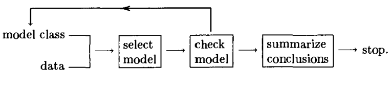

```{r setup, include=FALSE}
library(knitr)

default_source_hook <- knit_hooks$get('source')
default_output_hook <- knit_hooks$get('output')

knit_hooks$set(
  source = function(x, options) {
    paste0(
      "\n::: {.codebox data-latex=\"\"}\n\n",
      default_source_hook(x, options),
      "\n\n:::\n\n")
  }
)

knit_hooks$set(
  output = function(x, options) {
    paste0(
      "\n::: {.codebox data-latex=\"\"}\n\n",
      default_output_hook(x, options),
      "\n\n:::\n\n")
  }
)

knitr::opts_chunk$set(echo = TRUE)
```

# Recap

## The model

Writing the linear model:

\begin{equation}
y_i = \textcolor{red}{\alpha + \textbf{x}_i\symbf{\beta}} + \textcolor{blue}{\epsilon_i} \sim \mathcal{N}(0,\sigma^2)
\end{equation}

Is the same as:

\begin{equation}
\mathams{E}(y_i\vert \textbf{x}_i) = \alpha + \textbf{x}_i\symbf{\beta}
\end{equation}

as long as $\mathams{E}(\epsilon_i) = 0$.

## Generalised linear model

\begin{equation}
\begin{aligned}
 g\{\mathams{E}(y_i\vert x_i)\} &= \eta_i = \alpha + x_i\beta\\
 \mathams{E}(y_i\vert x_i) &= g^{-1}(\eta_i) = g^{-1}(\alpha + x_i\beta)
 \end{aligned}
\end{equation}

\center

\textbf{GLMs do not have a residual term}

## GLM Assumptions

- No outliers
- Independence
- Correct distribution
- Correct link function
- Correct variance function (implied by previous two)

# Outline

- Residual plots for checking GLM assumptions
- Issues with residuals in GLMs
- Types of residuals
- Residual diagnostics
- Dharma/quantile residuals
- Prediction error

## Modeling checking



# Residuals

## Methods for checking GLM assumptions

- ~~Tests~~
- Outliers: Cook's distance, Residual vs. fitted
- Independence: Partial residual plots, Residuals vs. fitted, Rresiduals vs. lagged residuals
- Correct distribution: QQ-plot
- Correct link function: residuals vs. fitted, include $\eta_i$ in the model \footnotesize (Hinkley 1985) \normalsize, linear predictor against transformed response
- Correct variance function: Abs(residuals) vs. fitted

## Response residuals

We could use the same residual as in linear regression:

$$\textcolor{blue}{\epsilon_i} = y_i - \textcolor{red}{\hat{\mu}_i}$$

But we do not expect these to look nice in GLMs.

- Because the variance depends on the mean
- We want nice looking residuals when a model is good
- We want bad looking residuals otherwise

## GLM residuals: Pearson's

Even though we lack the $\epsilon_i$ term in GLMs, we still calculate the residuals similarly

\pause

\begin{equation}
\hat{\epsilon_{i,pearson}} = \frac{y_i-\hat{\mu}_i}{\sqrt{\text{var}(y_i;\hat{\mu_i},\hat{\phi})}}
\end{equation}

as the scaled difference between data and mean

\pause

\center

\textbf{Approximately normally distributed in large samples}

## Recall deviance?

We do not have a $\epsilon_i$ term in GLMs, but we do have the deviance function

\pause

\begin{equation}
D(\textbf{y};\hat{\symbf{\mu}}) = \sum \limits^n_{i=1} 2y_i\{g(y_i)-g(\hat{\mu}_i)\} - y_i + \hat{\mu}_i
\end{equation}

Which represents distance to the saturated model

## GLM residuals: deviance

\begin{equation}
D(\textbf{y};\hat{\symbf{\mu}}) = \sum \limits^n_{i=1} 2y_i\{g(y_i)-g(\hat{\mu}_i)\} - y_i + \hat{\mu}_i
\end{equation}

\pause

- Note the summation over the observations
- Each observation has a defined contribution to the deviance
- $d_i = 2y_i\{g(y_i)-g(\hat{\mu}_i)\} - y_i + \hat{\mu}_i$
- We can use this to define a residual

\pause

\textbf{Deviance residuals}\newline
\begin{equation}
\hat{\epsilon_{i,deviance}} = \text{sign}(y_i - \hat{\mu}_i)\sqrt{d_i}, \qquad \text{so that } \sum \limits^n_{i=1} \hat{\epsilon_{deviance,i}}^2
\end{equation}

\center

\textbf{Approximately normally distributed in large samples}

## Why deviance residuals

- Converges faster to approximate normality \tiny \newline (Dunn and Smyth 2018, Cox and Snell 1968) \normalsize
- Can be adjusted for small samples \tiny (Pierce and Schafer 1986) \normalsize
  - e.g. Poisson $\mu_i^{-0.5}/6$

\pause

\textbf{Still inappropriate for discrete data and small samples}

## In practice

In practice, both Pearson's and Deviance residuals are often non-normally distributed.

## Randomized Quantile residual \tiny (Dunn and Smyth 1996) \normalsize

- Gold standard residual
- Better suited for small samples and discrete data types
- Exactly normally distributed
- Suitable for all kinds of models

### Continuous
\begin{equation}
r_Q = \Phi^{-1}\biggl\{\mathcal{F}\biggl(y_i;\hat{\mu_i},\hat{\phi}\biggr)\biggr\}
\end{equation}

```{r pgamma, eval=T, fig.align="center",out.width="30%", echo=F, warning=F,message=F, fig.show="hold"}
mu <- 2
y <- rpois(100,mu)

hist(qnorm(ppois(y,mu)), main="", cex.main=2, cex.lab=1.5, col="white", xlab="Normal deviates", ylab="")
hist(ppois(y, mu), main="", cex.main=2, cex.lab=1.5, col="white", xlab="Quantiles", ylab="")
```

# Example 2

## Example: horseshoe crabs 

Counts of male individuals ("satellites") near females (Note: not a crab)

\columnsbegin
\column{0.5\textwidth}


\column{0.5\textwidth}


\columnsend

## Horseshoe crabs: the data

Data originally from Brunswick  (1996) via Agresti (2007) via Dunn and Smyth (2018)

- 173 observations
- 4 traits: colour, spine condition, width (cm), weight (g)

\tiny

```{r, echo  =FALSE, message=FALSE, warning=FALSE}
data(hcrabs, package="GLMsData")
library(tidyr)
knitr::kable(head(hcrabs, 7), format="latex", booktabs = T)%>%kableExtra::kable_styling(position="center")
hcrabs$Col <-factor(hcrabs$Col, levels= c("LM","M","DM","D"))
levels(hcrabs$Col) <- c("Light medium","Medium","Dark medium","Dark")
hcrabs$Spine <-factor(hcrabs$Spine, levels= c("BothOK","OneOK","NoneOK"))
colnames(hcrabs)<-c("Colour","Spine","Width","Sat","Weight")
```

\normalsize

## What is the relationship between the number of satellites and the female crabs' traits?

\vspace*{-\baselineskip}

```{r, echo  =FALSE, message=FALSE, warning=FALSE, fig.width=13, fig.height=8}
par(mfrow=c(2,2))
plot(jitter(log1p(Sat)) ~Weight, data = hcrabs, ylab = "log(Number of satellites+1)", cex.lab=1.5, cex.axis = 2.5, cex = 2)
plot(jitter(log1p(Sat)) ~Colour, data = hcrabs, ylab = NA, yaxt="n", cex.lab=2.5, cex.axis=2.5, cex = 2)
plot(jitter(log1p(Sat)) ~Spine, data = hcrabs, ylab = NA, yaxt="n", cex.lab=2.5, cex.axis=2.5, cex = 2)
plot(jitter(log1p(Sat)) ~Width, data = hcrabs, ylab = NA, yaxt="n", cex.lab=2.5, cex.axis=2.5, cex = 2)
```


## Horseshoe crabs: fit the model

```{r}
model <- glm(Sat ~ Spine + Colour + Width + Weight, 
             family = "poisson", data = hcrabs)
```

## Horseshoe crabs: interpreting parameters

\small
```{r echo = FALSE}
signif(summary(model)$coefficients,digits = 2L)
```
\normalsize

<!-- (Intercept) = Light-medium coloured females with both spines in good condition \newline -->

How do we interpret the intercept? \newline
And its standard error?

\textcolor{red}{Weight and Width uncentered}

## Horseshoe crabs: interpreting parameters

\small
```{r echo = FALSE}
hcrabs$WeightC<-scale(hcrabs$Weight, scale = FALSE)
hcrabs$WidthC<-scale(hcrabs$Width, scale = FALSE)
model <- glm(Sat ~ Spine + Colour + WidthC + WeightC, 
             family = "poisson", data = hcrabs)
signif(summary(model)$coefficients,digits = 2L)
```

<!-- (Intercept) = Light-medium coloured females with both spines in good condition\newline -->

__Average weight: `r round(mean(hcrabs$Weight),2)`g __ \newline
__Average width: `r round(mean(hcrabs$Width),2)`cm __

How do we interpret the intercept? \newline
And its standard error?

\textcolor{red}{Weight and Width centered}
 
## Horseshoe crabs: interpreting parameters on the __response scale__

\footnotesize
- (Intercept) = Light-medium coloured females with both spines in good condition, Weight $\approx$ 2437g, Width $\approx$ 26.3cm
- Width: `exp(0.0170) = 1.017`, so double the number of satellites by `log(2)/0.01709 = 40.56`cm above average
- Weight: `exp(0.0005) = 1.0005`, so double the number of satellites by `log(2)/0.0005 = 1386.3`g above average

## Horseshoe crabs: visual interpretation

\small
```{r, echo  =FALSE, message=FALSE, warning=FALSE, fig.width=13, fig.height=8}
par(mfrow=c(1,3))
plot(effects::allEffects(model))
```

## Horseshoe crabs: Negative-binomial

\small
```{r}
modelnb <- MASS::glm.nb(Sat ~ Spine + Colour + Width + Weight,
                        data = hcrabs)
```

\normalsize

and compare the models:

```{r}
AIC(model, modelnb)
```

## Horseshoe crabs: comparing estimates

\footnotesize

```{r, echo = FALSE}
cbind("Poisson estimate"=signif(coef(model), 2L), "NB estimate" = signif(coef(modelnb), 2L), "Poisson SE" = signif(summary(model)$coef[,2],2L), "NB SE"= signif(summary(modelnb)$coef[,2],2L))
```

\normalsize 

- SEs have doubled
- Coefficients have changed, but largely the same conclusions
- Except perhaps for the effect of "Width"

## Horseshoe crabs: Poisson model residuals

```{r, echo = FALSE, fig.height = 8, fig.width = 13}
par(mfrow=c(1,3))
car::residualPlot(model, type="response", cex.main = 2, cex = 2, cex.lab = 1.5, main  ="Response")
car::residualPlot(model, type="deviance", cex.main = 2, cex = 2, cex.lab = 1.5, main  ="Deviance")
car::residualPlot(model, type="pearson", cex.main = 2, cex = 2, cex.lab = 1.5, main  ="Pearson")
```

## Horseshoe crabs: NB model residuals

```{r, echo = FALSE, fig.height = 8, fig.width = 13}
par(mfrow=c(1,3))
car::residualPlot(modelnb, type="response", cex.main = 2, cex = 2, cex.lab = 1.5, main  ="Response")
car::residualPlot(modelnb, type="deviance", cex.main = 2, cex = 2, cex.lab = 1.5, ylab = NA, main = "Deviance")
car::residualPlot(modelnb, type="pearson", cex.main = 2, cex = 2, cex.lab = 1.5, ylab = NA, main = "Pearson")
```

## Horseshoe crabs: Dunn-Smyth residuals

```{r, echo = FALSE, fig.height = 8, fig.width = 13}
par(mfrow=c(1,3))
# Poisson
b <- ppois(as.vector(hcrabs$Sat), predict(model, type = "response"))
a <- pmin(b, ppois(as.vector(hcrabs$Sat)-1, predict(model, type = "response")))
u <- runif(length(a),min=a,max=b)
plot(predict(model),qnorm(u), ylab = NA, xlab  = "Fitted values", main = "Horseshoe crabs Poisson", cex.main = 2, cex = 2, cex.lab = 1.5)
panel.smooth(y=qnorm(u),predict(model), cex = 0)
# negative-binomial
b <- pnbinom(as.vector(hcrabs$Sat), mu = predict(modelnb, type = "response"), size = modelnb$theta)
a <- pmin(b, pnbinom(as.vector(hcrabs$Sat)-1, mu = predict(modelnb, type = "response"), size = modelnb$theta))
u <- runif(length(a),min=a,max=b)
plot(predict(modelnb),qnorm(u), ylab = NA, xlab  = "Fitted values", main = "Horseshoe crabs NB", cex.main = 2, cex = 2, cex.lab = 1.5)
panel.smooth(y=qnorm(u),predict(modelnb), cex = 0)
```

# Prediction

When you are only interested in predictions, e.g.:

- 20 years from now
- on a map
- new values of predictors $x_i$

Some assumptions might not matter. Generally, we still do not want structural deviations from the model.

## Finding a model that predicts well\only<2->{: better}

\only<2->{\textcolor{red}{un}}Usual procedure
\begin{enumerate}
\itemsep-0.5em
\item \alt<2->{\textcolor{red}{Fit model to} \sout{a part of} \textcolor{red}{the data} \sout{("train" and "test")} }{Fit model to a part of the data ("train" and "test")}
\item \alt<2->{\sout{Predict for the remaining part ("test")} \textcolor{red}{Collect new data}}{Predict for the remaining part ("test")}
\item Quantify prediction error (e.g., RMSE)
\item Adjust model to minimize 3)
\end{enumerate}

Notes
\only<3>{
\begin{enumerate}
\itemsep-0.5em
\item Statistically leaving out data is weird
\item We want as much information for our model as possible.
\item The model should be applicable beyond just the data that we observed
\end{enumerate}
}

## Quantifying prediction error

MSE: $\frac{1}{n}\sum \limits^n_{i=1}(y_i-\mu_i)^2$\newline
RMSE: $\sqrt{\frac{1}{n}\sum \limits^n_{i=1}(y_i-\mu_i)^2}$ \newline
MAD: $\text{median}(\vert\textbf{y}-\symbf{\mu}\vert)^2$\newline

Or another metric. "AUC" is often used in binomial models.\newline

\textbf{For prediction, we want a model that performs well on one of these metrics.}

# Example

## Leave-one-out cross-validation Horseshoe crabs

```{r, echo = FALSE}
#prevent issues with factors in cross-validation
hcrabs <- data.frame(cbind(model.matrix(Sat ~ 0+Spine + Colour + Width + Weight, hcrabs), Sat = hcrabs$Sat))
model2 <- update(model2, formula = Sat~SpineBothOK+SpineOneOK+SpineNoneOK+ColourMedium+ColourDark.medium+ColourDark+Width+Weight)
```


```{r, cache = TRUE, warning=FALSE}
SE <- NULL
for(i in 1:nrow(hcrabs)){
set.seed(i)
train <- hcrabs[-i,]
model2 <- update(model2, data = train)
SE <- c(SE,(hcrabs[i, "Sat"]-
  predict(model2,newdata = hcrabs[i, ], type="response"))^2)
}
```

## Result

```{r, echo = FALSE, fig.height  =5}
hist(SE, main = "Leave-one-out", xlab = "Squared error")
```
\tiny
```{r}
cat("RMSE: ", sqrt(mean(SE)))
```

## K-fold cross-validation Horseshoe crabs

```{r, cache = TRUE, warning=FALSE}
k = 5
SE <- NULL
shuffle <- sample(1:nrow(hcrabs), nrow(hcrabs))
folds <- split(1:nrow(hcrabs), rep(1:k, length.out = nrow(hcrabs)))

for(i in 1:k){
idx <- folds[[i]]
test <- hcrabs[idx,]
train <- hcrabs[-idx, ]
model <- update(model2, data = train)
SE <- c(SE,(test$Sat-
  predict(model, newdata = test, type="response"))^2)
}
```

## Result

```{r, echo = FALSE, fig.height = 5}
hist(SE, main = "k-fold", xlab = "Squared error")
```
\tiny
```{r}
cat("RMSE: ", sqrt(mean(SE)))
```

## Stratified cross-validation

- Cross-validation in a structured fashion: time or space.

- Select roughly equal partitions
  - Time: fit to a few years per partition
  - Space: areas
- I.e., blocking for non-independent responses

## Stratified k-fold cross-validation Horseshoecrabs

Ensure a (roughly) similar distribution in every fold. For binary data, true stratified CV maintains the proportion.

\footnotesize
```{r, cache = TRUE, warning=FALSE}
k = 5
SE <- NULL
folds <- split(1:nrow(hcrabs),sample(rep(1:k, length.out = nrow(hcrabs))))

for(i in 1:k){
test <- hcrabs[order(hcrabs$Sat),][folds[[i]],]
train <- hcrabs[order(hcrabs$Sat),][-folds[[i]],]
model <- update(model2, data = train)
SE <- c(SE,(test$Sat-
predict(model, newdata = test, type="response"))^2)
}
```

## Result

```{r, echo = FALSE, fig.height = 5}
hist(SE, main = "stratified k-fold", xlab = "Squared error")
```
\tiny
```{r}
cat("RMSE: ", sqrt(mean(SE)))
```

# Summary

- I did not mention Anscombe residuals, nor working residuals
- Do not draw conclusions before validating your model
- Use residual diagnostics/plots!
- If violated, adjust the model
- For prediction, look at cross-validation
  - Consider the structure of the data
  - Use independently collected data
  - There are many forms of cross-validation and quantifying error
  - Find model that minimizes the prediction error
  
Useful packages: \texttt{car}, \texttt{DHARMa}, \texttt{boot}
