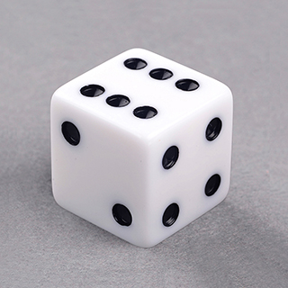
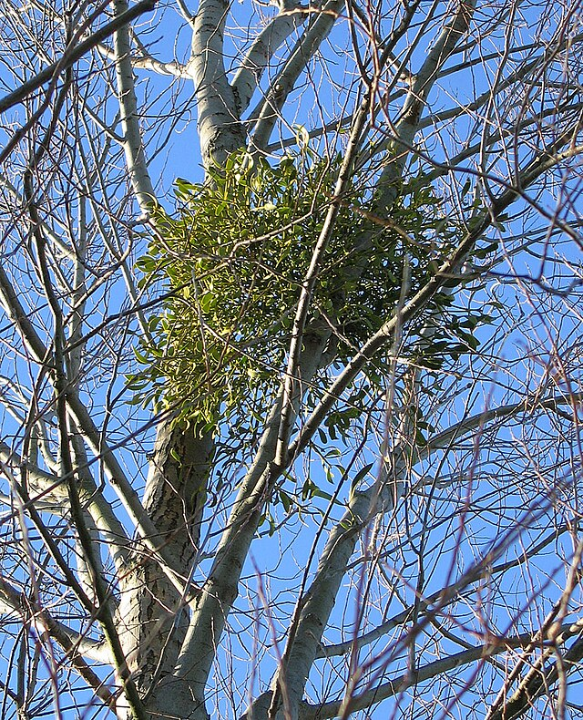

```{r setup, include=FALSE}
library(knitr)

default_source_hook <- knit_hooks$get('source')
default_output_hook <- knit_hooks$get('output')

knit_hooks$set(
  source = function(x, options) {
    paste0(
      "\n::: {.codebox data-latex=\"\"}\n\n",
      default_source_hook(x, options),
      "\n\n:::\n\n")
  }
)

knit_hooks$set(
  output = function(x, options) {
    paste0(
      "\n::: {.codebox data-latex=\"\"}\n\n",
      default_output_hook(x, options),
      "\n\n:::\n\n")
  }
)

knitr::opts_chunk$set(echo = TRUE)
```

# Outline

- Models so far
- Other GLMs
- Other useful models
- Some other approaches (\textbf{tomorrow})

## Covered GLMs

- Linear regression
- Binomial regression
- Poisson regression
- Negative-binomial regression (for fixed dispersion)

## Other models 

\begin{itemize}
\itemsep-0.5em
\item \textcolor{red}{Log-normal regression}
\item \textcolor{blue}{Inverse Gaussian regression}
\item \textcolor{blue}{Gamma regression}
\item \textcolor{blue}{Tweedie regression}
\item \textcolor{red}{beta-binomial regression}
\item \textcolor{blue}{Multinomial regression}
\item \textcolor{blue}{Ordinal regression}
\item \textcolor{red}{Zero-inflated regression}
\item \textcolor{red}{Zero-truncated regression}
\item Hurdle models
\item \textcolor{red}{Conway-Maxwell-Poisson regression}
\item \textcolor{orange}{Beta regression}
\end{itemize}

\textcolor{blue}{is EF and GLM}, \textcolor{orange}{is EF but not GLM}, \textcolor{red}{is not EF or GLM}

# Positive continuous data

Data bounded at zero $y_i>0$, and might or might not include zeros.

- Usually (right) skewed
- Variance increases with mean

E.g.,:

\columnsbegin
\column{0.5\textwidth}

- Biomass
- Size measurements
- Nitrogen in soil

\column{0.5\textwidth}

- Amount of rainfall
- Insurance claims

\columnsend

Options:

- Log-normal regression
- Inverse Gaussian GLM
- Gamma GLM
- __Tweedie GLMs__

## Log-normal regression

Connected to the normal distribution, in the sense:
\begin{equation}
\begin{aligned}
\log(y_i) &\sim \mathcal{N}(\mu_i,\sigma^2)\\
y_i &\sim \mathcal{Lognormal}(\mu_i,\sigma^2)
\end{aligned}
\end{equation}

- So, easy to fit!
- Two parameters: $\mu_i$ and $\sigma^2$
- $\mathams{E}(y_i\vert x_i) = \exp(\mu_i + \frac{\sigma^2}{2})$
- $\text{var}(y_i\vert x_i) = \{\exp(\sigma^2)-1\}\exp(2\mu_i+\sigma^2)$

\textbf{We are not modeling the mean but the location parameter $\mu_i$}

## Inverse Gaussian GLM

- Sharper peak and heavier tails than log-normal
- Often used in presence of extreme events

\begin{equation}
\begin{aligned}
\frac{1}{\mathams{E}(y_i\vert\textbf{x}_i)^2} &= \alpha + \textbf{x}_i\symbf{\beta}\\
\mathams{E}(y_i\vert\textbf{x}_i) &= \frac{1}{(\alpha + \textbf{x}_i\symbf{\beta})^2}
\end{aligned}
\end{equation}

- parameters: location $\mu_i$ and dispersion $\phi$
- canonical link: squared inverse
- alternatively inverse, log-link

$\text{var}(y_i\vert \textbf{x}_i) = \frac{\mu_i^3}{\phi}$

## Gamma GLM

- (negative) Inverse link is canonical
  - provide starting positive values `mustart`
- Log-link is more stable

## Tweedie distributions

Many of the distributions so far are special forms of the *Tweedie family* of distributions:

$\text{var}(y_i\vert\textbf{x}_i) = \mu_i^\xi\phi$

\columnsbegin
\column{0.5\textwidth}

- Normal distribution $\xi = 0$
- Poisson distribution $\xi = 1$

\column{0.5\textwidth}

- Gamma distribution $\xi = 2$
- Inverse Gaussian distribution $\xi = 3$

\columnsend

With Tweedie we can:

- Analyse positive continuous data (with zeros!)
- Counts

# Example 1

## Our example data: soil nitrogen

Originally by Lane et al. (2002)

- Soil nitrogen in kilograms per hectare
- Nitrogen fertilizer dose in kilograms per hectare

\center

```{r,echo=FALSE}
data(nitrogen, package="GLMsData")
```

```{r, echo = FALSE}
knitr::kable(head(nitrogen, 8), format="latex", booktabs = T)
```

## Log-normal regression in \texttt{R}

```{r}
model1 <- lm(log(SoilN)~Fert, data = nitrogen)
fitted <- exp(predict(model1)) #We need to backtransform
exp(cbind(est=coef(model1), confint(model1)))
```

- Soil nitrogen increases with supplied nitrogen
- $\log(2)/0.007234334 \approx 96$
- Soil nitrogen doubles for almost every 100 kg/hectare fertilizer

<!-- ## Doubling soil nitrogen  -->

<!-- \begin{equation} -->
<!-- \begin{aligned} -->
<!-- \exp((x_i+\Delta)\beta) &= \exp(x_i\beta)2\\ -->
<!-- \exp(x_i\beta)\exp(\Delta\beta) &= \exp(x_i\beta)2\\ -->
<!-- \exp(-\Delta\beta) &= \frac{1}{2}\\ -->
<!-- \Delta\beta &= \log(2)\\ -->
<!-- \Delta = \log(2)/\beta -->
<!-- \end{aligned} -->
<!-- \end{equation} -->


## Log-normal regression: results

```{r, echo = FALSE, fig.height = 6}
plot(nitrogen$Fert,nitrogen$SoilN, xlab="FertN", ylab="SoilN", cex = 2, cex.lab=2, cex.axis=2)
segments(x0=100,x1=100,y0=0,y1=exp(predict(model1,newdata=data.frame(Fert=100))),col="red")
segments(x0=100,x1=-10,y0=exp(predict(model1,newdata=data.frame(Fert=100))),y1=exp(predict(model1,newdata=data.frame(Fert=100))),col="red")

segments(x0=200,x1=200,y0=0,y1=exp(predict(model1,newdata=data.frame(Fert=200))),col="red")
segments(x0=200,x1=-10,y0=exp(predict(model1,newdata=data.frame(Fert=200))),y1=exp(predict(model1,newdata=data.frame(Fert=200))),col="red")

lines(seq(0,max(nitrogen$Fert),length.out=100), exp(predict(model1,newdata=data.frame(Fert=seq(0,max(nitrogen$Fert),length.out=100)))),type="l",ylim=c(0,70), lwd = 2, xlab  ="FertN", ylab="SoilN", cex.lab=1.5, cex = 2)
```

## Data-transformed linear regression

- I don't generally recommend response transformations
- Works poorly for a range of data-types
- GLMs are there to avoid this sort of thing
- But it usually works well for data with a large mean

## Inverse Gaussian GLM in \texttt{R}

\tiny

```{r}
model2 <- glm(SoilN~Fert, data = nitrogen, family = "inverse.gaussian")
summary(model2)
```

\normalsize

Interpretation is -very- difficult with inverse-type link functions

## Inverse Gaussian GLM: results

```{r, echo  =FALSE, fig.height = 6}
plot(seq(0,max(nitrogen$Fert),length.out=100), predict(model2,newdata=data.frame(Fert=seq(0,max(nitrogen$Fert),length.out=100)),type="response"),type="l",ylim=c(0,70), lwd = 2, xlab  ="FertN", ylab="SoilN", cex.lab=1.5, cex = 2)

points(nitrogen$Fert,nitrogen$SoilN,col="red", cex = 2,pch=16)
```

## Gamma GLM

\tiny

\hfill (note, uppercase Gamma)

```{r}
model3 <- glm(SoilN~Fert, data = nitrogen, family = "Gamma")
summary(model3)
```

\normalsize

## Gamma GLM: results

```{r, echo  =FALSE}
plot(seq(0,max(nitrogen$Fert),length.out=100), predict(model3,newdata=data.frame(Fert=seq(0,max(nitrogen$Fert),length.out=100)),type="response"),type="l",ylim=c(0,70), lwd = 2, xlab  ="FertN", ylab="SoilN", cex.lab=1.5, cex = 2)

points(nitrogen$Fert,nitrogen$SoilN,col="red", cex = 2,pch=16)
```

## Tweedie GLM in \texttt{R}: finding $\xi$

```{r, cache = TRUE, warning=FALSE, echo = FALSE, fig.height = 4}
out.est <- tweedie::tweedie.profile(SoilN ~ Fert, xi.vec = seq(2.01, 4, by=0.05), data = nitrogen)
out.est2 <- tweedie::tweedie.profile(SoilN ~ Fert, xi.vec =  seq(out.est$xi.max-0.5, out.est$xi.max+0.5, by=0.01), data = nitrogen, verbose = FALSE)
plot(out.est2, xlab = expression(xi), ylab="Log-likelihood", type = "l")
abline(v=out.est2$xi.max, col = "red")
```

## Tweedie GLM in \texttt{R}: fitting

\tiny

```{r}
model4 <- glm(SoilN~Fert, data = nitrogen, family = statmod::tweedie(var.power = out.est2$xi.max))
summary(model4)
```

\normalsize

## All together

```{r, echo  =FALSE}
plot(seq(0,max(nitrogen$Fert),length.out=100), predict(model3,newdata=data.frame(Fert=seq(0,max(nitrogen$Fert),length.out=100)),type="response"),ylim=c(0,70), lwd = 2, xlab  ="FertN", ylab="SoilN", cex.lab=1.5, cex = 2, type = "n")

points(nitrogen$Fert,nitrogen$SoilN,col="red", cex = 2,pch=16)

lines(seq(0,max(nitrogen$Fert),length.out=100), exp(predict(model1,newdata=data.frame(Fert=seq(0,max(nitrogen$Fert),length.out=100)))))
lines(seq(0,max(nitrogen$Fert),length.out=100), predict(model2,newdata=data.frame(Fert=seq(0,max(nitrogen$Fert),length.out=100)),type="response"), lty = "dashed", col ="blue")
lines(seq(0,max(nitrogen$Fert),length.out=100), predict(model3,newdata=data.frame(Fert=seq(0,max(nitrogen$Fert),length.out=100)),type="response"), lty = "dotted", col = "pink")
lines(seq(0,max(nitrogen$Fert),length.out=100), predict(model4,newdata=data.frame(Fert=seq(0,max(nitrogen$Fert),length.out=100)),type="response"), lty = "dotdash", col = "purple")

legend("topleft", lty = c("solid", "dashed", "dotted", "dotdash"), col = c("black","blue","pink", "purple"), legend = c("Log-normal", "Inverse Gaussian", "Gamma", "Tweedie"))
```

## Conclusion

- They can be relatively similar, but link function matters.
- \textbf{Mind the tail behavior}

\textbf{Tweedie for flexible modeling of positive data (potentially with zeros)}

# Categories

Binomial models assume \textbf{dichotomy} \newline 
Alternative: \textbf{polychotomy}, multiple groups

## Multinomial

Gives the number of successes for a set of outcomes (instead of either success or fail)

{width=30%}

## Multinomial logistic regression

The model we assume is:

\begin{equation}
\begin{aligned}
\text{pr}(y_{ij}) = \pi_{ij} &= \frac{\exp(\eta_{ij})}{1+\exp(\eta_{ij})}\\
\log(\frac{\pi_{ij}}{1-\pi_{ij}}) = \eta_{ij} &= \textbf{x}_{ij}\symbf{\beta}_j
\end{aligned}
\end{equation}

- E.g., probability of observing species at a site.
- We could fit multiple binomial models
  - Gets a bit messy: $y_{i1} \vert N_i \sim \mathcal{Bin}(\pi_{i1};N_i)$
  - $y_{i2} \vert N_i-y_{i1} \sim \mathcal{Bin}(\pi_{ij};N_i-y_{i1})$
- Equivalent to using a Poisson regression with fixed total


## Cumulative link models, such as:

For ordered data

-
-
-


## Ordinal: proportional odds

More commonly, the categories are ordered.

\begin{equation}
\text{pr}(y_i\leq j) = \sum \limits^{j}_{k=1} \text{pr}(y_k) = \frac{\exp(\theta_j + \symbf{\beta}^\top\symbf{x}_i)}{1+\exp(\theta_j + \symbf{\beta}^\top\symbf{x}_i)}
\end{equation}

- E.g., cover classes

<!-- MASS::polr(as.factor(dune[,"Bracruta"])~A1,data=dune.env) -->

## Ordinal: proportional odds

Referred to as "proportional odds" because:

\begin{equation}
\frac{\pi_{ij}/(1-\pi_{ij})}{\pi_{i+1j}/(1-\pi_{i+1j})} = \exp\{\symbf{\beta}(\symbf{x}_{ij}-\symbf{x}_{i+1j})\}
\end{equation}

the log-odds is proportional to the difference in the covariates.

## Ordinal example: vegetation data

\footnotesize

```{r}
data(dune,dune.env,package="vegan")
data <- cbind(y=as.factor(dune$Bracruta), dune.env)
(model5 <- MASS::polr(y~A1, data = data))
```

\normalsize

## Example: vegetation data

\small

```{r}
predict(model5,type="probs")
```

\normalsize

## Ordinal example: vegetation data

```{r, echo = FALSE, fig.height = 6}
A1new <- seq(0,100,length.out=1000)
preds <- predict(model5,type="probs", newdata=data.frame(A1=A1new))
plot(1,xlim=c(min(A1new),max(A1new)),ylim=c(0,1), xlab = "A1", ylab="Predicted probability", cex.lab=1.5, cex = 2, type = "n")
lines(A1new, preds[,1], col = "red", lwd = 2)
lines(A1new, preds[,2], lwd = 2)
lines(A1new, preds[,3], lty = "dashed", lwd = 2)
lines(A1new, preds[,4], col = "red", lty="dashed", lwd = 2)
lines(A1new, preds[,5], lty = "dotted", col = "orange", lwd = 2)
legend("topleft", lty=c("solid","solid","dashed","dashed","dotted"),col=c("red","black","black","red","orange"),legend=c("Class 1", "Class 2", "Class 3", "Class 4", "Class 5"), cex =2)
```

Note that ordering has introduced some shapes.

# Proportions

We cannot analyse proportion data with linear regression; might get something below zero or above one 

- Proportions usually include 0 and/or 1, but also everything between
- Binomial responses are dichotomous (either 0 or 1), not proportions
- If we know the total, we can specify the Binomial directly in terms of proportions

## Recall: binomial GLM

\begin{equation}
\mathcal{L}(y_i;\Theta) = \text{exp}\biggl\{\textcolor{orange}{\log\binom{N}{r}} + \frac{\frac{r}{N}\textcolor{blue}{\log(\frac{p_i}{1-p_i})}+\textcolor{red}{\log(1-p_i)}}{\textcolor{pink}{1/N}}\biggr\}
\end{equation}

\pause
in terms of proportion of successes:
\begin{equation}
\mathcal{L}(Ny_i;\Theta) = \text{exp}\biggl\{\textcolor{orange}{\log\binom{N}{N y_i}} + \frac{y_i\textcolor{blue}{\log(\frac{p_i}{1-p_i})}+\textcolor{red}{\log(1-p_i)}}{\textcolor{pink}{1/N}}\biggr\}
\end{equation}

\pause

\center

\textbf{So, we still model the successes and failures}

## Unknown total

If the number of trials is unknown, we cannot specify a binomial glm

- We can model the proportions directly
- "beta regression", which is not a GLM
- Various packages implement it, with logit or probit link-functions
- Requires data between 0 and 1 (i.e., without 0 or 1)

When there are zeros and/or ones..zero-inflated models or hurdle models (ZIB or ordered beta regression).
 
## Beta distribution 

Two parameter distribution with mean and variance

```{r, echo = FALSE, fig.height=5, fig.align="center"}
par(mfrow=c(2,2))
meanb <- function(shape1, shape2)shape1/(shape1+shape2)
varb <- function(shape1, shape2)(shape1*shape2)/((shape1+shape2)^2*(shape1+shape2+1))
shape1 <- 0.5;shape2<-0.5
hist((y<-rbeta(1000,shape1, shape2)), xlab = expression(y[i]), main = bquote(mu == .(meanb(1,1)) ~ "," ~ sigma^2 == .(varb(shape1,shape2))), cex.main = 2, cex.lab = 1.5, ylab = "Frequency")
shape1 <- 5;shape2<-1
hist((y<-rbeta(1000,shape1, shape2)), xlab = expression(y[i]), main = bquote(mu == .(meanb(1,1)) ~ "," ~ sigma^2 == .(varb(shape1,shape2))), cex.main = 2, cex.lab = 1.5, ylab = "Frequency")
shape1 <- 1;shape2<-3
hist((y<-rbeta(1000,shape1, shape2)), xlab = expression(y[i]), main = bquote(mu == .(meanb(1,1)) ~ "," ~ sigma^2 == .(varb(shape1,shape2))), cex.main = 2, cex.lab = 1.5, ylab = "Frequency")
shape1 <- 2;shape2<-2
hist((y<-rbeta(1000,shape1, shape2)), xlab = expression(y[i]), main = bquote(mu == .(meanb(1,1)) ~ "," ~ sigma^2 == .(varb(shape1,shape2))), cex.main = 2, cex.lab = 1.5, ylab = "Frequency")
```

# Example 2
 
## Example: Baseball game wins

Wins of baseball games


## Baseball wins: the data

Data from Cochran (2002)

- 838 games
- Many variables: team, league, division, year, runs scores, wins
- Response variable: attendance

\tiny

```{r, echo  =FALSE, message=FALSE, warning=FALSE}
data("MLBattend", package="UsingR")
MLBattend <- cbind(MLBattend, prop_wins = MLBattend$wins/(MLBattend$wins+MLBattend$losses))
library(tidyr)
knitr::kable(head(MLBattend, 7), format="latex", booktabs = T)%>%kableExtra::kable_styling(position="center")
```

\normalsize

\center
\textbf{Note the new column $prop_wins = \frac{wins}{wins+losses}$}

## Baseball wins: binomial GLM

Without weights
\tiny
```{r}
model6 <- glm(prop_wins ~ attendance, family="binomial", data = MLBattend)
```
\normalsize
With weights
\tiny
```{r}
model6 <- glm(prop_wins ~ scale(attendance), family="binomial", weights = wins + losses, data = MLBattend)
```

## Baseball wins: beta regression

\tiny
```{r, message=FALSE, warning=FALSE}
library(glmmTMB)
model7 <- glmmTMB(prop_wins ~ scale(attendance), family=beta_family(), data = MLBattend)
```

```{r, echo = FALSE}
cbind(data.frame(binomial = coef(model6)), data.frame(beta=fixef(model7)$cond))
```

# Excess zeros

When there are more zeros than the selected distribution can generate.

- Can be accounted for with additional model terms (covariate)
- Alternatively:
  - Zero-inflated models
  - Hurdle models
  - Negative-binomial models: can handle excess zeros very well

1) Zero-inflated models: another process generates additional zeros (e.g., colonisation vs. abundance)
- e.g., Species abundance
2) Hurdle models: only one of the two processes generates values below the hurdle \newline
- e.g., positive data with zeros, percentages

## Zero-inflation (Poisson)

\begin{equation}
y_i \sim ZIP(\lambda_{ij}, \pi_i)
\end{equation}

\begin{equation}
y_{i} \vert \nu_{j} \sim 
\begin{cases}
pPois(\lambda_i)  & \text{if}\ y_{i} > 0\\
\begin{cases}
p\exp(-\lambda_{i}) & \text{if}\ \nu_{i} = 1\\
1-p & \text{if}\ \nu_{i} = 0
\end{cases}
& \text{if}\ y_{i}  = 0\\
\end{cases}
\end{equation}

- can choose to separately model $p$ as a logistic regression
- quadratic mean-variance as in NB

# Example 3

## Example: Mistletoe infections

Counts of mistletoe infections


## Mistletoe: the data

Mistletoe data covered in Zuur (2021)

- Count of mistletoe infections in a tree stand
- DBH, tree infected or not, size of largest mistletoe

```{r, echo = FALSE}
data <- read.csv("../data/MistletoeV2.csv", header = TRUE)
knitr::kable(head(data, 8), format="latex", booktabs = T)
```

## Mistletoe: visually

```{r, echo = FALSE, fig.height = 6}
hist(data$No.of.mistletoes, xlab="Count", main = "Mistletoe infections")
```

## Mistletoe: poisson regression

\tiny
```{r}
model8 <- glm(No.of.mistletoes~DBH, family="poisson", data = data)
```

```{r, eval = FALSE, echo = FALSE}
DHARMa::testZeroInflation(model8)
```

```{r, eval = TRUE, echo = FALSE, fig.height = 3}
invisible(DHARMa::testZeroInflation(model8))
```

```{r, eval = TRUE, echo = FALSE, fig.height = 3}
DHARMa::testZeroInflation(model8, plot = FALSE)
```

## Mistletoe: zero-inflated poisson regression

\tiny
```{r}
model9 <- glmmTMB::glmmTMB(No.of.mistletoes~DBH,ziformula=~1, family="poisson", data = data)
```

```{r, eval = TRUE, echo = FALSE, fig.height = 3}
invisible(DHARMa::testZeroInflation(model9))
```

```{r, eval = TRUE, echo = FALSE, fig.height = 3}
DHARMa::testZeroInflation(model9, plot = FALSE)
```

## Summary

- At least not mentioned: Generalized and Conway-Maxwell Poisson
- Ordered beta
- Truncation
- Many, many others

