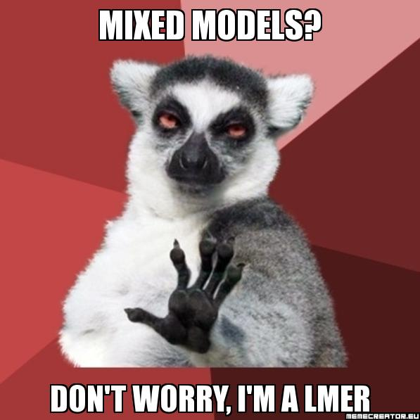
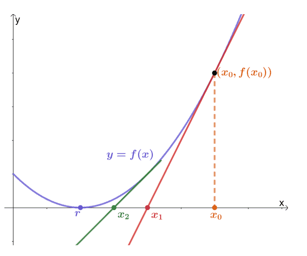
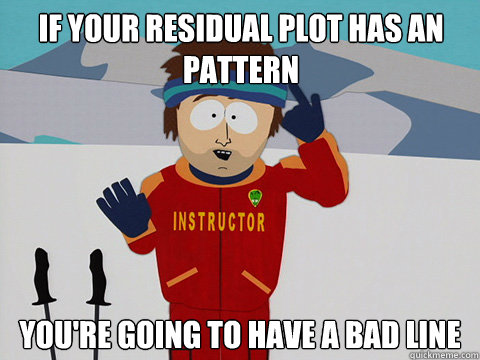

    
```{r setup, include=FALSE}
library(knitr)

default_source_hook <- knit_hooks$get('source')
default_output_hook <- knit_hooks$get('output')

knit_hooks$set(
    source = function(x, options) {
        paste0(
            "\n::: {.codebox data-latex=\"\"}\n\n",
            default_source_hook(x, options),
            "\n\n:::\n\n")
    }
)

knit_hooks$set(
    output = function(x, options) {
        paste0(
            "\n::: {.codebox data-latex=\"\"}\n\n",
            default_output_hook(x, options),
            "\n\n:::\n\n")
    }
)

knitr::opts_chunk$set(echo = TRUE)
```


# Recap

## Questions about yesterday?

\center

{width=40%}

## A typical workflow

1) Collect data
2) \alt<2>{\textcolor{blue}{Fit a model}}{Fit a model}
3) \alt<2>{\textcolor{blue}{Check assumptions}}{Check assumptions}
4) \alt<2>{\textcolor{blue}{Perform inference}}{Perform inference}
5) Write article

## Outline

- GLMs assume independence
- Mixed-effects models for clustered observations

# "Technicalities"

```{r echo=F,out.width="50%", fig.align="center"}

```

- We can formulate the same models
- But now, effects are from a distribution
- This allows us to incorporate correlation

## Recap Likelihood: independence


\begin{equation}
\mathcal{L}(\textbf{y};\Theta) = \prod \limits^n_i f(y_i;\Theta)
\end{equation}

We just multiply! (assumes independence)

## Our new likelihood

\begin{equation}
\mathcal{L}(\textbf{y};\symbf{\Sigma}) = \displaystyle \int \prod \limits^n_i f(y_i \vert \textbf{u}) f(\textbf{u};\symbf{\Sigma}) d\textbf{u}
\end{equation}

- Fixed effects: what we had so far
- Random effects: new, come from a distribution
- Mixed effects: contains both

\center

\textbf{Also notice that we cannot work with the log-likelihood here :(}

## The mixed-effects model

\begin{equation}
              \tikz[baseline,remember picture]{
              \node[fill=green!20,anchor=base] (t2)
              {$g$};
            }
            \{
 \tikz[baseline,remember picture]{
              \node[fill=blue!20,anchor=base] (t1)
              {$\text{E}(\textbf{y} \vert \textbf{u})$};
            } 
            \}
            = 
            \tikz[baseline,remember picture]{
            \only<1>{
              \node[fill=purple!20,anchor=base] (t3)
              {$\textbf{X}$};
            }
            \only<2>{
              \node[rectangle,draw,dotted,fill=purple!20,anchor=base] (t3)
              {$\textbf{X}$};
            }
            }
            \tikz[baseline,remember picture]{
            \only<1>{
              \node[rectangle,draw,solid,fill=purple!20,anchor=base] (t4)
              {$\beta$};
            }
            \only<2>{
              \node[fill=purple!20,anchor=base] (t4)
              {$\beta$};
            }
            }
            + 
            \tikz[baseline,remember picture]{
            \only<1>{
             \node[dotted,fill=gray!20,anchor=base] (t5)
              {$\textbf{Z}$};
            }
            \only<2>{
            \node[rectangle,draw,dotted,fill=gray!20,anchor=base] (t5)
              {$\textbf{Z}$};
            }
            } 
             \tikz[baseline,remember picture]{
             \only<1>{
             \node[rectangle,draw,solid,fill=gray!20,anchor=base] (t6)
              {$\textbf{u}$};
            }
            \only<2>{
             \node[fill=gray!20,anchor=base] (t6)
              {$\textbf{u}$};
            }
             }
\end{equation}

\begin{enumerate}
    \item Link-function
        \tikz[na,remember picture]\node[coordinate] (n2) {};
    \item Conditional mean
        \tikz[na,remember picture]\node[coordinate] (n1) {};
    \item \alt<1>{Fixed effects parameter vector}{Fixed effects design matrix}
        \tikz[na,remember picture]\node[coordinate] (n3) {};
    \item\alt<1>{Random effects parameter vector}{Random effects design matrix}
        \tikz[na,remember picture]\node[coordinate] (n4) {};
\end{enumerate}

\begin{tikzpicture}[overlay,remember picture]
        \path[->] (n1) edge [bend right] (t1);
        \path[->] (n2) edge [bend right] (t2);
        \path[->]<1> (n3) edge [bend right] (t4);
        \path[->]<1> (n4) edge [bend right] (t6);
        \path[->]<2> (n3) edge [bend right] (t3);
        \path[->]<2> (n4) edge [bend right] (t5);
\end{tikzpicture}

## The random effects design matrix

- it's the kind of thing as the fixed effects design matrix!

## When to include a random effect

- Unobserved effect vs. observed effect
- To account for pseudo replication
- Nuisance vs. of interest
- If parameter comes from a population
- To incorporate correlation

## A linear mixed-effects model

\begin{columns}
\column{0.6\textwidth}
\only<1->{
\begin{equation}
 \tikz[baseline,remember picture]{
              \node[fill=blue!20,anchor=base] (t1)
              {$\text{E}(\textbf{y} \vert \textbf{u})$};
            } = 
            \tikz[baseline,remember picture]{
              \node[anchor=base] (t2)
              {$\symbf{\mu}$};
            }
\end{equation}
}

\only<2->{
\begin{equation}
 \tikz[baseline,remember picture]{
              \node[fill=blue!20,anchor=base] (t1)
              {$\textbf{y}$};
            } = 
              \tikz[baseline,remember picture]{
              \node[fill=purple!20,anchor=base] (t3)
              {$\textbf{X}\symbf{\beta}$};
            } + 
            \tikz[baseline,remember picture]{
             \node[fill=gray!20,anchor=base] (t4)
              {$\textbf{Z}\textbf{u}$};
            } + 
            \tikz[baseline,remember picture]{
             \node[fill=yellow!90!black,anchor=base] (t5)
              {$\textbf{e}$};
            }
\end{equation}
}
\only<3->{

with
\begin{math}
 \tikz[baseline,remember picture]{
             \node[fill=gray!20,anchor=base] (t4)
              {$\textbf{u}$};
            } \sim \mathcal{N}(0,\symbf{\Sigma})
\end{math}

\pause 

with
\begin{math}
\tikz[baseline,remember picture]{
             \node[fill=yellow!90!black,anchor=base] (t5)
              {$\textbf{e}$};
            } \sim \mathcal{N}(0,\textbf{I}\sigma^2)
\end{math}
}

\column{0.4\textwidth}

```{r echo=F,out.width="100%", fig.align="right"}

```

\end{columns}


## A linear mixed-effects model

We can rewrite the model in terms of the complete error term.

\begin{columns}
\column{0.6\textwidth}

\begin{equation}
 \tikz[baseline,remember picture]{
              \node[fill=blue!20,anchor=base] (t1)
              {$\textbf{y}$};
            } = 
              \tikz[baseline,remember picture]{
              \node[fill=purple!20,anchor=base] (t3)
              {$\textbf{X}\symbf{\beta}$};
            } +  
            \tikz[baseline,remember picture]{
             \node[fill=yellow!90!black,anchor=base] (t4)
              {$\symbf{\epsilon}$};
            }
  \only<2>{
   \tikz[remember picture,overlay]{
    \draw[->] (t4.south)++(0,-5ex) to (t4);
    \node[xshift=3ex, below=5ex] (t5.south) {$\mathcal{N}(0,\textbf{Z}\symbf{\Sigma}\textbf{Z}^\top+\textbf{I}\sigma^2)$};
    }  
  }
\end{equation}

\column{0.4\textwidth}

```{r echo=F,out.width="100%", fig.align="right"}

```

\end{columns}

  \only<2>{
  \textbf{So, we are including covariance between our errors in the model.}
  }

# Fitting

## The objective function

\begin{equation}
 \tikz[baseline,remember picture]{
              \node[fill=blue!20,anchor=base] (t1)
              {$\textbf{y}$};
            } = 
              \tikz[baseline,remember picture]{
              \node[fill=purple!20,anchor=base] (t3)
              {$\textbf{X}\symbf{\beta}$};
            } + 
            \tikz[baseline,remember picture]{
             \node[fill=gray!20,anchor=base] (t4)
              {$\textbf{Z}\textbf{u}$};
            } + 
            \tikz[baseline,remember picture]{
             \node[fill=yellow!90!black,anchor=base] (t5)
              {$\textbf{e}$};
            }
\end{equation}

with 
\begin{math}
\symbf{\epsilon} =   
 \tikz[baseline,remember picture]{
             \node[fill=gray!20,anchor=base] (t4)
              {$\textbf{Z}\textbf{u}$};
            } +
            \tikz[baseline,remember picture]{
             \node[fill=yellow!90!black,anchor=base] (t5)
              {$\textbf{e}$};
            } 
\end{math} and $\symbf{\epsilon} \sim \mathcal{N}(0,\textbf{Z}\symbf{\Sigma}\textbf{Z}^\top + \textbf{I}\sigma^2)$

we have the marginal distribution $\textbf{y} \sim \mathcal{N}(\textbf{X}\symbf{\beta},\textbf{Z}\symbf{\Sigma}\textbf{Z}^\top + \textbf{I}\sigma^2)$

\textbf{This is not how things are done in practice (because the covariance matrix can get quite big!)}

<!--
- but includes inverse of $\boldsymbol{Z}\boldsymbol{\Sigma}\boldsymbol{Z}^\top + \textbf{I}\sigma^2$
-->

# Estimation
- Penalized quasi-likelihood methods
- Adaptive GH quadrature
- Laplace approximation
- Variational approximations
- Et cetera \footnotesize (see e.g., Bolker et al. 2009) \normalsize

\center Measure of central tendency: Mean or Mode

```{r, echo=F, eval=T, fig.show="hold", out.width="40%", fig.align="center"}
library(ggplot2)

ggplot(data.frame(x=0), aes(x=x))+stat_function(fun = dnorm, n = 101, args = list(mean = 0, sd = 1))+theme_classic()+geom_vline(aes(xintercept=0), col="red",lty="dashed")+theme(text = element_text(size=24))+xlim(c(-3,3))+xlab("Random effect")+ylab("Likelihood")

ggplot(data.frame(x=0), aes(x=x))+stat_function(fun = dgamma, n = 101, args = list(shape = 2, scale = 2))+theme_classic()+geom_vline(aes(xintercept=2), col="red",lty="dashed")+geom_vline(aes(xintercept=4), col="red",lty="dashed")+theme(text = element_text(size=24))+xlim(c(0,14))+ xlab("Random effect")+ylab("Likelihood")
#gamma mode is (k-1)*theta so here 2


```

## Fitting

- Objective function is assumed to be quadratic (often)

```{r echo=F, out.width="50%", fig.align="center"}

```

- Usually navigate it with newton's method (numerical optimization)

## Recall: Maximum Likelihood Estimation

At the maximum of the likelihood:

- The gradient is zero (tangent is straight)
- The hessian (of -LL) should
  - have positive diagonals
  - positive eigenvalues
  - be symmetric
  - and is thus invertible (we go up in both directions)
- Asymptotic covariance matrix is given by the inverse of the negative Hessian

\begin{center}
\textcolor{red}{These are important concepts to understand error messages and convergence in mixed-models.}
\end{center}

## There are many \texttt{R}-packages

\columnsbegin
\column{0.5\textwidth}
\begin{itemize}
\item \texttt{nlme}
\item \texttt{lme4}
\item \texttt{glmmTMB} (or \texttt{glmmADMB})
\item \texttt{sdmTMB}
\item \texttt{MASS}
\item \texttt{glmmML}
\item \texttt{repeated}
\item \texttt{glmm}
\end{itemize}

\column{0.5\textwidth}
\begin{itemize}
\item \texttt{hglm}
\item \texttt{spaMM}
\item \texttt{gllvm}
\item \texttt{mcmcGLMM}
\item \texttt{INLA}
\item \texttt{inlabru}
\item MCMC frameworks (JAGS, STAN, NIMBLE, greta)
\end{itemize}
\columnsend

\center 

\textbf{\texttt{lme4} and \texttt{glmmTMB} are most commonly used.}

## \texttt{lme4} \footnotesize (Bates et al. 2015) \normalsize

\begin{center}

\begin{itemize}
\item Correlation between random effects
\item Sparse matrices
\item Modern matrix algebra libraries
\item Likelihood profiling
\end{itemize}

\textcolor{red}{But can be fussy about convergence}

\end{center}

## \texttt{glmmTMB} \footnotesize (Brooks et al. 2017) \normalsize

\begin{center}

\begin{itemize}
\item Correlation between and within random effects (e.g., spatial)
\item Uses state-of-the art AD software  \footnotesize (TMB, Kristensen et al. 2015) \normalsize 
\item More supported distribution
\begin{itemize}
  \item E.g. zero-inflation
  \item Double hierarchical GLMs
\end{itemize}
\end{itemize}

\end{center}

## Specification with formula syntax in \texttt{R}

- We can think of our model in the same way
  - Intercepts for categorical covariates
  - Slopes for continuous covariates
  - Interactions
- Now the "parameters" can be correlated
- With the \texttt{R} syntax we formulate:
  - The design matrix \textbf{Z}
  - The covariance matrix $\symbf{\Sigma}$
- Just as before: intercepts are categorical, slopes for continuous covariates


# \texttt{R} formula

## Random effects \texttt{R} formula

Now some examples of how it works in \texttt{R}. Generally:

`y ~ (continuous and/or categorical | categorical)`

"Nested":

`y ~ (1|a/b)` is the same as `y ~ (1|a:b + b)`
 
"Crossed":

`y ~ (1|a) + (1|b)`

\center

\textcolor{A few examples next}

## Random intercepts

$y_{ij} = \textbf{x}_i\symbf{\beta} + \alpha_j, \qquad \text{with } \alpha_j \sim \mathcal{N}(0,\sigma^2)$

```{r, eval = FALSE}
y ~ fixed effects + (1|random intercept)
```

```{r, echo = FALSE, fig.height = 5, cache = TRUE}
x <- rnorm(50)
b <- rnorm(6)

y <- rnorm(x*b[1]+rep(b[2:6],10))

plot(y~x, cex = 3, ylab="Response variable", xlab = "Explanatory variable")
xnew <- seq(min(x)-2,max(x)+2, length.out=100)
lines(xnew, y=b[1]*xnew+b[2], col = "red", lwd = 2)
lines(xnew, y=b[1]*xnew+b[3], col = "orange", lwd = 2)
lines(xnew, y=b[1]*xnew+b[4], col = "blue", lwd = 2)
lines(xnew, y=b[1]*xnew+b[5], col = "forestgreen", lwd = 2)
lines(xnew, y=b[1]*xnew+b[6], col = "brown", lwd = 2)
```

## Random slopes

$y_{ij} = \textbf{x}_i\symbf{\beta} + z_{i}u_j , \qquad \text{with } u_i \sim \mathcal{N}(0,\sigma^2)$

```{r, eval = FALSE}
y ~ fixed effects + (0+random slope|categories)
```

```{r, echo = FALSE, fig.height = 5, cache = TRUE}
x <- rnorm(50)
b <- rnorm(6)

y <- rnorm(b[1]+rowSums(sapply(b[2:6],`*`,x)))

plot(y~x, cex = 3, ylab="Response variable", xlab = "Explanatory variable")
xnew <- seq(min(x)-2,max(x)+2, length.out=100)
lines(xnew, y=b[1]+xnew*b[2], col = "red", lwd = 2)
lines(xnew, y=b[1]+xnew*b[3], col = "orange", lwd = 2)
lines(xnew, y=b[1]+xnew*b[4], col = "blue", lwd = 2)
lines(xnew, y=b[1]+xnew*b[5], col = "forestgreen", lwd = 2)
lines(xnew, y=b[1]+xnew*b[6], col = "brown", lwd = 2)
```


## Random intercepts and slopes

$y_{ij} = \textbf{x}_i\symbf{\beta} + \alpha_j + z_iu_j, \text{  with } \left( \begin{array}{c}
    \alpha_j \\
    u_j\\
    \end{array} \right) \sim \mathcal{N}\biggl\{\textbf{0},
    \left( \begin{array}{cc}
    \sigma^2_1 & \textbf{0} \\
    \textbf{0} & \sigma^2_2 \\
    \end{array} \right)\biggr\}$

\footnotesize 
```{r, eval = FALSE}
y ~ fixed effects + (1|random intercept)+(0+random slope|categories)
```
\normalsize

```{r, echo = FALSE, fig.height = 5, cache = TRUE}
x <- rnorm(50)
b <- rnorm(5*2)

y <- rnorm(c(do.call(cbind,replicate(5,cbind(1,x),simplify=FALSE))%*%b))

plot(y~x, cex = 3, ylab="Response variable", xlab = "Explanatory variable")
xnew <- seq(min(x)-2,max(x)+2, length.out=100)
lines(xnew, y=b[1]+xnew*b[2], col = "red", lwd = 2)
lines(xnew, y=b[3]+xnew*b[4], col = "orange", lwd = 2)
lines(xnew, y=b[5]+xnew*b[6], col = "blue", lwd = 2)
lines(xnew, y=b[7]+xnew*b[8], col = "forestgreen", lwd = 2)
lines(xnew, y=b[9]+xnew*b[10], col = "brown", lwd = 2)
```

## Correlated random intercepts and slopes

$y_{ij} = \textbf{x}_i\symbf{\beta} + \alpha_j + z_iu_j, \text{  with } \left( \begin{array}{c}
    \alpha_j \\
    u_j\\
    \end{array} \right) \sim \mathcal{N}\biggl\{\textbf{0},
    \left( \begin{array}{cc}
    \sigma^2_1 & \sigma_{12} \\
    \sigma_{21} & \sigma^2_2 \\
    \end{array} \right)\biggr\}$


```{r, eval = FALSE}
y ~ fixed effects + (random slope|random intercept)
```


```{r, echo = FALSE, fig.height = 5, cache = TRUE}
x <- rnorm(50)
b <- sort(rnorm(5*2))

y <- rnorm(c(do.call(cbind,replicate(5,cbind(1,x),simplify=FALSE))%*%b))

plot(y~x, cex = 3, ylab="Response variable", xlab = "Explanatory variable")
xnew <- seq(min(x)-2,max(x)+2, length.out=100)
lines(xnew, y=b[1]+xnew*b[2], col = "red", lwd = 2)
lines(xnew, y=b[3]+xnew*b[4], col = "orange", lwd = 2)
lines(xnew, y=b[5]+xnew*b[6], col = "blue", lwd = 2)
lines(xnew, y=b[7]+xnew*b[8], col = "forestgreen", lwd = 2)
lines(xnew, y=b[9]+xnew*b[10], col = "brown", lwd = 2)
```

# Owl example

## Example: Owls data in \texttt{glmmTMB}

Originally by Roulin and Bersier (2007)

- Count of begging attempts by chicks
- Also data on treatments, nest ID, sex of the parent, and broodsize

\footnotesize

```{r, echo = FALSE}
library(glmmTMB)
data(Owls)
knitr::kable(Owls, format="latex", booktabs = T)
```

\normalsize

## Example: random intercept in \texttt{glmmTMB}

\footnotesize

```{r, echo = FALSE, cache = TRUE}
model1 <- glmmTMB(SiblingNegotiation ~ (1|Nest), family = nbinom2, data = Owls)
summary(model1)
```

## Example: extract random effect in \texttt{glmmTMB}

\footnotesize

```{r}
ranef(model1)
```

## Example: plot random effect in \texttt{glmmTMB}

```{r, echo = FALSE, fig.height = 6, message=FALSE, warning=FALSE}
plot(ggeffects::predict_response(model1, terms = "Nest", type = "random"))+see::scale_color_flat()+ggplot2::theme_classic(base_size=20)+ ggplot2::theme(axis.text.x = element_text(angle = 45, vjust = 1, hjust=1))
```

## Combining fixed and random effects

Having the same covariate in the fixed and random effects, is equal to having a mean effect, and variation around that \newline

On the previous example: global intercept with nest-specific deviation \newline

We can do this for slopes too (not covered in these examples)

## Example: random slopes in \texttt{glmmTMB}

\footnotesize 
```{r, echo = FALSE, cache = TRUE}
model2 <- glmmTMB(SiblingNegotiation ~ (0+BroodSize|Nest), family = nbinom2, data = Owls)
summary(model2)
```

## Example: extract random effect in \texttt{glmmTMB}

```{r}
ranef(model2)
```


## Example: plot it with \texttt{ggeffects}

```{r, echo = FALSE, fig.height = 6, message=FALSE, warning=FALSE}
plot(ggeffects::predict_response(model2, terms = ~(0+BroodSize|Nest), type = "random", ci_level=FALSE))+see::scale_color_flat()+ggplot2::theme_classic(base_size = 20)+ggplot2::theme(legend.position="none")
```

## Example: random slopes in \texttt{glmmTMB}

\footnotesize 

```{r, echo = FALSE, cache = TRUE}
model3 <- glmmTMB(SiblingNegotiation ~ (BroodSize||Nest), family = nbinom2, data = Owls)
summary(model3)
```

## Example: extract random effect in \texttt{glmmTMB}

\footnotesize 

```{r}
ranef(model3)
```

## Example: plot it with \texttt{ggeffects}

```{r, echo = FALSE, fig.height = 6, message=FALSE, warning=FALSE}
plot(ggeffects::predict_response(model3, terms = ~(0+BroodSize||Nest), type = "random", ci_level=FALSE))+see::scale_color_flat()+ggplot2::theme_classic(base_size=20)+ggplot2::theme(legend.position="none")
```

## Example: random slopes and random intercepts in \texttt{glmmTMB}

\footnotesize

```{r, echo = FALSE, cache = TRUE}
model4 <- glmmTMB(SiblingNegotiation ~ (BroodSize|Nest), family = nbinom2, data = Owls)
summary(model4)
```

## Example: extract random effect in \texttt{glmmTMB}

```{r}
ranef(model4)
```

## Example: plot it with \texttt{ggeffects}

```{r, echo = FALSE, fig.height = 6, message=FALSE, warning=FALSE}
plot(ggeffects::predict_response(model4, terms = ~(BroodSize|Nest), type = "random", ci_level=FALSE))+see::scale_color_flat()+ggplot2::theme_classic(base_size=20)+ggplot2::theme(legend.position="none")
```

# Convergence

```{r echo=F, out.width="50%",fig.show="hold",fig.align="center"}

```

see [Ben Bolker's GLMM FAQ](https://bbolker.github.io/mixedmodels-misc/glmmFAQ.html), [\texttt{lme4} page on performance](https://cran.r-project.org/web/packages/lme4/vignettes/lmerperf.html), and [the \texttt{glmmTMB} troubleshooting vignette](https://cran.r-project.org/web/packages/glmmTMB/vignettes/troubleshooting.html)

## Assessing arrival at the MLE

```{r echo=F, out.width="50%", fig.align="center"}

```

## Assessing arrival at the MLE

\begin{enumerate}
\item Stopping criteria
\begin{itemize}
\item Maximum iterations
\item Gradient close to zero
\item Relative criterion: objective function value improvement
\item Absolute criterion: objective function becomes zero (say)
\end{itemize}
\item Gradient
\item Hessian
\end{enumerate}

## \texttt{lme4} warnings: hessian

\footnotesize

\begin{itemize}
\item \texttt{Warning: Problem with Hessian check (infinite or missing values?)}
\item \texttt{Warning: Hessian is numerically singular: parameters are not uniquely determined}
\item \texttt{Warning: Model failed to converge: degenerate Hessian with 2 negative eigenvalues}
\item \texttt{Warning: Model is nearly unidentifiable: very large eigenvalue - Rescale variables?}
\item \texttt{Warning: Model is nearly unidentifiable: very large eigenvalue ratio - Rescale variables?}
\end{itemize}

<!--- eigendecomp failed-->
<!-- cholesky doesnt work on hessian or zero eigenvalues-->
<!-- - small or negative eigenvalues-->
<!-- - max(eigval) / min(eigval) ")-->
<!-- #min(eigval)/max(eigval)is very small-->


\normalsize

## Singular matrix

- determinant is zero
  - has zero eigenvalue(s)
- does not have inverse

\begin{equation}
\textbf{H} \textbf{A} = \textbf{I}
\end{equation}

## Numerical optimisation: best practices

1. Standardise (center and scale) explanatory variables
2. Try different optimisation routines
3. \textcolor{red}{Different starting values}
4. Rethink your model

## Mixed-effects model troubleshooting

see \href{https://bbolker.github.io/mixedmodels-misc/glmmFAQ.html}{Ben Bolker's GLMM FAQ}

- check data for mistakes
- check model formulation
  - correct distribution and link-function
  - few random effects levels
  - few (non-zero) observations in a category
  - overly complex: drop terms with zero variances
- double-check hessian calculation (finite differences)
- use random effect as fixed effect

\begin{itemize}
\item `?convergence` (and see the last line "convergence issues" for large datasets)
\end{itemize}

# Assumption checking

\columnsbegin
\column{0.5\textwidth}

```{r echo=F, out.width = "99%"}
knitr:::
```

\column{0.5\textwidth}

```{r echo=F, out.width = "99%"}
knitr:::
```

\columnsend

## Residuals

\begin{columns}
\column{0.6\textwidth}

\begin{equation}
 \tikz[baseline,remember picture]{
              \node[fill=blue!20,anchor=base] (t1)
              {$\textbf{y}$};
            } = 
              \tikz[baseline,remember picture]{
              \node[fill=purple!20,anchor=base] (t3)
              {$\textbf{X}\textbf{\beta}$};
            } + 
            \tikz[baseline,remember picture]{
             \node[fill=gray!20,anchor=base] (t4)
              {$\textbf{Z}\textbf{u}$};
            } + 
            \tikz[baseline,remember picture]{
             \node[fill=yellow!90!black,anchor=base] (t5)
              {$\textbf{e}$};
            }
   \tikz[remember picture,overlay]{
    \draw[->] (t5.south)++(0,-5ex) to (t5);
    \node[xshift=0, below=5ex] (t5.south) {Residual};
    } 
\end{equation}

\column{0.4\textwidth}

```{r echo=F, out.width="90%", fig.align="center"}
knitr:::
```

\end{columns}

\vskip 0.5in 

\pause
\begin{center}
\textcolor{red}{Violated residual assumptions mean that some or all of your model's results are untrustworthy.}
\end{center}

## Residual diagnostics: residuals vs. fitted

```{r, eval=T,echo=F, out.width="40%", fig.align="center", fig.show="hold", warning=F, message=F}
par(mar=c(5,5,4,2))
mod <- lm(y1~x1,data=anscombe)
plot(residuals.lm(mod)~fitted(mod), data = anscombe, col="red", cex.lab=2, cex=2, cex.main=2, main="linear", pch=16, xlab="Fitted", ylab="Residuals")
text(5.7,1.2,"Good", cex=6,col="green")

lines(loess.smooth(y=residuals.lm(mod),x=fitted(mod)),col="red", lty="dashed", lwd=4)

mod <- lm(y2~x2,data=anscombe)
plot(residuals.lm(mod)~fitted(mod), data = anscombe, col="red", cex.lab=2, cex=2, cex.main=2, main="non-linear", pch=16, xlab="Fitted", ylab="Residuals")
lines(loess.smooth(y=residuals.lm(mod),x=fitted(mod)),col="red", lty="dashed", lwd=4)
text(5.5,0.7,"Bad", cex=6,col="red")

mod <- lm(y3~x3,data=anscombe)
plot(residuals.lm(mod)~fitted(mod), data = anscombe, col="red", cex.lab=2, cex=2, cex.main=2, main="outlier", pch=16, xlab="Fitted", ylab="Residuals")
lines(loess.smooth(y=residuals.lm(mod),x=fitted(mod)),col="red", lty="dashed", lwd=4)
text(5.5,2.5,"Bad", cex=6,col="red")

mod <- lm(y4~x4,data=anscombe)
plot(residuals.lm(mod)~fitted(mod), data = anscombe, col="red", cex.lab=2, cex=2, cex.main=2, main="outlier", pch=16, xlab="Fitted", ylab="Residuals")
lines(loess.smooth(y=residuals.lm(mod),x=fitted(mod)),col="red", lty="dashed", lwd=4)
text(7.5,1.3,"Bad", cex=6,col="red")

```


##  GLMM residuals

### Conditional
\begin{equation}
\text{g}\{\text{E}(\textcolor{red}{y_{ij}} \vert \textcolor{red}{x_i})\} = \hat{\textcolor{blue}{\alpha}} + \hat{\textcolor{green}{\beta}}\textcolor{red}{x_i} + z_{i} \hat{u}_j
\end{equation}

### Unconditional
\begin{equation}
\text{g}\{\text{E}(\textcolor{red}{y_{ij}} \vert \textcolor{red}{x_i})\} = \hat{\textcolor{blue}{\alpha}} + \hat{\textcolor{green}{\beta}}\textcolor{red}{x_i}
\end{equation}

\textbf{How do we calculate the residual?}

- should we condition on the predicted random effect?
- simulate from conditional distribution?

\textbf{i.e. a range of options}


## Simulation: grouping of errors

```{r poissim, eval=T, echo=T}
n <- 200
ngroups <- 4
alpha <- 0.5
beta <- -1
x <- rnorm(n, sd = 0.2)

fac<-rep(1:ngroups,each=n/ngroups)
e <- seq(from=-2,to=2,length.out=ngroups)
mu <- exp(alpha + beta*x + e[fac])
y <- rpois(n = n, lambda = mu)
```

## Example: Poisson residuals (grouping)

```{r poisr, eval=T, fig.align="center", echo=F, warning=F,message=F, fig.show="hold", out.width="70%"}
par(mar=c(5,5,4,2))

mod <- glm(y~x, family = "poisson")
mu <- predict.glm(mod, type = "response")

b <- ppois(y,mu)
a <- pmin(b,ppois(y - 1, mu))
quant.resid <- qnorm(runif(n,min=a,max=b))

mu <- predict.glm(mod,type="link")

plot(y=quant.resid, x=mu, main=expression(r[Q]), cex.lab=2, cex=2, xlab="Fitted values", cex.main=2, ylab="Residuals", col=fac, pch=fac, cex.main=4)
lines(loess.smooth(y=quant.resid,x=mu),col="red")
```


## Residual diagnostics: Poisson residuals (grouping)

\columnsbegin
\column{0.5\textwidth}

<!--should transform unconditional residuals due to correlation -->
```{r glmmresid31, eval=T, echo=F}
par(mar=c(5,5,4,2))
n <- 200
ngroups <- 4
alpha <- 0.5
beta <- -1
x <- rnorm(n, sd = 0.2)

fac<-rep(1:ngroups,each=n/ngroups)
e <- seq(from=-2,to=2,length.out=ngroups)
mu <- exp(alpha + beta*x + e[fac])
y <- rpois(n = n, lambda = mu)
library(glmmTMB)
dat <- cbind(y=y,x=x,group=fac)
mod <- glmmTMB(y~x+(1|group), family = "poisson", data = data.frame(dat))
# 
# # U-U
# mu <- glmmTMB:::predict.glmmTMB(mod, type = "response", re.form=NA)
# 
# b <- ppois(y,mu)
# a <- pmin(b,ppois(y - 1, mu))
# quant.resid <- qnorm(runif(n,min=a,max=b))
# 
# mu <- glmmTMB:::predict.glmmTMB(mod,type="link", re.form=NA)
# 
# plot(y=quant.resid, x=mu, main="U-U", cex.lab=2, cex=2, xlab="Fitted values (u)", cex.main=2, ylab="Residuals (u)", col=fac, pch=fac)

# C-U
mu <- glmmTMB:::predict.glmmTMB(mod, type = "response")

b <- ppois(y,mu)
a <- pmin(b,ppois(y - 1, mu))
quant.resid <- qnorm(runif(n,min=a,max=b))

mu <- glmmTMB:::predict.glmmTMB(mod,type="link", re.form=NA)

plot(y=quant.resid, x=mu, main="Conditional residual - Unconditional fitted", cex.lab=2, cex=2, xlab="Fitted values (u)", cex.main=2, ylab="Residuals (c)", col=fac, pch=fac)
# 
# # U-C
# mu <- glmmTMB:::predict.glmmTMB(mod, type = "response", re.form=NA)
# 
# b <- ppois(y,mu)
# a <- pmin(b,ppois(y - 1, mu))
# quant.resid <- qnorm(runif(n,min=a,max=b))
# 
# mu <- glmmTMB:::predict.glmmTMB(mod,type="link")
# 
# plot(y=quant.resid, x=mu, main="U-C", cex.lab=2, cex=2, xlab="Fitted values (c)", cex.main=2, ylab="Residual (u)", col=fac, pch=fac)

```
<!--- what if we misspecify the random effect -->

\column{0.5\textwidth}

```{r glmmresid31a, eval=T, echo=F}
# C-C
mu <- glmmTMB:::predict.glmmTMB(mod, type = "response")

b <- ppois(y,mu)
a <- pmin(b,ppois(y - 1, mu))
quant.resid <- qnorm(runif(n,min=a,max=b))

mu <- glmmTMB:::predict.glmmTMB(mod,type="link")

plot(y=quant.resid, x=mu, main="Conditional residual - conditional fitted", cex.lab=2, cex=2, xlab="Fitted values (c)", cex.main=2, ylab="Residuals (c)", col=fac, pch=fac)
```

\columnsend

##  GLMM: checking random effect assumptions

- random effect is a type of residual
- $\hat{u}_j$ is an estimate of the mean or mode of $p(u_j \vert y_i)$
- we treat $\hat{u}_j$ as a sample of the random effect distribution
- so we check assumptions (marginal normality, constant variance, independence, no outliers)!
- difficult with small number of groups
- needs to be done for every random effect

##  Simulation: GLMM (outlier)

```{r glmmresid34, eval=T, echo=T, fig.align="center", fig.show="hold", out.width="40%"}
n <- 200
ngroups <- 4
alpha <- 0.5
beta <- -1
x <- rnorm(n, sd = 0.2)

fac<-rep(1:ngroups,each=n/ngroups)
e <- seq(from=-2,to=2,length.out=ngroups)
e[4] <- 10
mu <- exp(alpha + beta*x + e[fac])
y <- rpois(n = n, lambda = mu)
```

##  GLMM diagnostics

```{r randomd, eval=T, echo=F, out.width='.49\\linewidth', fig.align="center", fig.show="hold"}
par(mar=c(5,5,4,2))

dat <- cbind(y=y,x=x,group=fac)
mod <- glmmTMB(y~x+(1|group), family = "poisson", data = data.frame(dat))

plot(sort(unlist(ranef(mod))),x=qnorm(ppoints(ngroups)), cex.lab=2, cex.axis=2, cex.lab=2, cex=2, cex.main=2, ylab="", xlab="Theoretical quantiles", main="Normal Q-Q")
abline(lm(quantile(unlist(ranef(mod)),c(0.25,0.75))~qnorm(c(0.25,0.75))), lwd=2,lty="dashed")

h <- hist(unlist(ranef(mod)), main="", cex.main=3, cex.lab=3, col=NULL, xlab="Random effect", ylab="", cex.axis = 2)
```

##  GLMM diagnostics

\columnsbegin
\column{0.5\textwidth}

```{r randomd2a, eval=T, echo=F}
par(mar=c(5,5,4,2))

#Unconditional
mu <- glmmTMB:::predict.glmmTMB(mod, type = "response", re.form=NA)

b <- ppois(y,mu)
a <- pmin(b,ppois(y - 1, mu))
a <- ifelse(a==1,1-1e-6,a)
quant.resid <- qnorm(runif(n,min=a,max=b))

plot(y=quant.resid, x=(1:4)[fac], main="Unconditional residual vs. group", cex.lab=2, cex=2, xlab="Group", cex.main=2, ylab="Residual", col=fac, pch=fac)
```

\column{0.5\textwidth}

```{r randomd2ab, eval=T, echo=F}
#Conditional
mu <- glmmTMB:::predict.glmmTMB(mod, type = "response")

b <- ppois(y,mu)
a <- pmin(b,ppois(y - 1, mu))
a <- ifelse(a==1,1-1e-6,a)
quant.resid <- qnorm(runif(n,min=a,max=b))

plot(y=quant.resid, x=(1:4)[fac], main="Conditional residual vs. group", cex.lab=2, cex=2, xlab="Group", cex.main=2, ylab="", col=fac, pch=fac)
```

\columnsend

## What if constant variance is violated

```{r randomd2b, eval=T, echo=T}
n <- 200
ngroups <- 4
alpha <- 0.5
beta <- -1
x <- rnorm(n, sd = 0.2)

fac<-rep(1:ngroups,each=n/ngroups)
e <- seq(from=-2,to=2,length.out=ngroups)
e[4] <- 10
e2 <- MASS::mvrnorm(1,rep(0,n), diag(rep(c(1,2,3,4),
                                         each=n/ngroups)))
mu <- exp(alpha + beta*x + e[fac] + e2)
y <- rpois(n = n, lambda = mu)
```

## GLMM diagnostics

\columnsbegin
\column{0.5\textwidth}

```{r randomd2, eval=T, echo=FALSE}
par(mar=c(5,5,4,2))
dat <- cbind(y=y,x=x,group=fac)
mod<-update(mod)
#Unconditional
mu <- glmmTMB:::predict.glmmTMB(mod, type = "response", re.form=NA)

b <- ppois(y,mu)
a <- pmin(b,ppois(y - 1, mu))
a <- ifelse(a==1,1-1e-6,a)
quant.resid <- qnorm(runif(n,min=a,max=b))

plot(y=quant.resid, x=(1:4)[fac], main="Unconditional residual vs. group", cex.lab=2, cex=2, xlab="Group", cex.main=2, ylab="Residual", col=fac, pch=fac)
```

\column{0.5\textwidth}

```{r randomd2ab2, eval=T, echo=F}
# Conditional
mu <- glmmTMB:::predict.glmmTMB(mod, type = "response")

b <- ppois(y,mu)
a <- pmin(b,ppois(y - 1, mu))
a <- ifelse(a==1,1-1e-6,a)
quant.resid <- qnorm(runif(n,min=a,max=b))

plot(y=quant.resid, x=(1:4)[fac], main="Conditional residual vs. group", cex.lab=2, cex=2, xlab="Group", cex.main=2, ylab="", col=fac, pch=fac)
```

\columnsend

## Residual checking for mixed-models

- Check assumptions
  - Use both conditional and marginal residuals
  - Have a look at the \href{https://cran.r-project.org/web/packages/DHARMa/vignettes/DHARMa.html}{\texttt{DHARMa} vignette}
- Correct violations

\begin{center}
\textcolor{red}{Violation of some assumptions might be OK}
\end{center}

# Inference

\begin{center}
We have a good model!
\end{center}

\pause

\begin{columns}

\column{0.4\textwidth}

Now we want to do inference
\begin{itemize}
\item Hypothesis tests (t-test, LRT)/ P-values
\item Model-selection (e.g., with AIC; Akaike 1973)
\item Et cetera ($R^2$).
\end{itemize}

\column{0.6\textwidth}

```{r echo=F,out.width="80%", fig.align="right"}

```

\end{columns}

## Next crisis

\begin{enumerate}
    \item \alt<2->{Estimate \tikz[na,remember picture]\node[coordinate] (n1) {}; $\sim \mathcal{N}(\beta, (\textbf{X}^\top\textbf{X})^{-1}\sigma^2)$}{Estimate
    \tikz[na,remember picture]\node[coordinate] (n1) {};
    }

    \item Truth
        \tikz[na,remember picture]\node[coordinate] (n2) {};
\end{enumerate}

\begin{equation}
t = \frac{
\tikz[baseline,remember picture]{
              \node[rectangle, draw, dashed, fill=purple!20,anchor=base] (t1)
              {$\hat{\beta}$};
            } - 
            \tikz[baseline,remember picture]{
              \node[rectangle, draw, solid,fill=purple!20,anchor=base] (t2)
              {$\beta$};
            }
            \alt<2->{\sim \mathcal{N}(0,\textbf{X}^\top\textbf{X})^{-1}\sigma^2)}{}}{\sqrt{\alt<3->{\hat{\sigma}^2}{\sigma^2} \only<4->{\sim \sigma^2 \chi^2_{n-r}}}} 
               \tikz[baseline,remember picture]{
               \only<5->{
              \node[fill=gray!20,anchor=base] (t3)
              {$\sim t_{n-r}$};
               }
            }
\end{equation}

\begin{tikzpicture}[overlay,remember picture]
        \path[->] (n1) edge [bend left] (t1);
        \path[->] (n2) edge [bend left] (t2);
        \path<7->[->] (n3) edge [bend right] (t3);
\end{tikzpicture}

\begin{itemize}
  \item<6-> P-value \footnotesize (probability for the absolute value of the statistic to take on this, or a more extreme, value) \normalsize
    \tikz[na,remember picture]\node[coordinate] (n3) {};
  \item<7-> Degrees of freedom concept in (G)LMMs is unclear and subject to ongoing debate
  \item<7-> Unless in the simplest (balanced and uncorrelated) case
\end{itemize}

## DF approximation

- as implemented in e.g., the \texttt{lmerTest} \texttt{R}-package

\begin{equation}
\hat{\sigma^2} = \frac{\alt<2>{\symbf{\epsilon}^\top\symbf{\epsilon}}{RSS}}{n-r}\end{equation}

- i.i.f. $\symbf{\epsilon} \sim \mathcal{N}(0,\sigma^2\textbf{I}), \qquad RSS/\sigma \sim \chi^2_{n-r}$
  - $F =\frac{\symbf{\epsilon}^\top\symbf{\epsilon}/n1}{\symbf{\epsilon}_2^\top\symbf{\epsilon}_2/n2} \sim F_{n1,n2}$
- Otherwise approximate df
  - Satterthwaite (1941)
  - Kenward-Roger (1997)
    - REML only
- Performance is questionable
- Can always resort to asymptotics (Wald tests $\sqrt{z} = \frac{\hat{\beta}-\beta}{\sigma} \sim \mathcal{N}(0,1)$)


## Information criteria 

- Not clear which measure of AIC works best (it depends)
- As usual beware model selection bias (Freedman's paradox)
- Generally proceed with caution

## Take away tips

\begin{center}
\textcolor{red}{\href{https://en.wikipedia.org/wiki/No_free_lunch_theorem}{No free lunch in statistics}}
\end{center}

\pause

- Scale your predictors
- Carefully consider the model structure
- Keep your model as simple as possible, but not simpler
- Different packages have different benefits
  - \texttt{glmmTMB} vs. \texttt{lme4}
- Try not to -blindly- assume approximations perform well
- Always check (residual) assumptions
- Be pragmatic
- Consult a statistician

## Write article?

- Be pragmatic (but not too much)
- Do not rely on P-values (they're mostly useless anyway)
- Report a single (full) model (if possible, see convergence)
  - Alternatively, describe your modeling procedure
  - Use information criteria e.g., to compare two competing (non-nested) hypotheses
- Nakagawa $R^2$ for mixed models (also approximation)

\begin{center}
\textcolor{red}{Focus on estimates (effect sizes) and statistical uncertainy}
\end{center}

# End

\center

{width=75%}